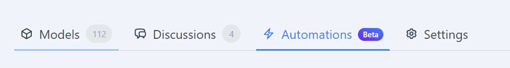
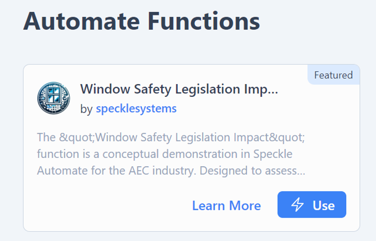
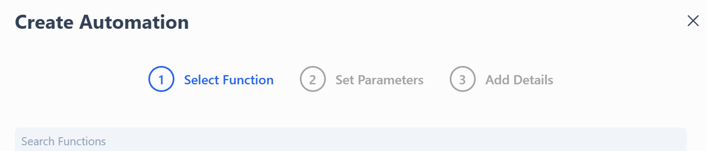
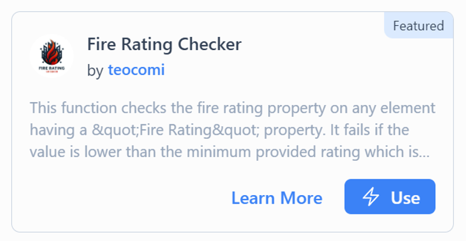
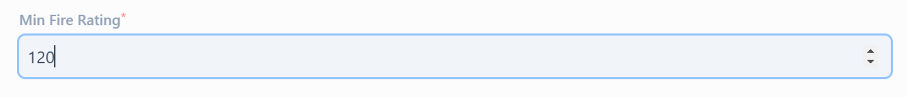
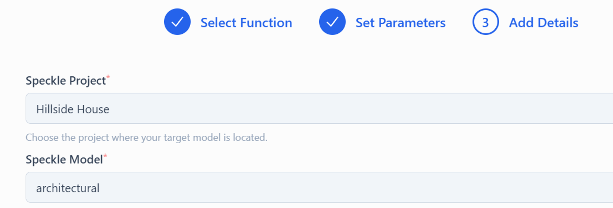
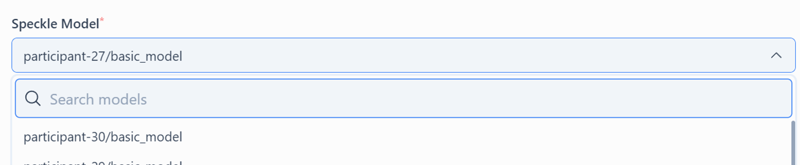
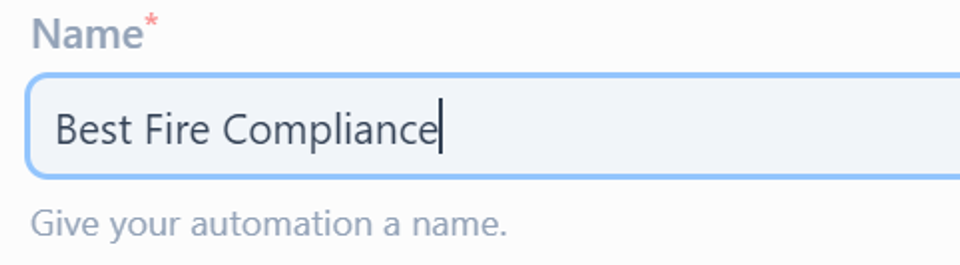
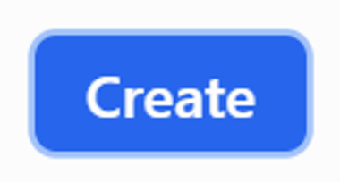

# Creating Automations

## **What is an Automation?**

- Automations allow you to achieve a wide variety of tasks.
- Automations are what apply a function to a Speckle model.
- Automations are used to configure a function to suit your particular requirements.

For example, a function may render a photograph-quality image of any given model. An automation would allow you to specify the camera position, lighting, and other settings to achieve the desired result and then command the Function to render an image of your particular Speckle Model.

## **Creating an Automation**

Automations are created from two contexts:

1. in the context of a project. Found under the Automations tab.
    
    
    
2. From the functions library
    
    
    

The resulting modal dialog will present you with four or five prompt screens:

1. If you started from an automations list, **select a function to use** and click Next.
    
    
    
    
    
2. If you start from the Functions library or a Function page, you will go directly to step 3.
3. If the function has defined inputs to configure it, s**et parameters** now.
    
    
    
4. **Add Automation Details**
    1. If you started the Automation from the project page, this is already selected for you; otherwise, you will now **choose which Speckle project** and model to trigger your automation.
        
        
        
    2. **Choose a Speckle Model from the current project**
        
        
        
    3. **Name your automation**. This is for your reference; ideally, make it meaningful, but it doesn’t need to be unique.
        
        
        
        
5. Create your Automation
    
    
    
6. **Success**! 🥳 You can now view your automation.