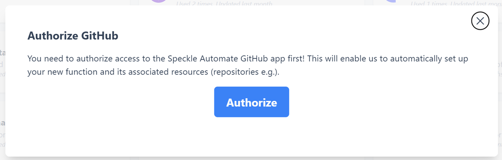
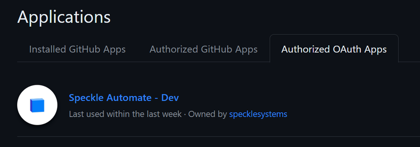
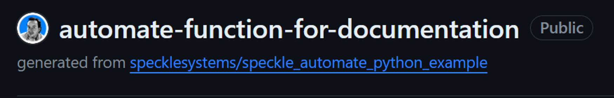
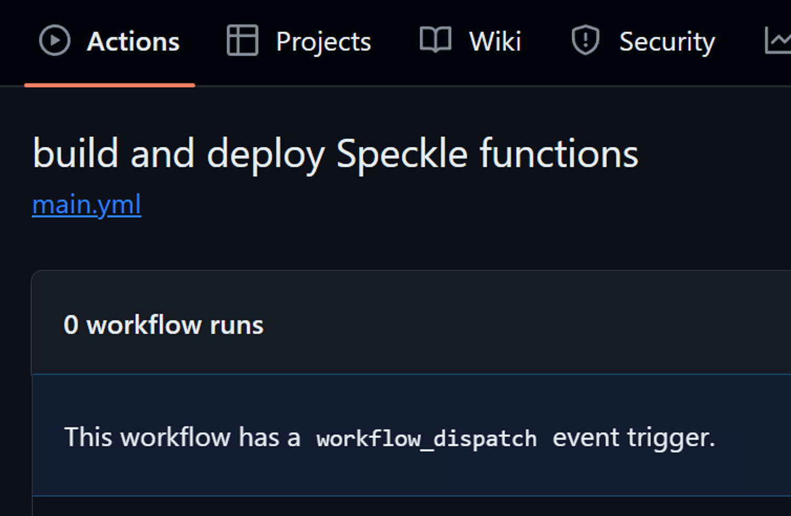
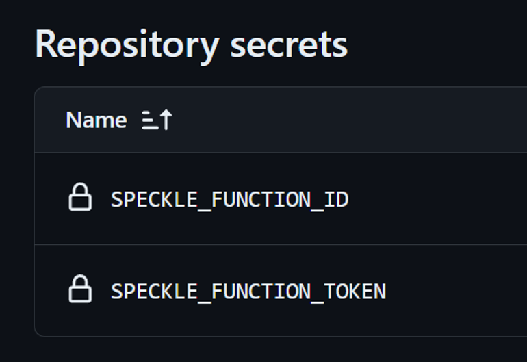
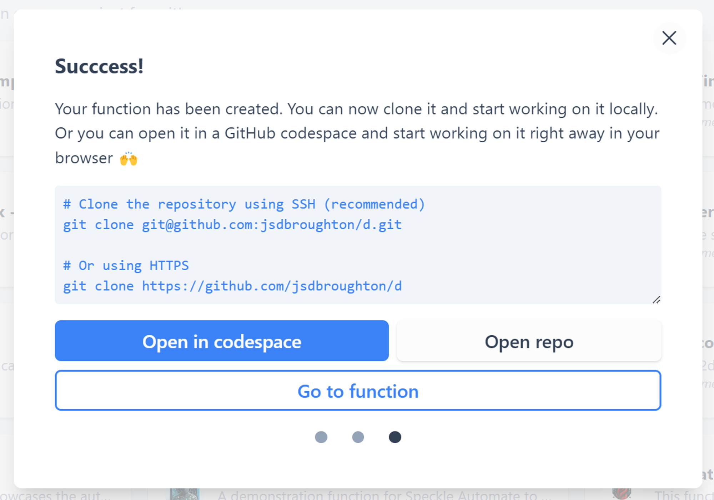

# Creating Functions

If you have your verified account on latest.speckle.systems, navigate to [latest.speckle.systems/functions](https://latest.speckle.systems/functions). 

You will now see above the Functions Library. In the top right, there is a new function button:

This will launch the function creation wizard

1. **Authorise GitHub:** Required only the first time.
    
    
    
    ::: tip 💡 Authorized OAuth Apps
    You will find Speckle Automate in your Github account Authorized OAuth Apps. Access can be revoked at any time, but will be necessary to publish new functions.
    
    
    
    :::
    
2. **Choose a template**: We are launching with Python and C# templates. These reflect our best-supported Speckle SDKs, **speckle-sharp** and **specklepy**. Each of our main SDKs includes the Automate SDK for that language.
3. **Define your function.** (Some of these details can be edited later)
    1. **Choose an avatar/logo/icon** [optional]: This will be displayed in the functions list
    2. **Choose a Name** [required]: This doesn’t need to be unique, but all functions will be a single list during the beta stages. The search filter will use the function name alone; it could be helpful if it identifies you as an author/company and the name/function intent. *e.g. SolarFarmLayout by Solarcorp*
    3. **Add a description** [required]: This will be the short description used in the function list. The description supports basic Markdown if you wish to add markup.
    4. **Identify source application data supported** [optional]: This may be helpful when defining Automations
    5. **Add Tags** [optional]: A list of terms to categorise your function further. Multi-word tags should use _ or - characters. *e.g. Solar_Panels*
    6. **~~Select a Github Organization** [optional]: This is only relevant if you want to publish as an organization and are a member of one.~~
    7. **Click Next**: All being well, the wizard will create your function project on GitHub.
        
        ::: tip 🧙‍♂️ Wizard Actions
        You will see that the wizard handles a lot of scaffolding for you. You can navigate to GitHub and see that the template project has been cloned under your repositories:
        
        
        
        A GitHub action has been created for you; the specification for it is defined in `.github/workflows/**main.yml**`
        
        
        
        It also has injected two environmental variables as repository secrets for the interaction with the Automate API `SPECKLE_FUNCTION_ID` and `SPECKLE_FUNCTION_TOKEN`: 
        
        
        
        
        :::
        
        ::: tip 💡 Note
        Choose whatever Project restrictions you wish, but it must be Public for now.
        :::
        
        </aside>
        
4. Your function has been created! 🥳 At this point, the template can be edited and amended to suit your own business logic.
    
    
    
5. You can follow the links provided to:
    1. **Open the repo:** this is a link to the project on GitHub
    2. **Open in codespace:** You can get coding immediately in a virtual machine operating in a container at GitHub. Remember that any changes you make must be pushed to your project. 
    3. **Go to function**: This will navigate you to your functions page within Speckle Automate.
6. Your function will only appear in the [functions list](https://automate.speckle.dev/functions) once a first Release has been made.