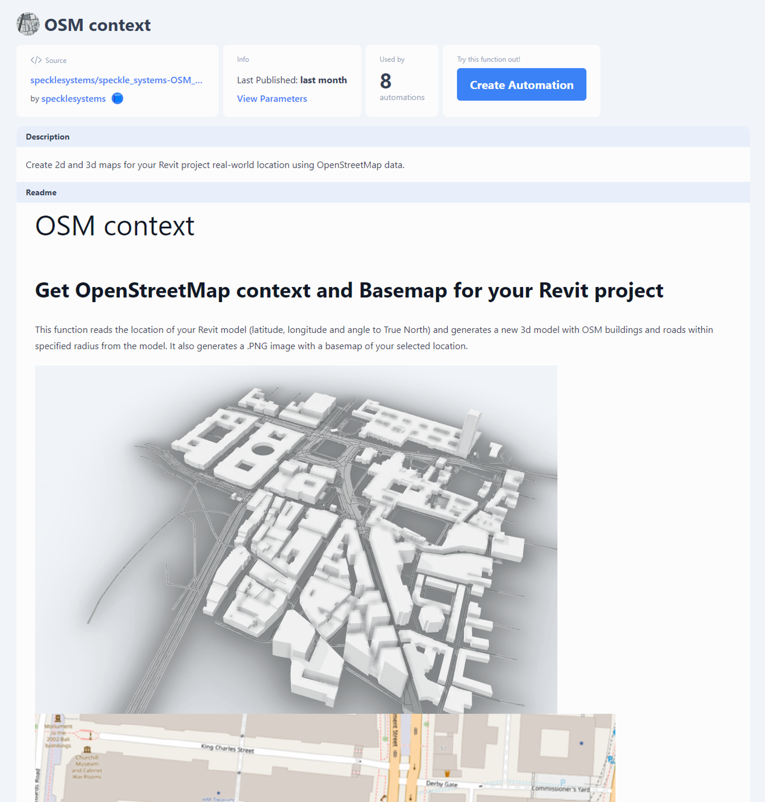

# Documenting your function
Your function’s `README.md` will be published to its dedicated Automate page. This is your opportunity to communicate the key functionality, limitations, and detailed instructions for the function’s inputs to automation composers.

Later, this will be your opportunity to market why your function is the go-to solution for quality control, solar farm layouts, or Pokemon detection for Speckle. It is also a great way to seek collaborators. 

You can choose how detailed you would want to document the functional logic, so long as it is abundantly clear what it results in given what source data.
Speckle Automate’s function listing will display with full Markdown support, including relevant imagery, etc.

Example of the Readme as displayed in a function listing.