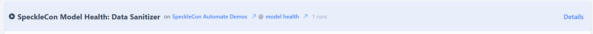
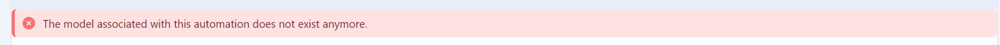
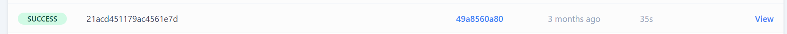

## **For Automation Composers**

### Designing Automation Workflows
- **Automation Workflows**: Automations are triggered by new versions published to a given model within a project. An automation will execute a function and pass the published data and any configuration parameters to it.
- **Creating Workflows**: Step-by-step guide on assembling workflows using pre-built and custom functions.

### Viewing Automation Runs

From your automation list, you can see each automation you have composed by name, what function it is deploying to, and which project and model it is in. If an automation has been disabled, it will be shown with a Paused icon.

If a model no longer exists, the automation will automatically be disabled, and a notification banner will be visible under the details header.

Below are all the runs of each automation, their status, the model version they ran on, when they started, how long they ran, and a link to view the log output of each run. This will show the current or evential status of the run: pending, running, success, or failure.

Clicking on the details header will bring up the Automation page, where you can manage more.

### Managing Automation Configurations

- **Editing details**: Clicking edit will allow you to rename a function and toggle its enabled state.
- **Enable and Disable**: Once defined, automations will always run on a new version of the selected model. If this is no longer needed, you can disable it. You can re-enable it at any time.
- **Amend Function:** Clicking on the function card allows you to select a different function version and alter its configuration details. The function card will indicate if it is set to the latest revision.
- **Trigger Automation**: If the model exists, you can manually trigger it even if the automation is disabled. This will use the latest version as the source.
- **Review Runs**: The same runs review is available in an automation page focussed on just that automation.
- **Version Control**: Automation is defined to run on a specific model for a specific project. When a function is selected, by default, you are selecting the latest version of that function. This is the best option. As parts get revisions, you will be alerted that your automation is not using the newest revision. You can choose to edit the automation to do this or not. While supported by the underlying API, there is no current means of auditing what version of an automation was live at a specific time.
- **Collaboration**:
    - Functions, by their open-source nature during the closed beta, may be authored by anyone with access to the function repository once created. This could be automatic among an organisation or enabled by the original function author, where the repo is tied to that author's GitHub account.
    - Automations, are tied to the composer's account who must have the owner role for the project.

## For Function Authors

- **Creating functions:** Follow our detailed instructions for publishing your first function using the Automate wizard.
    
- **Updating functions:** After your code's initial release completes your function's publishing, subsequent releases will automatically set the function listing to show the latest revision. Automations already using your function must be edited to point to specific modifications.
- **APIs and Data Access**: Functions can make external calls or even calls to other Speckle Models using REST via whatever library you choose. Speckle SDKs include a subset of methods specifically to handle Automate data. More details about this are below.
    
- **Runtime**: Automate functions run once per trigger; there is a generous execution time for all functions to cope with even intensive computation. This is not intended to allow for deliberately long-running executions with RTC or sockets, etc.
- **Rate-limits:** Functions CAN cause other functions to run. This could cause infinite execution loops. Speckle has implemented rate limiting as a bulwark against this during beta testing. When Speckle Automate moves to a paid compute, Speckle will have other methods of detecting such loops, but you could still incur an expensive compute cost.
- **Best Practices**: Do test, test and test your code. Deploying code to Automate the testing on every model version sent is possible but will become tedious. Look into modularising your function so that business logic can be tested locally. Test suites can be executed as part of the GitHub automation for quality CI/CD.
