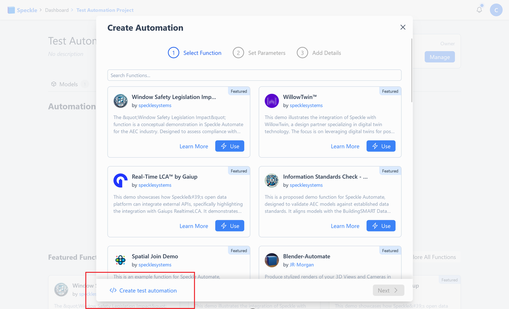
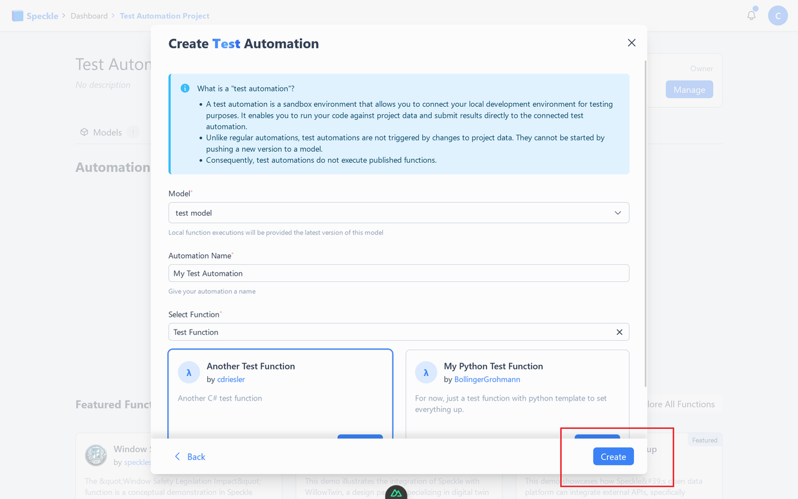
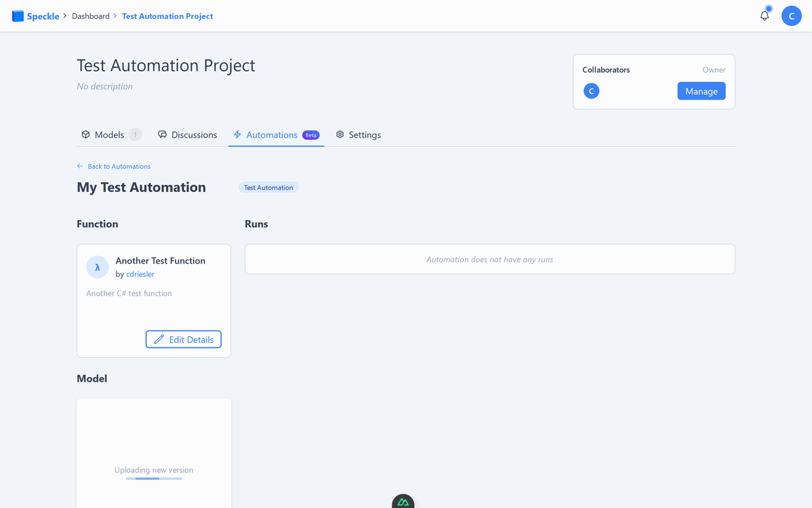

# Testing Your Functions

Speckle Automate supports robust testing for your functions through local testing setups and **test automations**—sandbox environments designed to validate your function's business logic and results against real project data.

## What Are Test Automations?

Test automations provide a safe, sandboxed environment for function authors to:

1. Test how a function’s business logic interacts with Speckle project data.
2. Validate that the function produces the desired results.

Unlike regular automations, test automations:
- Are not triggered by project data changes.
- Cannot be manually triggered via the UI.
- Do not execute published functions directly, but allow you to run your function locally while connecting to Speckle data.

## How to Create a Test Automation

1. Navigate to the **Automations** tab on your project page.  
   

2. Click the **New Automation** button.  
   

3. Select **Create Test Automation** in the bottom left.  
   

4. Follow the instructions to configure your test automation.  
   

5. Once created, your test automation will appear in the list. Use it to test your function against the project’s data.  
   

## How to Use Test Automations

Both the [C# SDK](https://github.com/specklesystems/speckle-sharp/tree/main/Automate/Speckle.Automate.Sdk) and [Python SDK](https://github.com/specklesystems/specklepy/tree/main/src/speckle_automate) include utilities for interacting with test automations. Example functions are available in both:

- [C# Example Function](https://github.com/specklesystems/SpeckleAutomateDotnetExample)
- [Python Example Function](https://github.com/specklesystems/speckle_automate_python_example)

### Required Environment Variables

To run your tests, configure the following in your environment:

- **Python**: Use a `.env` file ([example](https://github.com/specklesystems/speckle_automate_python_example/blob/main/.env.example)).  
- **C#**: Use an `appsettings.json` file ([example](https://github.com/specklesystems/SpeckleAutomateDotnetExample/blob/main/TestAutomateFunction/appsettings.example.json)).

Environment Variables:
- `SPECKLE_TOKEN`: [Create a Personal Access Token](https://speckle.guide/dev/tokens.html).
- `SPECKLE_SERVER_URL`: URL of your Speckle Server, e.g., `https://app.speckle.systems/`.
- `SPECKLE_PROJECT_ID`: The ID of your Speckle project with the test automation.
- `SPECKLE_AUTOMATION_ID`: The ID of your test automation.

The project and automation IDs are in the URL of your automation page: `/projects/[project-id]/automations/[automation-id]`.

## Running Test Cases

1. Set up your local environment with the required values.  
2. Run the test command (`pytest`, `dotnet test`, etc.) from your development setup.  
3. The SDK utilities will:
   - Connect to the test automation via the API.
   - Run your function locally, generating results.
   - Submit the results to the test automation for validation.

Test results will be visible on the automation page and the project’s automation status display.

## Limitations

To set up a test automation, you must:
- Be an owner of the Speckle project.
- Have published the function to the Function Library.
- Ensure the function has at least one release (current technical limitation).

::: note Future Restrictions  
We may introduce further restrictions, such as requiring the test automation owner to be the author of the function being tested.
:::

## Key Notes on Test Automations

- Test automations do not ask for function inputs during creation; inputs should be set up in your development environment.  
- Test automations are sandboxed environments designed to aid in integration testing. They do not execute functions directly within the Automate runtime.  
- Test runs allow you to debug locally while validating outcomes against Speckle project data.

Happy hacking! 🎉  
For further assistance, refer to the SDK documentation and example repositories.
