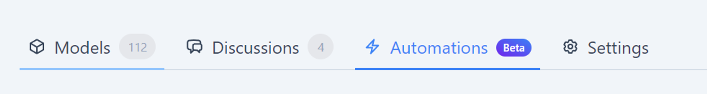

# Testing Your Functions

Functions can be tested using your preferred local testing library. We have also introduced the ability to create special “test automations” that provide you with the ability to test:

1. how a function’s business logic executes its intended checks against a real Speckle project, and 
2. how it produces the desired function results.

A test automation is a sandbox environment that allows you to connect your local development environment for testing purposes. It enables you to run your code against project data and submit results directly to the connected test automation. 

Unlike regular automations, test automations are not triggered by changes to project data. They cannot be started by pushing a new version to a model. Consequently, test automations do not execute published functions.

### How to create test automations

1. Visit the new Automations tab on the project page
    
    
    
2. Click the New Automation button
    
    
    
3. Click Create test automation in the bottom left.
    
    
    
4. Follow the instructions to configure your test automation
    
    
    
5. Congratulations! You now have a test automation against which you can run your automated functions. Uploading new versions of the project’s model(s) will provide you with new data against which to test your functions.
    
    

### How to use test automations

Both the [C# SDK](https://github.com/specklesystems/speckle-sharp/tree/main/Automate/Speckle.Automate.Sdk) and [Python SDK](https://github.com/specklesystems/specklepy/tree/main/src/speckle_automate) provide utilities for interacting with your test automations from local code environments. We also provide an example function in each supported language:

- [C# example function](https://github.com/specklesystems/SpeckleAutomateDotnetExample)
- [Python example](https://github.com/specklesystems/specklepy)

In either language, the tests can be successfully run once a `.env` file ([in python](https://github.com/specklesystems/speckle_automate_python_example/blob/main/.env.example)) or an `appsettings.json` ([in C#](https://github.com/specklesystems/SpeckleAutomateDotnetExample/blob/main/TestAutomateFunction/appsettings.example.json)) file is configured with the following values:

- `SPECKLE_TOKEN` - See [Creating Personal Access Tokens](https://speckle.guide/dev/tokens.html)
- `SPECKLE_SERVER_URL` - The literal url of your Speckle Server, like [`https://latest.speckle.systems/`](https://latest.speckle.systems/)
- `SPECKLE_PROJECT_ID` - The id for the project with your test automation
- `SPECKLE_AUTOMATION_ID` - The id of your test automation

Both the project id and the automation id can be found in the url of your automation’s page in the form of `/projects/[project-id]/automations/[automation-id]`.

Once your environment variables are configured in this way, you can write your test cases and use the test setup utilities provided by your language’s SDK. Happy hacking!

### Limitations

To set up a sandbox automation you will need:

- a Speckle project you are an owner of
- a function you’ve published to the Automate marketplace.
- the function needs to have minimum 1 release (its a tech limitation for now)

Note: We do not currently enforce that test results in a test automation are coming from the author of that function. In the future, we are likely to introduce further restrictions on how and when test automations can be used like requiring the test automation owner to be the same user as the author of the function being tested.

::: tip Notes
  
  To create an easy to use yet meaningful testing setup for function authors, we’ve developed a workflow specifically geared towards providing an easy to use yet robust setup.
  
  When testing the correctness of an automate function, we want to test:
  
  1. how a function’s business logic executes its intended checks against a real Speckle project, and 
  2. how it produces the desired function results.
  
  For this reason we allow the creation of test automations aka automation sandboxes in the automation creation wizard. Test automations may be created on any project, where you are eligible for creating automations.
  
  At its core a test automation is a special type of automation, that does not run, even if the trigger conditions are met (not even manual triggers are allowed). What this means in the background we do not associate the automation with any resource in the Automate Execution engine.
  
  When creating a sandbox automation, we do not ask for function inputs in the wizard, those are better provided in the development environment.
  
  When executing a test run, the automate SDK will hook into the schematically correct test tools to provision a new test automation run, that can be used for the integration test run
  
  To set up a sandbox automation you will need:
  
  - a Speckle project you are an owner of
  - a function you’ve published to the Automate marketplace.
      - the function needs to have minimum 1 release (its a tech limitation for now)
      - for now, the author match is not enforced, but we will probably turn on a check, that only allows using functions in sandboxes, where the automation composer is the same as the function author
  
  Steps:
  
  - got to the new automation tab on the project page
  - click create new automation
  - select automation dev mode
  - select function from list
  - automation created
  - follow the instructions on the test automation page, to set up the required input values in your development environment
  - run the cli test command ( npm run test, pytest, dotnet test, etc,) that is relevant for your function setup.
      - Internally these test commands do the following:
          - Finds the Test Automation ID, Function ID, & API token stored in the local development environment
          - Calls the API to request a new Automation run and a function run
          - Runs the function locally, creating the json file (this can have a uniquely generated file name including timestamp to avoid overwriting previous attempts and allow for later auditing/debugging), updating the input command parameter pointing to the file’s path.
  - test run results should be visible on the automation page and in the project’s automation status display
:::