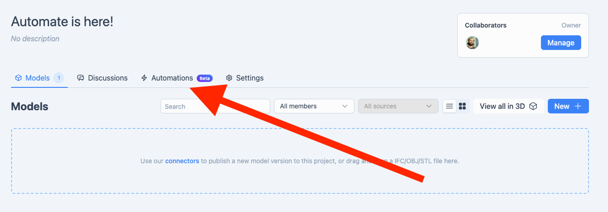

# Getting Started

## Accounts and Authentications

::: tip 💡 You must verify your account on https://latest.speckle.systems.
This is done by responding via the email sent to you on sign-up
::: 

To participate in the Speckle Automate beta, you will need:

- A verified account on [latest.speckle.systems](https://latest.speckle.systems)
- An account on [github.com](https://github.com)
- An account on [speckle.community](http://speckle.community)

## User Interface

As a change from the closed beta experience you may have joined, Automate is now fully integrated into our main Speckle web application interface, and you can find it by clicking on a project that you are the owner of:

