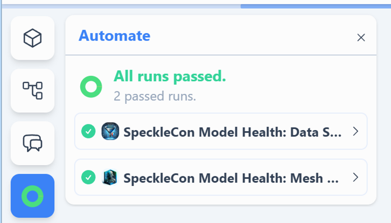
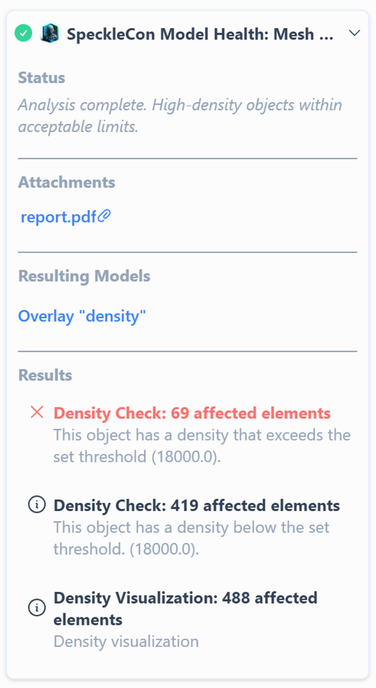
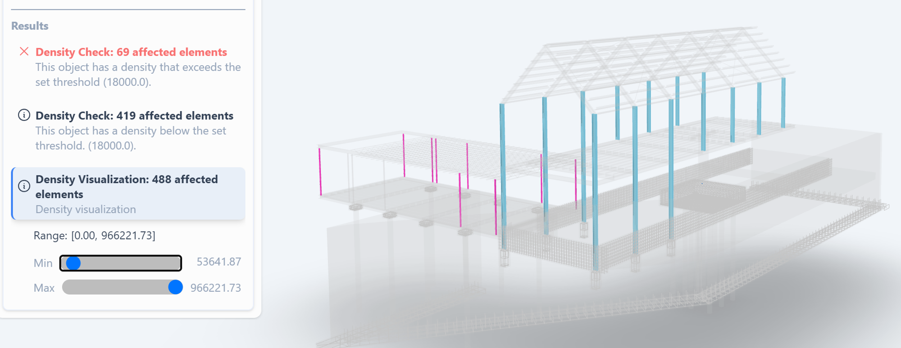
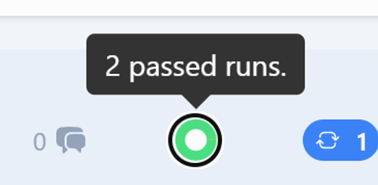
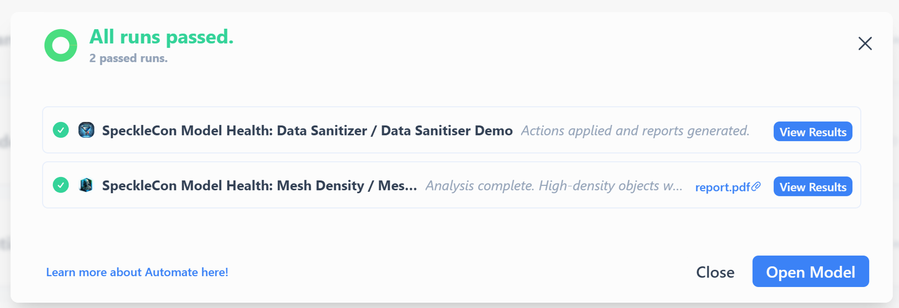

# Viewing results in Speckle UI

There are two entry points to Automate results:

### From the Model Scene View

If automations are running or have been completed, a results doughnut icon will appear. Clicking on this will reveal all the automations that have reported results for the currently viewed version. 
    
  
  
  Clicking either of the runs cards will expand to show:
      
  
      
  - Status: The message included with a Fail or Success result.
  - Attachments: Any artefacts uploaded by the function.
  - Resulting Models: An option to add any model version produced by the function.
  - Results: Each result report with its status, category, object count and message as reported by the function
      - Clicking on a results card will isolate the objects reported by the card and
      - Where the result includes metadata, a filter function may be presented to highlight the outcome
          
          
            
            
### From the project dashboard
In the models’ list or card view, each model with automation runs completed will show the same doughnut icon.
    
  
  
  - Clicking the doughnut in the model list will show a summary, as seen above, but with additional options.
      
      
      
      - **View Results**: Will link through to the relevant version and use the results context view to include any other models or objects
      - **Open Model**: Will open the model at the latest version
      - **View Artefact**: Will either open the artefact in a new browser tab (images) or prompt to download (files)