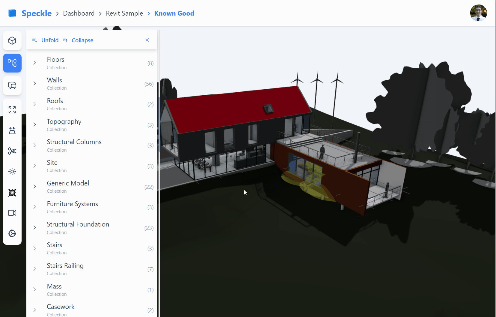
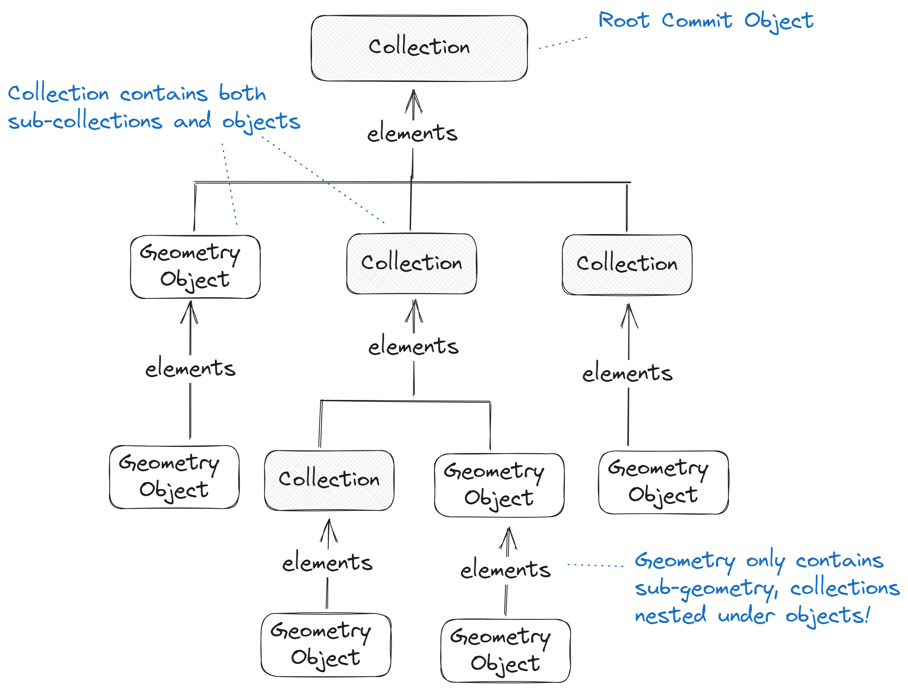
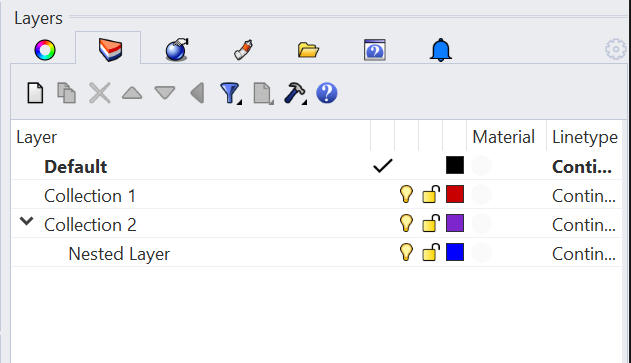
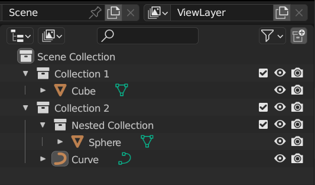
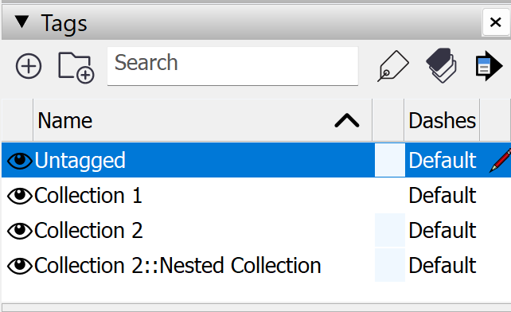

<Banner />

# The Base Object

This post was originally part of the Making Speckle 2.0 series of posts on the community forum, it's been adapted as part of our dev docs. Check out [the original on our forum](https://speckle.community/t/core-2-0-the-base-object/782)!

## Preamble

The Base object is one of the smallest, yet most critical parts of our SDKs as it influences the serialisation & deserialisation process, hashing speed & correctness, overall performance, and how elements are defined in the Speckleverse. It's the building block of Speckle.

In this page we'll describe what it is and how to use it in more detail. Please note that currently examples are only in C#, equivalent implementations are available in our other SDKs.

## Using `Base`

The base object class (actually called `Base`) is the foundation of all data being transferred with Speckle. Any custom data structure that you want to transfer via Speckle should inherit from it. You can read more on creating your own schemas in the [kits section](/dev/kits)

`Base` inherits from a C# dynamic object. This allows us to be strongly typed when needed, but as well fall back elegantly on dynamic properties when we want to, or need to. Imagine a crossover between a JavaScript object and a strongly defined C# class. It's quite cool! Furthermore, this removes some of the friction in aligning with our Python and JS implementations.

This is what it looks like:

```csharp
// Simplified class definition:
public class Base {
	public string id { get; set; } // this is the unique hash, generated from the serialized object
    	public string applicationId { get; set; } // a secondary (optional) identity value, for example the host application object id
	public string speckle_type { get; } // this is the discriminator comprised of assembly name and inheritance
	public long totalChildrenCount { get; } // this is the total number of detachable objects
}
```

### Direct Usage

Here's how you would use a "raw" `Base` object as a custom data structure. It's essentially just a dynamic object at heart.

```csharp
var myObject = new Base();

// setting properties using dot notation requires cast to dynamic
((dynamic)myObject).myNewProperty = "foo";

// alternatively, just pretend it's a dictionary!
myObject["myNewProperty2"] = "bar";
```

You can define singular objects like this - like something representing a built element; alternatively you can define your own object collection types based on the source application you're working from.

```csharp
var myCommit = new Base();
myCommit["RhinoLayer-A"] = new List<Base>() { ... };
myCommit["RhinoLayer-B"] = new List<Point>() { ... };
myCommit["RhinoLayer-A:RhinoLayer-C"] = new List<String>() { ... };
```

:raised_hand: All property names will need to be serializable and some characters prevent this. With dot notation this is more obvious, but using the dictionary method, invalid prop names will only show up at serialization time. There is a helper function `IsPropNameValid` within `DynamicBase` that you could use to check whenever you are dealing with handling indeterminate properties from other software. It also checks for double special characters or overwritten instance property names.

### Inherited Usage

Of course, you can define custom classes that inherit from `Base` and define strongly typed properties in there, which can then be accessed as usual; these can easily coexist alongside dynamic ones.

```csharp
public class Point : Base {
  // define a set of strongly typed properties
  public double x { get; set; }
  public double y { get; set; }
  public double z { get; set; }
}

// Strongly typed props behave as you would expect them to:
var myPt = new Point();
myPt.x = 10;
var whatIsX = myPt.x;

// With a dynamic property, things are a bit more verbose, but still manageable:
((dynamic)myPt).bar = "baz";
var whatIsBar = ((dynamic)myPt).bar as string; // "baz"

// Alternative syntax, if you actually pass the property name at runtime:
var whatIsBar = myPt["bar"] as string; // "baz"

```

::: tip NOTE
Setting a dynamic property that overlaps with a strongly typed one will actually just set the strongly typed one 🙂
:::

All kit object models are inheriting from the `Base` object class for their object definitions. This ensures that Speckle will be able to transport them!

## Detaching @

When defining your dynamic `Base` object properties, you can detach them by prepending an `@` to your property name like so:

```csharp
public class Foo : Base { }
public class Bar : Base { }

var foo = new Foo();
var bar = new Bar();

foo["@bar"] = bar;
```

Detaching a property stores that property value as a reference to another object. Why do this? Since it's possible to nest your `Base` inherited class objects, detaching any properties that may be assigned an object used by other objects keeps your data squeaky clean. Since detached objects are only serialized once during transport, detaching when appropriate means faster sending and receiving times as well ⚡ 

For a more in depth rundown of detachables and examples, check out the [decomposition API section](/dev/decomposition).

## Hashing

As you may or may not know, objects in Speckle are immutable. That means that if you change a property of one, it essentially gets a whole new identity; it's a whole new object (as far as the storage layer is concerned). This immutability is enforced through unique hashes that are dependent on the object's properties.

As a developer, you don't need to care about all this 🙌. Our SDKs takes care of correctly setting the hash of an object, at the correct time: at the end of the serialisation process. There's another purely cosmetic change that we made: the hash is now stored in an field called `id`. Why? Mostly so it's clear that it's the single object identity mechanism that **should** be used across all storage layers.

What about operations that are dependent on hashes? From our analysis of existing programmatic usage, you rarely really need the hash of an object before serialising (and, implicitly, storing it somewhere). When retrieving objects from "somewhere" (more on this in another post), the hash already exists, so you can check against an existing application state and manage updates.

```csharp
var x = myObject.id; // will be populated only if this object has been previously serialised!
```

If you really need the hash (id!) before serialising it, don't panic! You can still generate it - nevertheless we've put that behind an explicit function call so you, as a developer, are aware of the extra cost that you will be incurring. Here's how the signature of that function looks like:

```csharp
/// <summary>
/// Gets the id (a unique hash) of this object. ⚠️ This method fully serializes the object, which in the case of large objects (with many sub-objects), has a tangible cost.
/// <para><b>Hint:</b> Objects that are retrieved/pulled from a server/local cache do have an id (hash) property pre-populated.</para>
/// <para><b>Note:</b>The hash of a decomposed object differs from the hash of a non-decomposed object.</para>
/// </summary>
/// <param name="decompose">If true, will decompose the object in the process of hashing.</param>
/// <returns></returns>
public string GetId(bool decompose = false) { }
```

Noticed that `decompose` flag? You're sharp - check out the [decomposition API section](/dev/decomposition) for more.

## The Speckle Objects Kit

Our SDKs come with our in-house Objects Kit comprised of `Base` inherited classes for your standard AEC needs. The core geometry kit contains all your basic elements like Points, Lines, Curves, and Breps, which are then used as properties for our more extensively defined BIM, Structural, and Civil elements. Read more in our [Objects section](/dev/objects)!

## Displaying `Base`

In addition to the `Base` properties in our model above, you may also encounter certain common properties when exploring your data in our web viewer. The objects in our Objects Kit come with properties that we use to display them in our frontend:

```csharp
// Class definition with additional display properties
public class Foo : Base {
	[DetachProperty]
	public List<Mesh> displayValue { get; set; } // Mesh objects that represent the geometry of this Base object, e.g. used to render surfaces, or solid objects in our viewer
	// or
	[DetachProperty]
	public Polyline displayValue { get; set; } // a polyline used to render complex curve objects in our viewer
	
	public Box bbox { get; set; } // a bounding box used to assist with object selection in our viewer
}
```

The `displayValue` property is a **special property** within the Objects kit. It is common for classes inheriting `Base` to represent complex, conceptual, or domain specific objects.
The `displayValue` property can be used to provide a **geometric representation** to help display the object in applications that don't have a native form.

For example, When receiving **BIM types** like `Wall`, `Floor`, `Beam`, etc into a **non-BIM application** like Rhino, Unity, or our web viewer, these applications **have no way of rendering these elements natively**. The `displayValue` property represents **fallback** geometry, that will automatically be used by applications when receiving types without a native conversion.

The `displayValue` property is expected to be either an **object inheriting `Base`** or a **`List` of objects inheriting `Base`**.
Ideally, these types **should be simple geometry types** like `Mesh` or `Polyline` as these can be converted in all (or almost all) receiving applications (However, this rule isn't enforced for custom `Base` objects, and in theory, any type inheriting `Base` can be used .)


## Collections

Whether to represent Layers, Categories, Tags, Collections, Groups, or hierarchical containers,
it is common to see a natural grouping of objects within a 3D model.
The `Collection` type provides a unified way to represent hierarchical collections of Speckle objects
in a queryable, filterable way and is useful for interoperability between applications.

A collection object only has three properties (in addition to those inherited from the `Base` Speckle object)
and is completely kit/domain agnostic.


> `name` - Any (non-empty) human-readable `string` name, one not necessarily unique.
>
> `collectionType` - Any `string` value describing the type of collection, used for convenience, and specific interop.
>
> `elements` - A `List<Base>` representing child objects, may include nested `Collection` objects. 


---

Our new front-end (fe2) is designed to display `Collection` in the scene explorer.



Suppose we look at how Collection objects are used inside Speckle versions.
We see within the Collection’s `elements` property; we can expect any objects to be nested, including sub-collections.

Importantly, however, we only see `Collection` objects nested under other `Collections`.
Unlike other speckle objects which may form any [directed acyclic graph](https://en.wikipedia.org/wiki/Directed_acyclic_graph) structure,
Collections must be in a true directed tree structure.

> 
>
> Diagram of collections within a Speckle commit, illustrating collections can contain both sub-collections and other objects under the `elements` property. While the `elements` property of geometry objects do not contain Collections

With the exception of the Revit connector, connectors will send `Collection`s from the layer/tag/collection structure. 

| Rhino | Blender | Sketchup |
| -- | -- | -- |
|  |  | |