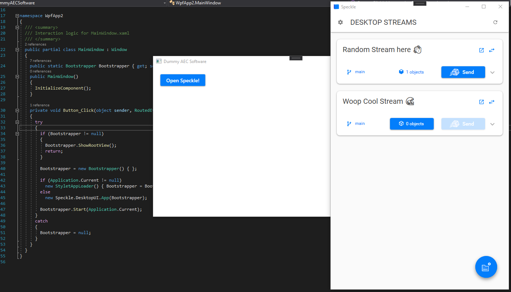

# Writing Your Own connector


Have a dream for a connector that doesn't yet exist? We have all the tools ready for you to start developing your own!

We are very enthusiastic about community connectors and would love to help you bring them to life. To get started, check out the guide below. Feel free to reach out with any questions or calls for more contributors to the project on our [forum](https://speckle.community/).

## Before you begin

Before you begin writing your own connector, we encourage you to follow the steps below:

1. **make sure you are comfortable** writing plugins for the host application you are planning to target, otherwise the guide below will not be of great help 😅
2. **check our [roadmap](https://www.notion.so/speckle/28be414411934168af2a262fd5289fbe?v=42772fc697d6411bb348e6969366885b)** and see if we might be already working on it or planning to
3. **post on the [community forum](https://speckle.community/)** announcing what you are planning to develop and how
4. **consider** that if you make your connector publicly available it's going to be your own responsibility to maintain it
5. **check whether the [objects](https://github.com/specklesystems/speckle-sharp/tree/master/Objects) kit is fit** to support your future connector, if it might need to be extended or if you might want to develop a new kit as well
6. **read** our [dev docs on Base object, Kits, Transports](dev/base.html) etc...

## Anatomy of a connector

Connectors are made of the following parts:

- **a User Interface**
- **bindings** between the host application and the UI
- **custom logic** specific to the host application (for selecting elements, saving senders and receivers in the project file etc)
- **a converter** to convert between the host application and Speckle geometry and BIM elements

For the purpose of this tutorial, we'll be using a user interface called [DesktopUI](/user/ui) currently in use by our Revit, Rhino, AutoCAD and Civil 3D connectors. But you can of course create your own or use whatever the host application you are integrating with provides - that's the case of visual programming software.

## Getting started

To get started, create a C# project in your IDE of choice by following the conventions and requirements for writing plugins for the host application you are targeting. In most cases you'll be creating a .NET Framework class library project.

To be consistent with other Speckle connectors you should name your project `ConnectorAPP_NAME`, set the Assembly name to `SpeckleConnectorAPP_NAME` and the namespace to `Speckle.ConnectorAPP_NAME` where `APP_NAME` is the name of your host application (eg Tekla, Etabs...).

::: tip Requirements

The minimum supported .NET Framework for using our .NET SDK is **4.6.1**

:::

Then you can proceed to add the following packages from NuGet:

- `Speckle.DesktopUI`
- `Speckle.Objects`


By installing these packages,`Speckle.Core` and other packages will be also added automatically.

## Launching the UI

Assuming the host application you are integrating with provides a way to launch plugins via command or by clicking a button, you can insatiate and launch the DesktopUI with the code below:

```csharp
public static Bootstrapper Bootstrapper { get; set; }

internal void StartOrShowPanel()
{
  if (Bootstrapper != null)
  {
    Bootstrapper.ShowRootView();
    return;
  }

  Bootstrapper = new Bootstrapper();

  if (Application.Current != null)
    new StyletAppLoader() { Bootstrapper = Bootstrapper };
  else
    new DesktopUI.App(Bootstrapper);

  Bootstrapper.Start(Application.Current);
}

```

You can see how it's been implemented in [Rhino](https://github.com/specklesystems/speckle-sharp/blob/master/ConnectorRhino/ConnectorRhino/ConnectorRhinoCommand.cs#L80) and [Revit](https://github.com/specklesystems/speckle-sharp/blob/master/ConnectorRevit/ConnectorRevit/Entry/SpeckleRevitCommand.cs#L24).

Now, in your host application, after launching the Speckle plugin you should see this window pop up:



## Adding the Bindings

The UI we just launched is quite sleek, but also a bit useless for the time being, as it doesn't have any connection to the host application; so it wouldn't know what to do when the _Send_ button is clicked, when the user wants to change selection or where to load saved streams from etc...

DesktopUI comes with some [DummyBindings](https://github.com/specklesystems/speckle-sharp/blob/master/DesktopUI/DesktopUI/Utils/DummyBindings.cs) so that you can test it, but let's go ahead and write our own.

Create a class named something like `ConnectorBindingsAPP_NAME.cs` and have it implement the abstract class `ConnectorBindings.cs`. It'll look something like the code below:

```csharp
public class ConnectorBindingsAECApp : ConnectorBindings
  {
    public override void AddNewStream(StreamState state)
    {
      throw new NotImplementedException();
    }

    public override string GetActiveViewName()
    {
      throw new NotImplementedException();
    }

    public override string GetDocumentId()
    {
      throw new NotImplementedException();
    }

    public override string GetDocumentLocation()
    {
      throw new NotImplementedException();
    }

    public override string GetFileName()
    {
      throw new NotImplementedException();
    }

    public override string GetHostAppName()
    {
      throw new NotImplementedException();
    }

    public override List<string> GetObjectsInView()
    {
      throw new NotImplementedException();
    }

    public override List<string> GetSelectedObjects()
    {
      throw new NotImplementedException();
    }

    public override List<ISelectionFilter> GetSelectionFilters()
    {
      throw new NotImplementedException();
    }

    public override List<StreamState> GetStreamsInFile()
    {
      throw new NotImplementedException();
    }

    public override void PersistAndUpdateStreamInFile(StreamState state)
    {
      throw new NotImplementedException();
    }

    public override Task<StreamState> ReceiveStream(StreamState state)
    {
      throw new NotImplementedException();
    }

    public override void RemoveStreamFromFile(string streamId)
    {
      throw new NotImplementedException();
    }

    public override void SelectClientObjects(string args)
    {
      throw new NotImplementedException();
    }

    public override Task<StreamState> SendStream(StreamState state)
    {
      throw new NotImplementedException();
    }
  }
```

As you might have guessed, we now need to populate these methods with logic that calls the host app API to perform the various actions. You don't have to implement each method as some might not be relevant for your host application, but make sure they are handled gracefully. This is one of the most complicated parts of writing a connector and requires a very good understanding and experience with the host app API.

You can see how that's been done in [Rhino](https://github.com/specklesystems/speckle-sharp/blob/master/ConnectorRhino/ConnectorRhino/UI/ConnectorBindingsRhino.cs) and [Revit](https://github.com/specklesystems/speckle-sharp/tree/master/ConnectorRevit/ConnectorRevit/UI) (where it's split in multiple partial classes).

In this class you might also want to add the logic to handle various events triggered from the host application such as `DocumentOpened` and automatically open the UI if the document has any streams saved.

Once the binding class is complete you need to set it in the Bootstrapper we initialized when launching the UI.

Change:

```csharp
Bootstrapper = new Bootstrapper();
```

To something like:

```csharp
 Bootstrapper = new Bootstrapper()
 {
     Bindings = new ConnectorBindingsAECApp()
 };
```

You should now see the UI responding to various user actions with your custom binding logic.

For any questions feel free to write on the [community forum](https://speckle.community/)!

## Writing the Converter

Last crucial bit for your connector to work properly is to create a converter. The converter will take care of converting native data and geometry from your host application to Speckle when sending and vice-versa when receiving.

For the purpose of this guide, we'll assume your converter will be extending the [Objects Kit](/dev/objects), but you can also [write your own kit](/dev/kits-dev) if you so wish.

::: tip IMPORTANT

The Connector **should never have a direct references** to the Converter or Kit. This is because Kits are swappable and having a direct reference would prevent this mechanism from working.

:::

### Creating the Converter Project

Create a new C# project for the converter, we recommend using a class library with .NET Standard 2.0.

To be consistent with other Speckle converters you should name your project `ConverterAPP_NAME`, set the Assembly name to `Objects.Converter.APP_NAME` and the namespace to `Objects.Converter.APP_NAME` where `APP_NAME` is the name of your host application (eg Tekla, Etabs...).

Then add references to the following NuGet packages:

- `Speckle.Objects`
- Your host app API (preferably as NuGets)

### Adding the Converter logic

Now create a new class named `ConverterAPP_NAME` and have it implement the `ISpeckleConverter` interface. It'll look something like this:

```csharp
 public class ConverterAECApp : ISpeckleConverter
  {
    public string Description => throw new NotImplementedException();

    public string Name => throw new NotImplementedException();

    public string Author => throw new NotImplementedException();

    public string WebsiteOrEmail => throw new NotImplementedException();

    public HashSet<Exception> ConversionErrors => throw new NotImplementedException();

    public bool CanConvertToNative(Base @object)
    {
      throw new NotImplementedException();
    }

    public bool CanConvertToSpeckle(object @object)
    {
      throw new NotImplementedException();
    }

    public object ConvertToNative(Base @object)
    {
      throw new NotImplementedException();
    }

    public List<object> ConvertToNative(List<Base> objects)
    {
      throw new NotImplementedException();
    }

    public Base ConvertToSpeckle(object @object)
    {
      throw new NotImplementedException();
    }

    public List<Base> ConvertToSpeckle(List<object> objects)
    {
      throw new NotImplementedException();
    }

    public IEnumerable<string> GetServicedApplications()
    {
      throw new NotImplementedException();
    }

    public void SetContextDocument(object doc)
    {
      throw new NotImplementedException();
    }

    public void SetContextObjects(List<ApplicationPlaceholderObject> objects)
    {
      throw new NotImplementedException();
    }

    public void SetPreviousContextObjects(List<ApplicationPlaceholderObject> objects)
    {
      throw new NotImplementedException();
    }
  }
```

You might not need to implement all these methods, it really depends on how you want to handle the conversions and on how complex is the host app you're dealing with.

We'll detail a few of these methods and properties below, and you can see how they have been implemented for [Rhino](https://github.com/specklesystems/speckle-sharp/blob/master/Objects/Converters/ConverterRhinoGh/ConverterRhinoGh.cs) and [Revit](https://github.com/specklesystems/speckle-sharp/blob/master/Objects/Converters/ConverterRevit/ConverterRevitShared/ConverterRevit.cs).

:::tip IMPORTANT

Please note that **it's fundamental** that the string value(s) returned by `GetServicedApplications()` matches the name used for `APP_NAME`. So if your converter is built as `Objects.Converter.Tekla.dll` , the method should return `new string[] { "Tekla"};`

:::

If you'd like to add your `APP_NAME` to the [list of applications in Core](https://github.com/specklesystems/speckle-sharp/blob/master/Core/Core/Kits/Applications.cs), we can certainly do so, just submit a PR.

### The Context Document

The `SetContextDocument` is used to _inject_ the Document from the connector and host app API to the converter ( it might have a different name in your case, or not even exist!), but in software as Revit or Rhino it's fundamental to create new objects, start transactions, get units etc...

### The Convert methods

The most important methods in a converter are `ConvertToNative` and `ConvertToSpeckle`, and are what will take most of your time and API flexing skills.

Please have a look at how things are done in other converters, you will most likely end up having a switch statement with a list of functions that handle the various geometry and data types.

The logic of these routines can get quite complicated if you want to support nested elements or update previously received objects, and we recommend adding such functionalities later.

::: tip IMPORTANT

Don't forget to properly set the units of your objects when sending to Speckle and to scale incoming geometry when receiving from Speckle.

:::

For any questions feel free to write on the [community forum](https://speckle.community/)!

### New Objects

If the host app you're targeting uses object types not currently defined in the Objects Kit and you'd like to write conversions for them, we are happy to extend it!

Please get in touch on the forum before making a PR, then have a look at [how to write new objects](/dev/objects.html#writing-objects).

## Loading the Converter

At some point in your `ConnectorBindings` you'll need to implement the `SendStream` and `ReceiveStream` methods. It's within these that we will be invoking methods of the converter and then either send or receive data to/from Speckle.

::: tip IMPORTANT

The Connector **should never have a direct references** to the Converter or Kit. This is because Kits are swappable and having a direct reference would prevent this mechanism from working.

:::

To invoke the `ConvertToNative` and `ConvertToSpeckle` methods (and other methods / properties as well) of the converter, we first need to load it. To do so, you should use the `KitManager` in `Core` as follows:

```csharp
var kit = KitManager.GetDefaultKit();
var converter = kit.LoadConverter(APP_NAME);
// then stuff like converter.ConvertToNative(obj);
```

The converter, as you might have seen above should have implemented other handy methods such as `CanConvertToSpeckle`

## Publishing the Connector

We currently don't have mechanisms to publish third party connectors via Manager, but if you'd like to do so please write on the [community forum](https://speckle.community/) and we'll work out a solution! You are of course free to develop your own installer / deployment mechanism.

## Conclusion

We hope this guide will make it easier for you to start writing your own connector and we are really looking forward to seeing it! As this is a quite high level guide we encourage you to check out how our other connectors have been written and ping us with additional questions if you have any.
