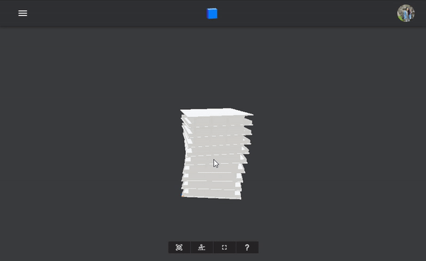

<Banner />

# Tutorial: Simple Dashboard

In this tutorial, we'll be working with Speckle data and using it to create a super simple dashboard. We'll be receiving geometry from a stream, updating the data, and using it to do some calculations and simple plots using Plotly and Dash.


We will assume you have general knowledge of Python and Speckle. If anything trips you up, have a look back at the [Python examples](/dev/py-examples) or the [Speckle Concepts](/user/concepts).

If you want to follow along with the code, the repo for this project can be found [here](https://github.com/izzylys/demo-specklepy).

## Receive Objects from the Server

If you've already been through the [Python examples](/dev/py-examples), you'll already know how to receive objects from the server. As a refresher, you'll need to create a `SpeckleClient` which serves as your entry point to the API. We then authenticate this client using a token from a local account. If you haven't used the [Manager](/user/manager) to add a local account, you can go to `your-server.com/profile` and create a Personal Access Token to use here. We'll then use this client to get the commit we're interested in.

In this case, we're going to be looking at this twisty building Alan generated in Grasshopper and send to Speckle using the [Grasshopper Connector](/user/grasshopper). It has 10 levels split into separate objects each containing fields for facades, columns, banisters, and floor slabs.


The snippet below shows how you would authenticate the client, get the commit we're interested in, and use a server transport to receive the commit object.

```py
from specklepy.api import operations
from specklepy.api.client import SpeckleClient
from specklepy.api.credentials import get_default_account
from specklepy.transports.server import ServerTransport

# create and authenticate a client
client = SpeckleClient(host=HOST)
account = get_default_account()
client.authenticate_with_account(account)

# get the specified commit data
commit = client.commit.get(STREAM_ID, COMMIT_ID)

# create an authenticated server transport from the client and receive the commit obj
transport = ServerTransport(client=client, stream_id=STREAM_ID)
res = operations.receive(commit.referencedObject, transport)

# get the list of levels from the received object
levels = res["data"]
```

## Update Existing Objects

Now that we've received this building from Grasshopper, let's make some modifications. The data has already been structured nicely into a list of `Base` objects each representing a level. Each level has attributes containing that level's facade, columns, banister, and floor slab.

```json
{
    "id":  "idfcaf8b9e145241dsdfa915885d87cda2",
    "speckle_type": "Base",
    "data": [
        {
            "id":  "ide6acabd37e865ce87a5sdf444d733877",
            "speckle_type": "Base",
            "@facade": [ { ... }, ... ],
            "@columns": [ { ... }, ... ],
            "@banister": { ... },
            "@floorSlab": { ... }
        },
        {
            ...
        }
    ]
}
```

Let's say we want to do some estimated embodied carbon calculations. However, currently no material information has been added to the elements in the stream. We can add this ourselves and update the stream for the rest of the team.

### Subclassing Base

To do this, let's create classes for each material and add these materials to a "material" attribute on each object within the stream. Obviously, this is a bit of an over the top example. It would be more efficient to just add a string attribute to each object that indicates the material, then look up the material properties from a database when running the calculations. However, I want to have some fun here and show you some of the cool things you can do with the `Base` class!

Let's start with defining our materials as `Base` subclasses. This ensures they'll be serialised correctly and that they'll be picked up by the `Base` type registry. We can then create a mapping for each element type name to the `speckle_type` of the corresponding material class. The `speckle_type` is prepopulated by the class and defaults to the class name.

```py
# density (kg/m^3) and embodied carbon (kg CO^2/kg) estimates
# from https://www.greenspec.co.uk/building-design/embodied-energy/
class Concrete(Base):
    density: str = 2400
    embodied_carbon = 0.159


class Glass(Base):
    density: str = 2500
    embodied_carbon = 0.85


class Steel(Base):
    density: str = 7800
    embodied_carbon = 1.37


MATERIALS_MAPPING = {
    "@floorSlab": "Concrete",
    "@banister": "Glass",
    "@facade": "Glass",
    "@columns": "Steel",
}
```

We can now write a function that iterates through all the members of a level and adds a material if it exists in our mapping.

```py
def add_materials_data(level: Base) -> Base:
    # first, get all the attribute names
    names = level.get_member_names()
    # then iterate through them to check if they exist in our mapping
    for name in names:
        if name not in MATERIALS_MAPPING.keys():
            break
        # if they do, use this class method to get the class and init it
        material = Base.get_registered_type(MATERIALS_MAPPING[name])()
        # now we can add a `@material` attribute dynamically to each object.
        # note that we're making it detachable with the `@`
        prop = level[name]
        if isinstance(prop, Base):
            prop["@material"] = material
        elif isinstance(prop, list):
            for item in prop:
                item["@material"] = material
    return level
```

Note that we've added a _detached_ dynamic attribute called `@material` to each element we are interested in. We've marked it as detachable (prepended with an `@`) so we don't store hundreds of copies of the same materials classes in this stream. Each instance of each materials class in our case is the same, so we only need to store each once. However, we want to reference them within multiple elements. Using a detachable attribute is the solution! You get a reference for the correct material object in each element, but you only store unique objects (in our case, one instance of each material class) in the stream.

### Sending to the Stream

We can now use the `add_materials_data()` method we wrote to update all the levels in the stream and send these updated levels back. Let's add on to what we've already written.

To send our updated building, we'll need to create a parent `Base` and place our list of nested levels inside this parent. To keep things consistent, we'll be adding them to a field called `data`.

```py
from specklepy.objects import Base

# add the materials data to our levels
levels = [add_materials_data(level) for level in levels]

# create a base object to hold the list of levels
base = Base(data=levels)
```

We'll then use `operations.send()` to send this object to the stream, then use `client.commit.create()` to commit our changes to the stream. If we want to send to a new branch, we can do so by first creating one using `client.branch.create(stream_id, name, description)`. The snippet below shows this full process.

```py
# recap from earlier
client = SpeckleClient(host=HOST)
account = get_default_account()
client.authenticate_with_account(account)

commit = client.commit.get(STREAM_ID, COMMIT_ID)

transport = ServerTransport(client=client, stream_id=STREAM_ID)
res = operations.receive(commit.referencedObject, transport)

# get the list of levels from the received object
levels = res["data"]

# add the materials data to our levels
levels = [add_materials_data(level) for level in levels]

# create a branch if you'd like
branch_name = "🐍 demo"
branches = client.branch.list(STREAM_ID)
has_res_branch = any(b.name == branch_name for b in branches)
if not has_res_branch:
    client.branch.create(
        STREAM_ID, name=branch_name, description="new stuff from py"
    )

# create a base object to hold the list of levels
base = Base(data=levels)
# and send the data to the server and get back the hash of the object
obj_id = operations.send(base, [transport])

# now create a commit on that branch with your updated data!
commid_id = client.commit.create(
    STREAM_ID,
    obj_id,
    branch_name,
    message="add detached materials",
)
```

If we go back to the web to look at the stream, you'll see your newest commit. The geometry should look the same since this hasn't been modified, but stepping into the data will show you the new material attribute. As you can see in the gif below, the id of the `Concrete` object is the same on different floor slabs since the attribute is detached and the objects are identical.



Now that you've sent your changes to the server, anyone you're collaborating with will also be able to pull down your changes and use these updated elements with materials data!

## Do Cool Stuff

We've now seen how we can receive, work with, and send data from Python just like you can with any of the other SDKs and connectors. Great, now we can use that data to make something cool! Let's plot the data using [plotly](https://plotly.com/python/) and display it on a simple page using [dash](https://dash.plotly.com/layout). I won't go into too much detail on using the libraries themselves, but most of the plotting code has just been modified from the boilerplate and examples in their docs.

To start, let's extract some existing data from the objects and plot them. Each geometry object we're interested in has a `Vertices` attribute containing a list of points. Let's plot the vertices of the floor slabs and columns on a 3D scatter plot. To do this, we'll need to construct a pandas data frame with the values we are interested in by iterating through the levels.

```py
import pandas as pd

def construct_points_df(levels: List[Base]):
    # initialise a pandas data frame
    df_vertices = pd.DataFrame(columns=("x", "y", "z", "element"))

    vertices = []
    for level in levels:
        # add column vertices
        columns = level["@columns"]
        for column in columns:
            points = column.Vertices
            for p in points:
                vertices.append({"x": p.x, "y": p.y, "z": p.z, "element": "columns"})
        # add floor slab vertices
        floorslab = level["@floorSlab"]
        points = floorslab.Vertices
        for p in points:
            vertices.append({"x": p.x, "y": p.y, "z": p.z, "element": "floorSlab"})

    return df_vertices.append(vertices)
```

Now we can just pass that data frame into the plotly express `scatter_3d` method and `show()` the figure.

```py
import plotly.express as px

df_vertices = construct_points_df(levels)

fig = px.scatter_3d(
    df_vertices,
    x="x",
    y="y",
    z="z",
    color="element",
    opacity=0.7,
    title="Element Vertices (m)",
)

fig.show()
```

Plotly plots have interactivity built in, so this is all the code we need to produce this 3D scatter plot.


Next, let's make use of the material properties we added to each of the stream objects. Let's calculate the mass and embodied carbon for each element type in one level and construct a data frame with the results.

```py
def construct_carbon_df(level: Base):
    data = {"element": [], "volume": [], "mass": [], "embodied carbon": []}

    # get the attributes on the level object
    names = level.get_dynamic_member_names()
    # iterate through and find the elements with a `volume` attribute
    for name in names:
        prop = level[name]
        if isinstance(prop, Base):
            if not hasattr(prop, "volume"):
                break
            # if it has a volume, use the material attribute to calculated
            # the embodied carbon
            data["volume"].append(prop.volume)
            data["mass"].append(data["volume"][-1] * prop["@material"].density)
            data["embodied carbon"].append(
                data["mass"][-1] * prop["@material"].embodied_carbon
            )
        elif isinstance(prop, list):
            if not hasattr(prop[0], "volume"):
                break
            data["volume"].append(sum(p.volume for p in prop))
            data["mass"].append(data["volume"][-1] * prop[0]["@material"].density)
            data["embodied carbon"].append(
                data["mass"][-1] * prop[0]["@material"].embodied_carbon
            )
        data["element"].append(name[1:]) # removing the prepending `@`

    return pd.DataFrame(data)
```

Using this data frame, we can use the plotly express `pie()` and `bar()` methods to create some lovely plots.

```py
# take the first level from our levels list and construct a data frame
df_carbon = construct_carbon_df(levels[0])

# let's add them all to a dict to keep the together
figures = {}

figures["volumes"] = px.pie(
    df_carbon,
    values="volume",
    names="element",
    color="element",
    title="Volumes of Elements Per Floor (m3)",
)

figures["carbon bar"] = px.bar(
    df_carbon,
    x="element",
    y="embodied carbon",
    color="element",
    title="Embodied Carbon Per Floor (kgC02)",
)

figures["carbon pie"] = px.pie(
    df_carbon,
    values="embodied carbon",
    names="element",
    color="element",
    title="Embodied Carbon Per Floor (kgC02)",
)
```

The last thing we're going to do is add the figures to a dash app. To do this, we are simply taking the boilerplate [dash layout](https://dash.plotly.com/layout), replacing the sample figure with our own figures, and adding some custom css in `/assets/style.css`.

<code-group>
<code-block title="app.py">

```py
import dash
import dash_core_components as dcc
import dash_html_components as html
from demo_specklepy.speckle_data import get_figures

external_stylesheets = [
    {
        "href": "https://fonts.googleapis.com/css2?"
        "family=Roboto:wght@400;700&display=swap"
        "family=Space+Mono:wght@400;700&display=swap",
        "rel": "stylesheet",
    },
]

app = dash.Dash(__name__, external_stylesheets=external_stylesheets)
app.title = "speckle-py demo"

# wrapped the figure plotting code into a function to return the `figures` dict here
figures = get_figures()

app.layout = html.Div(
    children=[
        html.Div(
            children=[
                html.H1(children="speckle-py example", className="header-title"),
                html.P(
                    children="""
                    Speckle is the open source data platform for AEC.
                    We free your data from proprietary file formats so you can own
                    and access your data wherever you need it - including Python!
                    """,
                    className="header-description",
                ),
            ],
            className="header",
        ),
        html.Div(
            children=[
                html.Div(
                    children=[
                        dcc.Graph(id="example-3d-scatter", figure=figures["vertices"])
                    ],
                    className="card",
                ),
                html.Div(
                    children=[
                        dcc.Graph(id="volume-pie-chart", figure=figures["volumes"])
                    ],
                    className="card",
                ),
                html.Div(
                    children=[
                        dcc.Graph(id="carbon-bar-graph", figure=figures["carbon bar"])
                    ],
                    className="card",
                ),
                html.Div(
                    children=[
                        dcc.Graph(id="carbon-pie-chart", figure=figures["carbon pie"])
                    ],
                    className="card",
                ),
            ],
            className="wrapper",
        ),
    ],
)

if __name__ == "__main__":
    app.run_server(debug=True)

```

</code-block>

<code-block title="style.css">

```css
body {
  font-family: "Roboto", sans-serif;
  margin: 0;
  background-color: #f0f0f0;
}

.header {
  background-color: #0a2948;
  height: 256px;
  display: flex;
  flex-direction: column;
  justify-content: center;
}

.header-title {
  color: #fafafa;
  font-size: 48px;
  font-weight: bold;
  text-align: center;
  font-family: "Space Mono";
  margin: 0 auto;
}

.header-description {
  color: #fafafa;
  margin: 4px auto;
  text-align: center;
  max-width: 450px;
}

.container {
  display: flex;
  flex-flow: row wrap;
  justify-content: center;
  max-width: 1200;
  padding-right: 10px;
  padding-left: 10px;
  margin-top: 32px;
}

.card {
  display: flex;
  margin: 1em;
  box-shadow: 0 20px 40px -14px rgba(0, 0, 0, 0.25);
  @media {
    width: 48%;
  }
}
```

</code-block>
</code-group>

Now all that's left is to run `app.py` and head to `http://127.0.0.1:8050/` to see your amazing plots.


## Conclusion

And voila - you've created the basis for a dashboard powered by your Speckle data! This is just a simple start, and we'd love to see the interesting things you build with Speckle. If you have any questions or want to share what you've been hacking, start a conversation on our [forum](https://speckle.community/)

For reference, all the code for this project can be found [here](https://github.com/izzylys/demo-specklepy).
