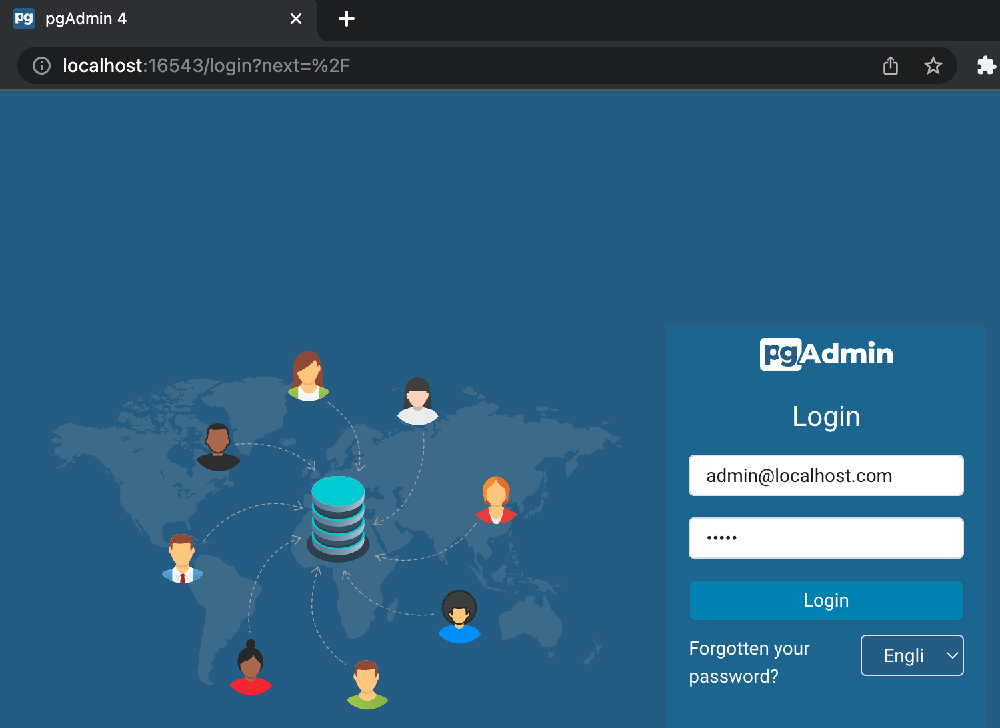
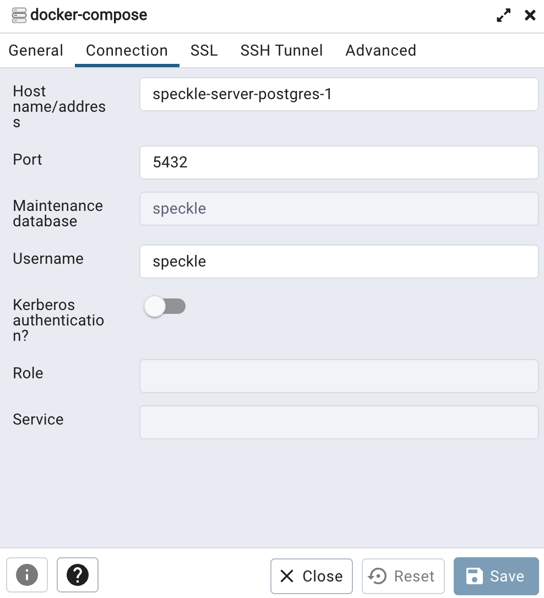
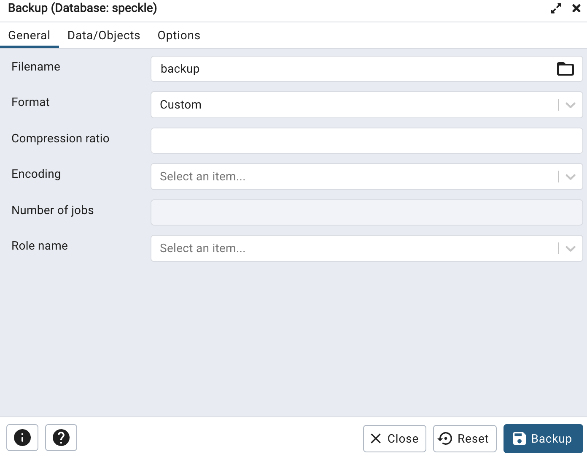

# Database backup, upgrade, and restore

We recommend backing up your database regularly, and especially prior to upgrading Speckle.  Backing up a database is often a requirement of a database upgrade, migrating your database between servers, or recovering from an incident.

## TL;DR

Speckle's preferred method of backing up and restoring data in a Postgres database is with [pgAdmin](https://www.pgadmin.org/). This guide assumes you are running Speckle via Docker-Compose, perhaps a [manual setup](./server-manualsetup.md) or a [DigitalOcean 1-click](./server-setup.md) setup.

## Using pgAdmin

### Prerequisites

#### For DigitalOcean 1-click deployments

1. Log in to DigitalOcean and find your Droplet which is running Speckle
1. Connect to your DigitalOcean Droplet, full instructions can be found in [DigitalOcean's documentation](https://docs.digitalocean.com/products/droplets/how-to/connect-with-ssh/).

#### For Docker-Compose ('manual setup') deployments

1. Docker should be [installed and running](https://docs.docker.com/get-docker/).
1. We expect you to have followed the instructions for [manual installation](./server-manualsetup.md)

### Ensure Postgres and pgAdmin are running

1. Determine if pgAdmin is already installed and running. From your terminal window, request the list of running processes from Docker. Full details of this command can be found in [Docker's documentation](https://docs.docker.com/engine/reference/commandline/ps/).

    ```shell
    docker ps --filter name='pgadmin'
    ```

1. If pgAdmin is already running, you should see something like the following output. If so, you can move on to the next section.

    ```shell
    CONTAINER ID   IMAGE            COMMAND            CREATED      STATUS          PORTS                              NAMES
    04fb5cfc43e9   dpage/pgadmin4   "/entrypoint.sh"   8 days ago   Up 53 minutes   443/tcp, 127.0.0.1:16543->80/tcp   speckle-server-pgadmin-1
    ```

1. Save the following Docker-Compose configuration in a file named `docker-compose-pgadmin.yml`

    ```yaml
    version: '3'
    services:
      pgadmin:
        image: dpage/pgadmin4
        restart: always
        environment:
          PGADMIN_DEFAULT_EMAIL: admin@localhost.com
          PGADMIN_DEFAULT_PASSWORD: admin
        volumes:
          - pgadmin-data:/var/lib/pgadmin
        ports:
          - '127.0.0.1:16543:80'
        depends_on:
          - postgres

    volumes:
      pgadmin-data:
    ```

1. Start the pgAdmin using Docker-Compose:

   ```shell
   docker-compose --file docker-compose-pgadmin.yml up --detach
   ```

1. Verify that pgAdmin is now running:

   ```shell
   docker ps --filter name='pgadmin'
   ```

### Connecting to pgAdmin

#### Connecting to pgAdmin running in Docker on your local machine

1. Find the port that pgAdmin is being served on using [Docker's `ps` command](https://docs.docker.com/engine/reference/commandline/ps/).

    ```shell
    docker ps --filter name='pgadmin'
    ```

1. The above command should produce something like the below. In this example, the port we are interested in is the port exposed on our localhost (`127.0.0.1`), this port is `5432`.

    ```shell
    CONTAINER ID   IMAGE            COMMAND            CREATED       STATUS       PORTS                              NAMES
    465897401a96   dpage/pgadmin4   "/entrypoint.sh"   2 hours ago   Up 2 hours   443/tcp, 127.0.0.1:16543->80/tcp   speckle-server-pgadmin-1
    ```

1. Open the [pgAdmin dashboard](http://127.0.0.1:16543/) in your browser. If you have changed the configuration of pgAdmin, you can find how to access it by running `docker ps --filter name='pgadmin'` and making a note of the host and port it is being served on.

#### Connecting to pgAdmin running in a DigitalOcean 1-click Droplet

1. From your local machine, create an SSH tunnel to your DigitalOcean droplet. Replace `DROPLET_USERNAME` with the username for your droplet, and `DROPLET_IP_ADDRESS` with the IP address of your Droplet; more information on how to find these can be found in [DigitalOcean's documentation](https://docs.digitalocean.com/products/droplets/how-to/connect-with-ssh/).

    ```shell
    ssh -L 16543:localhost:16543 DROPLET_USERNAME@DROPLET_IP_ADDRESS
    ```

For those who are interested, more information about SSH tunnels can be found in [DigitalOcean's Documentation](https://www.digitalocean.com/community/tutorials/how-to-set-up-ssh-tunneling-on-a-vps)

### Connecting pgAdmin to Postgres

1. The user name and password can be found next to `PGADMIN_DEFAULT_EMAIL` and `PGADMIN_DEFAULT_PASSWORD` in your configuration file for pgAdmin.
   - The default values we provided in our `docker-compose-pgadmin.yml` file are `admin@localhost.com` and the password `admin`.

  

1. Click `add new server`.

  

1. In the dialog box in the `General` tab, enter the name `docker-compose`.
1. In the dialog box in the `Connection` tab:
   - for the `Host name/addresses` enter the name of the Postgres container, in our example it is `speckle-server-postgres-1`
       - the name of the Postgres container can be found with `docker ps --filter name='postgres'`
   - for `port`, use `5432` (or the value discovered when running `docker ps --filter name='postgres'`, see instructions above).
   - for `database`, `username`, and `password` use the values in your configuration assigned to the respective `POSTGRES_DB`, `POSTGRES_USER`, and `POSTGRES_PASSWORD` keys. If installed with Speckle's manual installation or DigitalOcean 1-click, by default the value of these are all `speckle`.

  

1. Click `save`.

### Backing up Postgres

1. You can now select the database from the browser window (typically found on the left hand side). Expand `docker-compose` and `databases` to select your database. The default database name for Speckle is `speckle`.

1. Once you have found the database in pgAdmin, right-click the database name and select `backup`.

  

1. Provide a filename (there is no need to change directory or select other options) and then start the backup process. This will generate a backup that is stored in the container's volume.

  

1. Once the backup is prepared, we now need to save the file to your local machine.
    - If a `Click to open file location` button is displayed (this may depend on the version of pgAdmin running), click on it and download the backup to your machine.
    - If a button is not displayed, you can copy the file from the container to your machine by user docker. Replace `speckle-server-pgadmin-1` with the name of your pgAdmin container and `BACKUP_FILE_NAME` with the file name you provided in the pgAdmin dialog.

        ```shell
        docker cp speckle-server-pgadmin-1:'/var/lib/pgadmin/storage/admin_localhost.com/BACKUP_FILE_NAME' .
        ```

    - If connected via SSH to a DigitalOcean or other virtual or remote machine, you will have to undertake further steps to move the file from the host machine to either your local machine or storage location of your choice. DigitalOcean [suggest using `scp`](https://www.digitalocean.com/community/questions/how-to-copy-files-from-one-server-to-another-droplet).

1. We recommend testing the integrity of the backup at this time. One way of doing this is to install speckle-server on another machine (or modify the name and ports in the file and install a second locally), then upload the backup per the below instructions using pgAdmin. Use pgAdmin or Speckle to check that the information is present.
1. Store the backup in a safe and secure location. You may wish to copy the backup to multiple secure locations to provide redundancy.

### Backing up a Docker volume (optional)

As well as creating a Postgres backup, we also recommend a full Docker volume backup. The Docker volume backup can only be used with the current version of Postgres, so is more limited than the Postgres backup created via pgAdmin (the latter allows us to move data between different versions of Postgres, which is useful when upgrading). Generating an additional backup from the Docker volume provides us with additional confidence that we can 
recover to a previous good working state.

1. Find the name of the Postgres database volume.

   ```shell
   docker volume ls --filter name='postgres'
   ```

1. Follow the instructions on backing up a Docker Volume in [Docker's Documentation](https://docs.docker.com/storage/volumes/#backup-restore-or-migrate-data-volumes)
1. Store the backup in a safe and secure location. You may wish to copy the backup to multiple secure locations to provide redundancy.

If you are not upgrading the Postgres database, you can stop at this step. The following instructions relate only to the event of a major version upgrade of Postgres.

### Preparing Postgres for an upgrade

1. Determine the name of the Docker container that is running your Postgres database, and the version of Postgres.

    ```shell
    docker ps --filter name='postgres'
    ```

1. If successful, the above will print out something similar to the below. In our example the name is `speckle-server-postgres-1` and the image version `13-alpine`.

    ```shell
    CONTAINER ID   IMAGE                COMMAND                  CREATED       STATUS       PORTS                      NAMES
    510e024a4700   postgres:13-alpine   "docker-entrypoint.s…"   2 hours ago   Up 2 hours   127.0.0.1:5432->5432/tcp   speckle-server-postgres-1
    ```

1. ⚠️ **CAUTION** This step will cause Speckle, and any other application relying on the database, to stop working until the database is restored. You may wish to notify users of your Speckle server about the disruption to Speckle before proceeding with this and the following steps. Stop your Postgres database with the following command, replacing `speckle-server-postgres-1` with the name of your container.

   ```shell
   docker stop speckle-server-postgres-1
   ```

1. Remove the container from docker, this detaches it from its volume and allows the volume to be deleted. Replace `speckle-server-postgres-1` with the name of your container.

    ```shell
    docker rm speckle-server-postgres-1
    ```

1. Find the name of the Postgres database volume.

   ```shell
   docker volume ls --filter name='postgres'
   ```

1. During upgrades we recommend undertaking a Docker volume backup. This allows us to restore to the previous version if the upgrade was unsuccessful. See the instructions for undertaking a Docker volume backup in the section above.

1. ⚠️ **CAUTION** This step is destructive and cannot be undone, please ensure that the backup is correct and saved securely before proceeding - see instructions above. Delete the volume storing your Postgres database, replacing `speckle-server_postgres-data` with the name of your Postgres volume.

   ```shell
   docker volume rm speckle-server_postgres-data
   ```

#### Upgrading Postgres

1. If you installed Speckle via a  [DigitalOcean 1-click setup](./server-setup.md), please SSH into the Droplet (instructions in section above). If you installed Docker using a manual setup, please log into the machine in which you installed it.

1. Using `git`, clone the Speckle Server repository. More details instructions are available in GitHub's documentation.

    ```shell
    git clone https://github.com/specklesystems/speckle-server.git
    ```

1. Navigate into the directory of the cloned repository.

    ```shell
    cd speckle-server
    ```

1. Check out the version of Speckle Server you wish to deploy. For example, using `git` on the command line to checkout a tagged version - in this case Speckle Server version `2.9.0` (please change to the [latest released version](https://github.com/specklesystems/speckle-server/releases), or the version you wish to deploy):

   ```shell
   git checkout tags/2.9.0 -b main
   ```

1. Deploy the docker-compose file with the updated Postgres version:

   ```shell
   docker-compose -f ./docker-compose-deps.yml up --detach
   ```

1. Verify everything is up and running by viewing the status of all containers:

    ```shell
    docker ps
    ```

### Restoring your data to Postgres from pgAdmin backup

1. If connected via SSH to a DigitalOcean or other virtual or remote machine, you will have to undertake steps to move the file your local machine or storage location to the host machine (Droplet). DigitalOcean [suggest using `scp`](https://www.digitalocean.com/community/questions/how-to-copy-files-from-one-server-to-another-droplet).
1. Copy the file from the host machine to the pgAdmin container by user Docker. Replace `speckle-server-pgadmin-1` with the name of your pgAdmin container and `BACKUP_FILE_NAME` with the file name you provided in the pgAdmin dialog.

    ```shell
    docker cp BACKUP_FILE_NAME speckle-server-pgadmin-1:'/var/lib/pgadmin/storage/admin_localhost.com/'
    ```

1. Connect to pgAdmin using the instructions above.
1. Connect pgAdmin to the server using the instructions above.
1. Right-click `databases` from the browser window, and click `create`. The name of the database should be `speckle`.
1. Right-click the created database and click `restore`, selecting your previously stored backup. You will need to upload the backup you previously downloaded back into pgAdmin first.

  

1. Deploy Speckle server, if not already deployed, and verify the data is correct.

Congratulations! - your data has been backed up, your database has been upgraded, and your data restored. We recommend undertaking the backup steps regularly, even if you are not upgrading your database.
