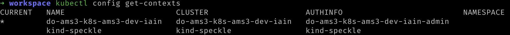
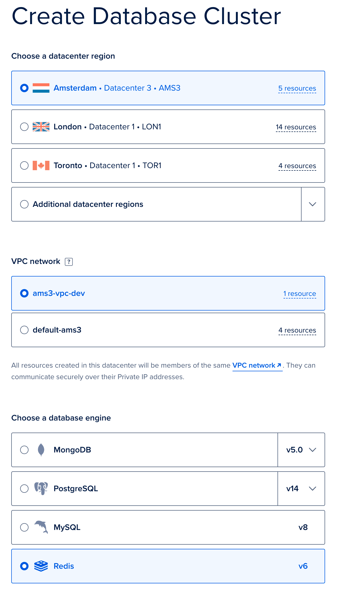
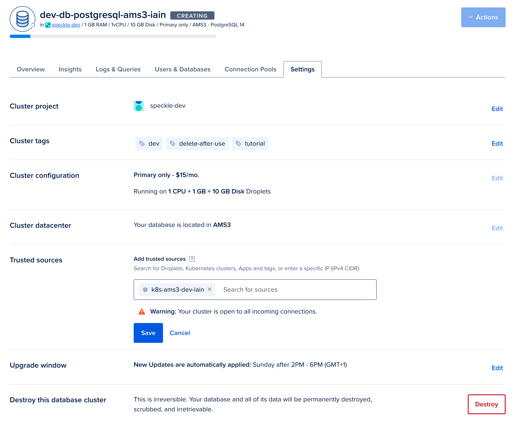
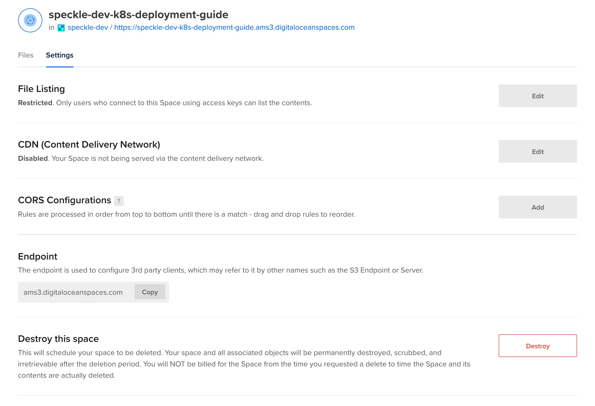
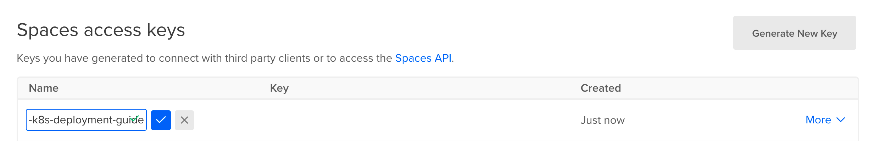

# Deploying a Server - Kubernetes

To ease new deployments, we are maintaining [a Kubernetes Helm chart](https://specklesystems.github.io/helm/).

::: tip IMPORTANT
This setup is not recommended for use as-is in production for a few reasons, namely:

- application level updates: we tend to move quite fast, and if things get busy, blink twice and you’re on an outdated server. This has security implications too.
- database backups: again this is up to you mostly on what’s your risk appetite when it comes to dealing with live data. We’re a bit more on the paranoid side, so we’ve set up replication, failover nodes and PITR.
- automatic scalability: for example, the preview service can be quite a monster; that setup can eat up all a vm’s resources, and starve other processes causing general system wide instability. Cloud providers can provide horizontal VM auto-scaling and Kubernetes can provide horizontal pod auto-scaling but these are not discussed in this guide.
- monitoring: this setup does not describe integrations for telemetry, metrics, tracing, or logging. Nor does it describe alerting or response actions.
- firewall and network hardening: running in production requires additional security hardening measures, particularly protecting the network from intrusion or data exfiltration.

If you need help deploying a production server, [we can help](https://speckle.systems/getstarted/)!
:::

## Prerequisites

- [Required] A [DigitalOcean](https://www.digitalocean.com/) account. Please note that this guide will create resources which may incur a charge on DigitalOcean.
- [Required][helm](https://helm.sh/docs/intro/install/) installed
- [Required][kubectl](https://kubernetes.io/docs/tasks/tools/#kubectl) installed
- [Optional] A domain name (to use https encryption)
- [Optional] An email service provider account of your choice (to allow the server to send emails)
- [Optional] An authentication service of your choice (to allow the server to authenticate users)
- [Optional] The [DigitalOcean client, `doctl`](https://docs.digitalocean.com/reference/doctl/how-to/install/), installed on your local machine

## Step 1: Create the kubernetes cluster

Speckle requires a Postgres database to function, you can provide your own if you have an existing database or follow the following steps to create a new one in DigitalOcean.

- Go to your DigitalOcean dashboard and [create a new Kubernetes cluster](https://cloud.digitalocean.com/kubernetes/clusters/new).  We provided the cluster a name, but otherwise left configuration as per DigitalOcean's recommended defaults. When prompted to select the node count and size, we selected the default of three nodes. Each node with the default 2 vcpu and 4Gb (`s-2vcpu-4gb`). Your usage may vary, and we recommend testing under your typical loads and adjusting by deploying new node-pools.
  

- Configure other options for your Kubernetes cluster and click the `Create Cluster` button. After the cluster is created and initialized, you should see it in your list of kubernetes clusters:
  

- To log into the cluster, follow the getting started guide on the DigitalOcean dashboard for your cluster.  We recommend the automated option of updating your local Kubernetes configuration (kubeconfig) using the [DigitalOcean client, `doctl`](https://docs.digitalocean.com/reference/doctl/how-to/install/).
  

- After downloading the kubernetes config, you can verify that your kubernetes client has found it by running the following command.  A list of kubernetes clusters will be printed, your cluster context should have the prefix `do-`. Make a note of the name, you will use this in place of `YOUR_CLUSTER_CONTEXT_NAME` in following steps of this guide.
 ```shell
 kubectl config get-contexts
 ```
   

- Verify that you can connect to the cluster using kubectl by running the following command to show the nodes you have provisioned. Remember to replace `YOUR_CLUSTER_CONTEXT_NAME` with the name of your cluster.

 ```shell
 kubectl get nodes --context YOUR_CLUSTER_CONTEXT_NAME 
 ```
 
 - You should see something like the following:
  

## Step 2 (optional): Deploy dependent external services

If you already have Redis, Postgres, and Blob storage available, you can skip this step.  You will need the connection details in following steps.

### Step 2a (optional): Configure Redis

Speckle requires a Redis database to function. You can provide your own if you have an existing database. Otherwise, follow the following steps to create a new Redis database in DigitalOcean.

- We will deploy a managed Redis provided by DigitalOcean. Go to the [new Database creation page](https://cloud.digitalocean.com/databases/new). Firstly, select the same region and VPC as you used when deploying your Kubernetes cluster, and select Redis.  Provide a name, and click `Create Database Cluster`.
  Again we used the default sizes, but your usage will vary and we recommend testing under your typical loads and adjusting by the database size as necessary.
  

- From the overview, click on `Secure this database cluster by restricting access.`.  This will take you to the Trusted Sources panel in the Settings tab. Here we will improve the security of your database by only allowing connections from your Kubernetes cluster.  Type the name of your Kubernetes cluster and add it as a Trusted Source.
  

- In the Overview tab for your Redis database. Select `connection string` from the dropdown, and copy the displayed Connection String. You will require this for Step 3.
  
### Step 2b (optional): Configure Postgres

Speckle requires a Postgres database to function. You can provide your own if you have an existing database. Otherwise, follow the following steps to create a new Postgres database in DigitalOcean.

- We will now deploy a managed Postgres provided by DigitalOcean. Go to the [new Database creation page](https://cloud.digitalocean.com/databases/new). Firstly, select the same region and VPC as you used when deploying your Kubernetes cluster, and then select Postgres.  Provide a name, and click `Create Database Cluster`.
  Again we used the default sizes, but your usage will vary and we recommend testing under your typical loads and adjusting by the database size as necessary.
  

- From the overview, click on `Secure this database cluster by restricting access.`.  This will take you to the Trusted Sources panel in the Settings tab. Here we will improve the security of your database by only allowing connections from your Kubernetes cluster.  Type the name of your Kubernetes cluster and add it as a Trusted Source.
  

- In the Overview tab for your Redis database. Select `connection string` from the dropdown, and copy the displayed Connection String. You will require this for Step 3.
  
### Step 2c (optional): Configure blob storage (DigitalOcean spaces)
Speckle requires blob storage to save files and other similar data.   You can provide your own if you have an existing blob storage which is compatible with the [Amazon S3 API](https://docs.aws.amazon.com/AmazonS3/latest/API/Welcome.html). Otherwise follow the following steps to create a new S3-compatible blob storage on DigitalOcean.

- Navigate to the [Create a Space page](https://cloud.digitalocean.com/spaces/new).  Please select a region of your choice, we recommend the same region as you have deployed the cluster.  We did not enable the CDN and we restricted the file listing for security purposes.  Please provide a name for your Space, this has to be unique in the region so please use a different name than our example. Make a note of this name, this is the `bucket` value which we will require in a later step. Click on `Create Space`.
  

- Once created, click on the `Settings` tab and copy the `Endpoint` value.
  

- Now navigate to the [API page](https://cloud.digitalocean.com/account/api/tokens) in DigitalOcean.  Next to the `Spaces access keys` heading, click `Generate New Key`.  You will only be able to see the Secret value once, so copy the name, the key and the secret and store this securely.
  
## Step 3: Deploy dependencies to Kubernetes
### Step 3a: Create Secrets
- Create a secret in your Kubernetes Cluster in the `speckle-test` namespace.  Replace all the items starting with `YOUR_`... with the appropriate value.
 ```shell
 kubectl create secret generic server-vars \
  --context YOUR_CLUSTER_CONTEXT_NAME
  --namespace speckle-test \
  --from-literal=redis_url=YOUR_REDIS_CONNECTION_STRING \
  --from-literal=postgres_url=YOUR_POSTGRES_CONNECTION_STRING \
  --from-literal=s3_secret_key=YOUR_SPACES_SECRET \
 ```
  

- Priority Classes #TODO
  

- CertManager (optional) #TODO
  

- Ingress (optional) #TODO
  

## Step 3: Configure your deployment

- [Download the `values.yaml` file from the Helm chart repository](https://raw.githubusercontent.com/specklesystems/helm/main/charts/speckle-server/values.yaml) and save it to a directory on your local machine, we will be editing and using this file in the following steps.

- Fill in the requested fields and save the file:
  - `Domain name` (optional, but providing a domain name will use HTTPS to encrypt your data when you send/receive from your Speckle Server)
  - `Enable emails` + email provider details (optional, but enabling emails will enable extra features like sending invites)
  - If you entered a domain name, you will also configure the LetsEncrypt tool that generates HTTPS certificates and keeps them up to date (you should enter your email to receive important notifications about the certificates)

## Step 4: Deploy Speckle to Kubernetes

- Run the following command to add the Speckle Helm repository

```shell
helm repo add speckle https://specklesystems.github.io/helm
```

- You should see something like this:
  

- Run the following command to deploy the Helm chart to your Kubernetes cluster configured with the values you configured in the prior step.  Replace `YOUR_CLUSTER_CONTEXT_NAME` with the name of your cluster.

```shell
helm install my-speckle-server speckle/speckle-server --values values.yaml --kube-context YOUR_CLUSTER_CONTEXT_NAME
```

- After configuration is done, you should see this success message:
  

- Verify the helm chart was successful by checking its status on the cluster. Replace `YOUR_CLUSTER_CONTEXT_NAME` with the name of your cluster.:

```shell
helm list --all-namespaces --kube-context YOUR_CLUSTER_CONTEXT_NAME
```

- You should see something similar to the following:
  

- For more information about the release, including it's current Status, run the following command. Replace `YOUR_CLUSTER_CONTEXT_NAME` with the name of your cluster.:

```shell
helm get all my-speckle-server --all-namespaces --kube-context YOUR_CLUSTER_CONTEXT_NAME
```

- You should see something similar to the following:
  

## Step 5: Create an account on your Server

- (optional) You may need to wait a short period of time while the loadbalancer and certificate for the ingress is generated by DigitalOcean.  While you are waiting you can access the cluster via the kubernetes client, using the following command. Replace `YOUR_CLUSTER_CONTEXT_NAME` with the name of your cluster.:

```shell
kubectl port-forward service/speckle-server --namespace speckle-test --context YOUR_CLUSTER_CONTEXT_NAME 3000:3000
```

You should now be able to access the cluster at `http://localhost:3000`. To stop the port-forward, press `ctrl + c` in your shell.

After you configure the server, you should open the url in your browser and `Register` a first user. The first user that registers will be the administrator account for that server.


## That's it

You have deployed a Speckle Server on Kubernetes that you have full control over.

To reconfigure the server, you can run this command:

```shell
helm install my-speckle-server speckle/speckle-server --values values.yaml
```

If you encounter any issue, have any question or just want to say hi, reach out in [our forum](https://speckle.community/).
