# Deploying a Server - Kubernetes

To ease new deployments, we are maintaining [a Kubernetes Helm chart](https://specklesystems.github.io/helm/).

::: tip IMPORTANT
This setup is not recommended for use as-is in production for a few reasons, namely:

- application level updates: we tend to move quite fast, and if things get busy, blink twice and you’re on an outdated server. This has security implications too.
- database backups: again this is up to you mostly on what’s your risk appetite when it comes to dealing with live data. We’re a bit more on the paranoid side, so we’ve set up replication, failover nodes and PITR.
- automatic scalability: for example, the preview service can be quite a monster; that setup can eat up all a vm’s resources, and starve other processes causing general system wide instability. Cloud providers can provide horizontal VM auto-scaling and Kubernetes can provide horizontal pod auto-scaling but these are not discussed in this guide.
- monitoring: this setup does not describe integrations for telemetry, metrics, tracing, or logging. Nor does it describe alerting or response actions.
- firewall and network hardening: running in production requires additional security hardening measures, particularly protecting the network from intrusion or data exfiltration.

If you need help deploying a production server, [we can help](https://speckle.systems/getstarted/)!
:::

## Prerequisites

- [Required] A [DigitalOcean](https://www.digitalocean.com/) account. Please note that this guide will create resources which may incur a charge on DigitalOcean.
- [Required] [Helm CLI](https://helm.sh/docs/intro/install/) installed.
- [Required] [Kubernetes CLI client](https://kubernetes.io/docs/tasks/tools/#kubectl) installed.
- [Required] A domain name, or a sub-domain to which a DNS A Record can be added.
- [Optional] An email service provider account of your choice (to allow the server to send emails)
- [Optional] An authentication service of your choice (to allow the server to authenticate users), otherwise username & password authentication will be used.
- [Optional] The [DigitalOcean CLI client](https://docs.digitalocean.com/reference/doctl/how-to/install/) installed.

## Step 1: Create the kubernetes cluster

- Go to your DigitalOcean dashboard and [create a new Kubernetes cluster](https://cloud.digitalocean.com/kubernetes/clusters/new).  We provided the cluster a name, but otherwise left configuration as per DigitalOcean's recommended defaults. When prompted to select the node count and size, we selected four nodes. Each node has the default 2 vcpu and 4Gb (`s-2vcpu-4gb`).  While this is a minimum, your usage may vary and we recommend testing under your typical loads and adjusting by deploying new nodes or larger sized machines in new node-pools.
  

- Configure other options for your Kubernetes cluster and click the `Create Cluster` button. After the cluster is created and initialized, you should see it in your list of kubernetes clusters:
  

- To log into the cluster, follow the getting started guide on the DigitalOcean dashboard for your cluster.  We recommend the automated option of updating your local Kubernetes configuration (kubeconfig) using the [DigitalOcean client, `doctl`](https://docs.digitalocean.com/reference/doctl/how-to/install/).
  

- After downloading the kubernetes config, you can verify that your kubernetes client has the cluster configuration by running the following command.  A list of kubernetes clusters will be printed, your cluster context should have the prefix `do-`. Make a note of the name, you will use this in place of `YOUR_CLUSTER_CONTEXT_NAME` in following steps of this guide.
 ```shell
 kubectl config get-contexts
 ```
   

- Verify that you can connect to the cluster using kubectl by running the following command to show the nodes you have provisioned. Remember to replace `YOUR_CLUSTER_CONTEXT_NAME` with the name of your cluster.

 ```shell
 kubectl get nodes --context YOUR_CLUSTER_CONTEXT_NAME 
 ```
 
 - You should see something like the following:
  

## Step 2 (optional): Deploy dependent external services

If you already have Redis, Postgres, and Blob storage available, you can skip this step.  You will need the connection details for these services when configuring your deployment in [step 4](#step-4-configure-your-deployment).

### Step 2.a (optional): Configure Redis

Speckle requires a Redis database to function. You can provide your own if you have an existing database. Otherwise, follow the following steps to create a new Redis database in DigitalOcean.

- We will deploy a managed Redis provided by DigitalOcean. Go to the [new Database creation page](https://cloud.digitalocean.com/databases/new). Firstly, select the same region and VPC as you used when deploying your Kubernetes cluster, and select Redis.  Provide a name, and click `Create Database Cluster`.
  Again we used the default sizes, but your usage will vary and we recommend testing under your typical loads and adjusting by the database size as necessary.
  

- From the overview, click on `Secure this database cluster by restricting access.`.  This will take you to the Trusted Sources panel in the Settings tab. Here we will improve the security of your database by only allowing connections from your Kubernetes cluster.  Type the name of your Kubernetes cluster and add it as a Trusted Source.
  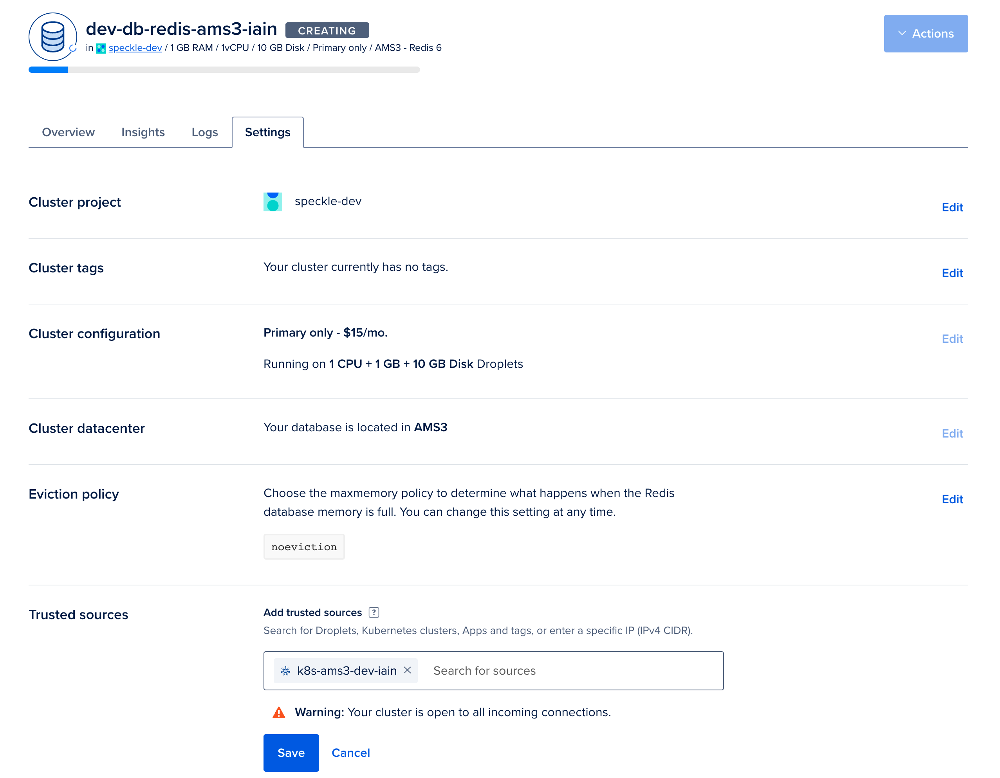

- In the Overview tab for your Redis database. Select `connection string` from the dropdown, and copy the displayed Connection String. You will require this when configuring your deployment in [step 4](#step-4-configure-your-deployment).
  
### Step 2.b (optional): Configure Postgres

Speckle requires a Postgres database to function. You can provide your own if you have an existing database. Otherwise, follow the following steps to create a new Postgres database in DigitalOcean.

- We will now deploy a managed Postgres provided by DigitalOcean. Go to the [new Database creation page](https://cloud.digitalocean.com/databases/new). Firstly, select the same region and VPC as you used when deploying your Kubernetes cluster, and then select Postgres.  Provide a name, and click `Create Database Cluster`.
  Again we used the default sizes, but your usage will vary and we recommend testing under your typical loads and adjusting by the database size as necessary.
  
  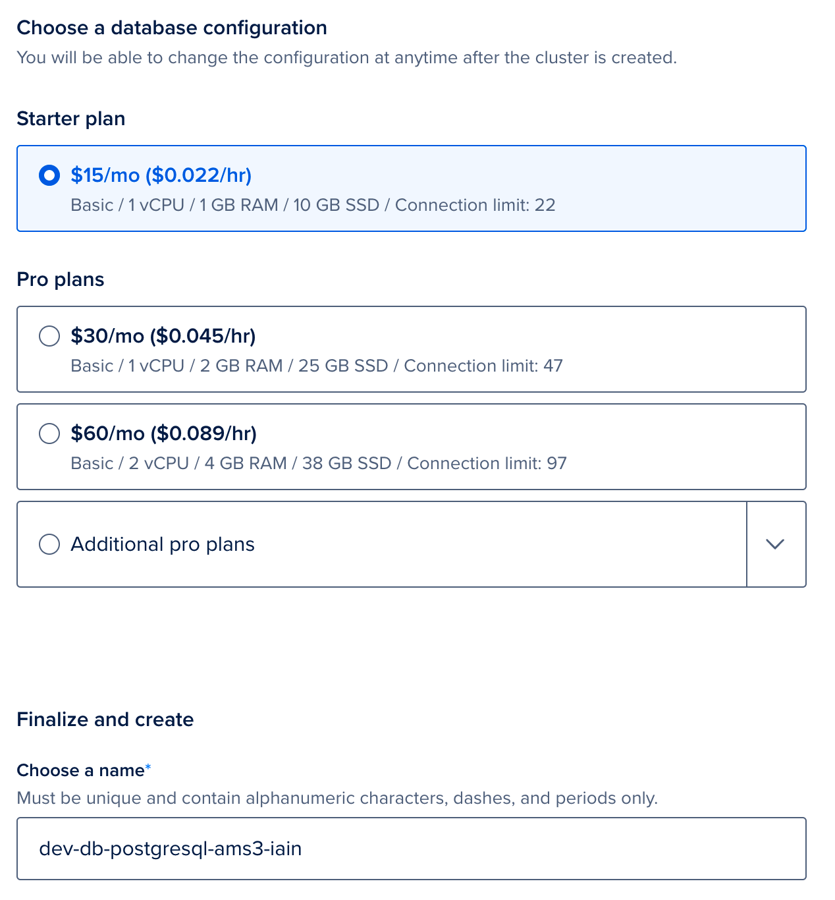

- From the overview page for your Postgres database, click on `Secure this database cluster by restricting access`.  This will take you to the Trusted Sources panel in the Settings tab. Here we will improve the security of your database by only allowing connections from your Kubernetes cluster.  Type the name of your Kubernetes cluster and add it as a Trusted Source.
  

- In the Overview tab for your Redis database. Select `connection string` from the dropdown, and copy the displayed Connection String. You will require this for when configuring your deployment in [step 4](#step-4-configure-your-deployment).
  
### Step 2.c (optional): Configure blob storage (DigitalOcean spaces)
Speckle requires blob storage to save files and other similar data.   You can provide your own if you have an existing blob storage which is compatible with the [Amazon S3 API](https://docs.aws.amazon.com/AmazonS3/latest/API/Welcome.html). Otherwise follow the following steps to create a new S3-compatible blob storage on DigitalOcean.

- Navigate to the [Create a Space page](https://cloud.digitalocean.com/spaces/new).  Please select a region of your choice, we recommend the same region as you have deployed the cluster.  We did not enable the CDN and we restricted the file listing for security purposes.  Please provide a name for your Space, this has to be unique in the region so please use a different name than our example. Make a note of this name, this is the `bucket` value which we will require when configuring your deployment in [step 4](#step-4-configure-your-deployment). Click on `Create Space`.
  

- Once created, click on the `Settings` tab and copy the `Endpoint` value.
  

- Now navigate to the [API page](https://cloud.digitalocean.com/account/api/tokens) in DigitalOcean.  Next to the `Spaces access keys` heading, click `Generate New Key`.  You will only be able to see the Secret value once, so copy the name, the key and the secret and store this securely.
  
## Step 3: Deploy dependencies to Kubernetes
### Step 3.a: Create a namespace
- Kubernetes allows applications to be separated into different namespaces.  We can create a namespace in our Kubernetes cluster with the following:
```shell
kubectl create namespace speckle --context YOUR_CLUSTER_CONTEXT_NAME
```
  

- Verify that the namespace was created by running the following command. You should see a list of namespaces, including `speckle`.  The other existing namespaces were created by Kubernetes and are required for Kubernetes to run.
```shell
kubectl get namespace --context YOUR_CLUSTER_CONTEXT_NAME
```
  

### Step 3.b: Create Secrets
- To securely store the connection details of Speckle's dependencies, we will create a secret in the Kubernetes Cluster in the `speckle` namespace.  Replace all the items starting with `YOUR_`... with the appropriate value. `YOUR_SECRET` should be replaced with a value unique to this cluster, we recommend creating a random value of at least 10 characters long.

 ```shell
 kubectl create secret generic server-vars \
  --context YOUR_CLUSTER_CONTEXT_NAME \
  --namespace speckle \
  --from-literal=redis_url="YOUR_REDIS_CONNECTION_STRING" \
  --from-literal=postgres_url="YOUR_POSTGRES_CONNECTION_STRING" \
  --from-literal=s3_secret_key="YOUR_SPACES_SECRET" \
  --from-literal=session_secret="YOUR_SECRET" \
  --from-literal=email_password="YOUR_EMAIL_SERVER_PASSWORD" # optional, only required if you wish to enable email invitations
 ```

- You can verify that your secret was created correctly by running:

  ```shell
  kubectl describe secret server-vars --namespace speckle --context YOUR_CLUSTER_CONTEXT_NAME
  ```
  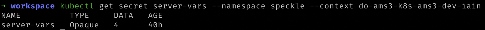

- To view the contents of an individual secret, you can run the following replacing `redis_url` with the key you require:

```shell
kubectl get secret server-vars --context YOUR_CLUSTER_CONTEXT_NAME \
  --namespace speckle \
  --output jsonpath='{.data.redis_url}' | base64 --decode
```

- Should you need to amend any values after creating the secret, use the following command. More information about working with secrets can be found on the [Kubernetes website](https://kubernetes.io/docs/concepts/configuration/secret/#editing-a-secret).

  ```shell
  kubectl edit secrets server-vars --namespace speckle --context YOUR_CLUSTER_CONTEXT_NAME
  ```

### 3.c: Priority Classes

If Kubernetes ever begins to run out of resources (such as processor or memory) on a node then Kubernetes will have to terminate some of the processes.  Kubernetes decides which processes will be terminated based on their priority.  Here we will tell Kubernetes which priority that Speckle will have.

- Run the following command:
  ```shell
  cat <<'EOF' | kubectl create --context YOUR_CLUSTER_CONTEXT_NAME --namespace speckle --filename -
  apiVersion: scheduling.k8s.io/v1
  kind: PriorityClass
  metadata:
    name: high-priority
  value: 100
  globalDefault: false
  description: "High priority (100) for business-critical services"
  ---
  apiVersion: scheduling.k8s.io/v1
  kind: PriorityClass
  metadata:
    name: medium-priority
  value: 50
  globalDefault: true
  description: "Medium priority (50) - dev/test services"
  ---
  apiVersion: scheduling.k8s.io/v1
  kind: PriorityClass
  metadata:
    name: low-priority
  value: -100
  globalDefault: false
  description: "Low priority (-100) - Non-critical microservices"
  EOF
  ```
  

### 3.d: Certificate Manager

To allow secure (https) access to your Speckle server from the internet, we have to provide a means of creating a TLS (X.509) certificate.  This certificate will have to be renewed and kept up to date. To automate this, we will install CertManager and connect it to a Certificate Authority. CertManager will create a new certificate, request the Certificate Authority signs it and any renewals when required.  The Certificate Authority in our case will be [Let's Encrypt](https://letsencrypt.org/).  If you are interested, you can read more about how Let's Encrypt knows to trust your server with an [HTTP-01 challenge](https://letsencrypt.org/docs/challenge-types/#http-01-challenge), in our case CertManager acts as the ACME client.

- We first need to let Helm know where CertManager can be found:
```shell
helm repo add jetstack https://charts.jetstack.io
```
  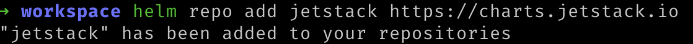

- Then update Helm so it knows what the newly added repo contains
```shell
helm repo update
```

- Deploy the CertManager Helm release in a new namespace
```shell
helm upgrade cert-manager jetstack/cert-manager --namespace cert-manager --version v1.8.0 --set installCRDs=true --install --create-namespace --kube-context YOUR_CLUSTER_CONTEXT_NAME
```
  

- We can verify that this deployed to Kubernetes with the following command:
```shell
kubectl get pods --namespace cert-manager --context YOUR_CLUSTER_CONTEXT_NAME
```
  

- We now need to tell CertManager which Certificate Authority should be issuing the certificate. We will deploy a CertIssuer. Run the following command, replacing `YOUR_EMAIL_ADDRESS` and `YOUR_CLUSTER_CONTEXT_NAME` with the appropriate values.  Please note that this targets the staging issuer of letsencrypt, which is recommended when testing a new system.  A production system will need to target the server, `https://acme-staging-v02.api.letsencrypt.org/directory`.
```shell
cat <<'EOF' | kubectl create --context YOUR_CLUSTER_CONTEXT_NAME --namespace cert-manager --filename -
apiVersion: cert-manager.io/v1
kind: ClusterIssuer
metadata:
 name: letsencrypt-staging # For production, rename to letsencrypt-prod
spec:
 acme:
   # The ACME server URL
   # For production, change the below value to https://acme-staging-v02.api.letsencrypt.org/directory
   server: https://acme-staging-v02.api.letsencrypt.org/directory
   # Email address used for ACME registration
   email: YOUR_EMAIL_ADDRESS
   # Name of a secret used to store the ACME account private key
   privateKeySecretRef:
     name: letsencrypt-staging
   # Enable the HTTP-01 challenge provider
   solvers:
   - http01:
       ingress:
         class:  nginx
EOF
```
  

- We can verify that this worked by running the following command. Within the response it should state that the message was "_The ACME account was registered with the ACME server_".
```shell
kubectl describe clusterissuer.cert-manager.io/letsencrypt-staging \
 --namespace cert-manager --context YOUR_CLUSTER_CONTEXT_NAME
```
  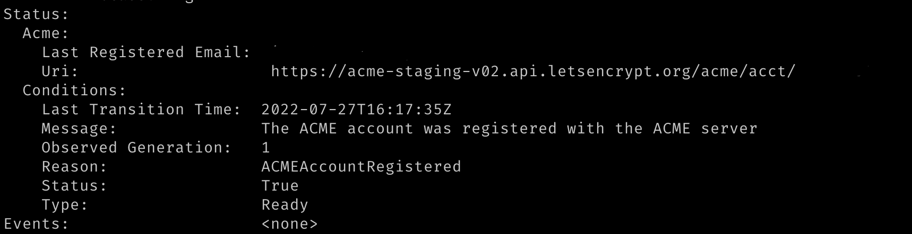
### 3.e: Ingress

To allow access from the internet to your kubernetes cluster, Speckle will deploy a [Kubernetes Ingress](https://kubernetes.io/docs/concepts/services-networking/ingress/) which defines how that external traffic should be managed.  The component that manages the traffic per Speckle's ingress definition is known as an Ingress Controller.  In this step we will deploy our Ingress Controller, [NGINX](https://www.nginx.com/).

- We first let Helm know where NGINX ingress can be found:
```shell
helm repo add ingress-nginx https://kubernetes.github.io/ingress-nginx
```
  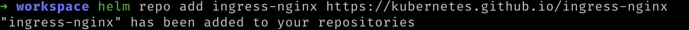

- Then update Helm so that it can discover what the newly added repo contains:
```shell
helm repo update
```
  

- Now we can deploy NGINX to our kubernetes cluster. The additional annotation allows CertManager, deployed in the [previous step](#3d-certificate-manager), to advise NGINX as to the certificate to use for https connections.
  ```shell
  helm upgrade ingress-nginx ingress-nginx/ingress-nginx \
    --install --create-namespace \
    --set-string controller.podAnnotations."acme\.cert-manager\.io/http01-edit-in-place"=true \
    --namespace ingress-nginx \
    --kube-context YOUR_CLUSTER_CONTEXT_NAME
  ```
  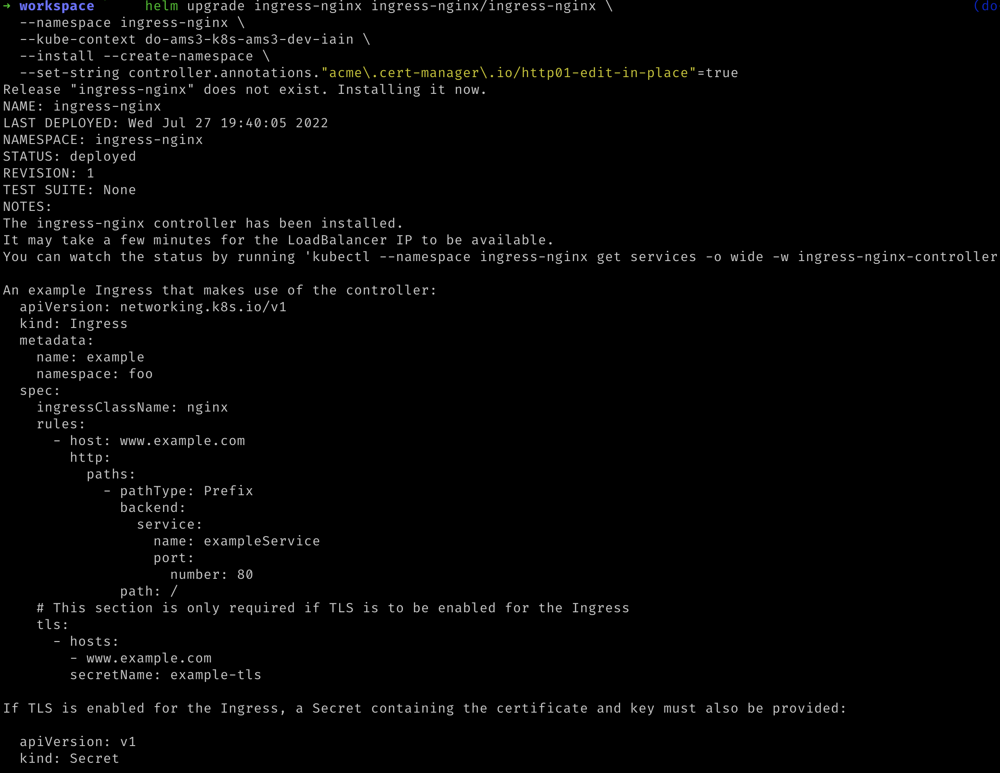

- We can ignore the instructions printed out by the NGINX Helm chart as the required resources will be provided by the Speckle Helm chart.

## Step 4: Configure your deployment

- [Download the `values.yaml` file from the Helm chart repository](https://raw.githubusercontent.com/specklesystems/helm/main/charts/speckle-server/values.yaml) and save it as `values.yaml` to the current directory on your local machine. We will be editing and using this file in the following steps.

- Fill in the requested fields and save the file:
  - `namespace`: required, we are using `speckle` in this guide so change this value
  - `domain`: required, this is the domain name at which your Speckle server will be available.
  - `server.email`: optional, enabling emails will enable extra features like sending invites.  This requires the `email_password` secret to have been set in [Step 3](#step-3b-create-secrets).
  - `db.useCertificate`: required, this should be set to true and will force Speckle to use the certificate for Postgres we shall provide in `db.certificate`.
  - `db.certificate`: required, this can be found by clicking `Download CA certificate` in your database's overview page on DigitalOcean.  You can find your Postgres database by selecting it from the [Database page on DigitalOcean](https://cloud.digitalocean.com/databases).  When entering the data, please be careful with indentation.  We recommend reading [Helm's guide on formatting multiline strings](https://helm.sh/docs/chart_template_guide/yaml_techniques/#strings-in-yaml).
  - `s3.endpoint`: required, the endpoint can be found in the Settings Page of your DigitalOcean Space.  You can find your Space by selecting it from the [Spaces page on DigitalOcean](https://cloud.digitalocean.com/spaces?i=b49c54).  This value must be prepended with `https://`.
  - `s3.bucket`: required, this is the name of your DigitalOcean space.
  - `s3.access_key`: required, this is the `Key` of your Spaces API key.  You can find this by viewing it from the [Spaces API Key page on DigitalOcean](https://cloud.digitalocean.com/account/api/tokens)
  - `s3.auth.local.enabled`: this is enabled by default.  This requires users to register on your Speckle cluster with a username and password.  If you wish to use a different authorization provider, such as Azure AD, Github, or Google, then set this value to `false`, and amend the relevant section below by enabling that and providing the relevant details where necessary.
  - `cert_manager_issuer`: optional, the default is set for Let's Encrypt staging api.  For production, change the value to `letsencrypt-prod` and amend the ClusterIssuer in [Step 3.d](#3d-certificate-manager).

The remaining values can be left as their defaults.

## Step 5: Deploy Speckle to Kubernetes

- Run the following command to let your Helm know about the Speckle Helm repository

```shell
helm repo add speckle https://specklesystems.github.io/helm
```

- You should see something like this:
  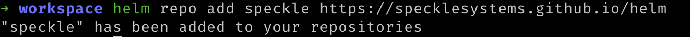

- Then update Helm so it knows what the newly added repository contains:
```shell
helm repo update
```
  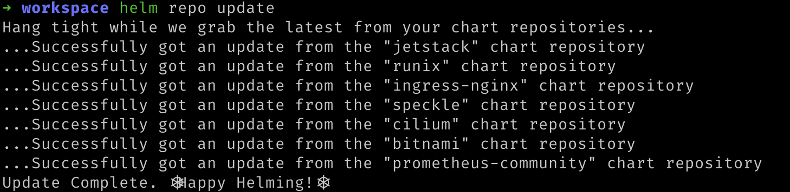

- Run the following command to deploy the Helm chart to your Kubernetes cluster configured with the values you configured in the [prior step](#step-4-configure-your-deployment).  Replace `YOUR_CLUSTER_CONTEXT_NAME` with the name of your cluster.

```shell
helm upgrade my-speckle-server speckle/speckle-server \
 --values values.yaml \
 --namespace speckle \
 --install --create-namespace \
 --kube-context YOUR_CLUSTER_CONTEXT_NAME
```

- After configuration is done, you should see this success message:
  

- Verify all of the deployed Helm charts were successful by checking their deployed status. Replace `YOUR_CLUSTER_CONTEXT_NAME` with the name of your cluster.:

```shell
helm list --all-namespaces --kube-context YOUR_CLUSTER_CONTEXT_NAME
```

- You should see something similar to the following:
  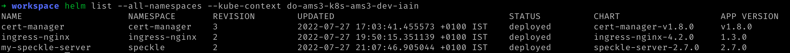

## Step 6: Update your domain
Initially accessing Speckle may take some time as DigitalOcean has to create a load balancer and Let's Encrypt sign the Certificate. The DigitalOcean load balancer was automatically requested from the Infrastructure provider (DigitalOcean) by the Ingress controller we deployed earlier.  You can see the progress of the load balancer's deployment on the [Networking page](https://cloud.digitalocean.com/networking/load_balancers) of your DigitalOcean dashboard.

- Once the load balancer has finished creating DigitalOcean will display an externally-accessible IP address for it.  Please make a note of the IP address.
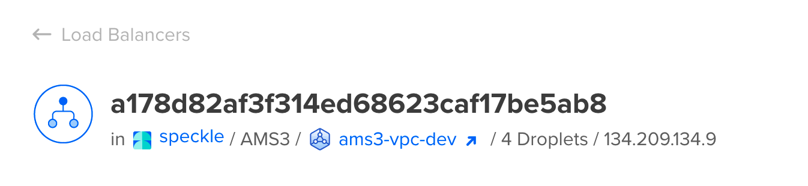

- Navigate to your domain registrar's website for your domain name and add a DNS A record. This will allow web browser's to resolve your domain name to the IP of the load balancer.  The domain must match the domain name provided to Speckle in the `values.yaml` file you edited previously.  If DigitalOcean manages your Domain Names, adding a DNS A record using [DigitalOcean's Domain page(https://cloud.digitalocean.com/networking/domains) will look something like the following:


- It may take a moment for the domain name and A Record to be propogated to all relevant DNS servers, and then for Let's Encrypt to be able to reach your domain and generate a certificate.  Please be patient while this is updated.

## Step 7: Create an account on your Server

You should be able to now visit your domain name and see the same Speckle welcome page.

Finally, you should now register the first user. The first user that registers will be the administrator account for that server.


## That's it

You have deployed a Speckle Server on Kubernetes that you have full control over.

To reconfigure the server, you can change the values in values.yaml, and run this command:

```shell
helm upgrade my-speckle-server --values values.yaml --kube-context YOUR_CLUSTER_CONTEXT_NAME
```

## Common Issues

### Untrusted Certificate

Your browser may not trust the certificate generated by Let's Encrypt's staging API.  In Google's Chrome browser, the warning will appear as follows:


You can verify that the certificate was generated correctly by inspecting the Certificate's Issuing Authority. If the Certificate was correctly generated, the root certificate should be one of either `(STAGING) Pretend Pear X1` and/or `(STAGING) Bogus Broccoli X2`.  Click the `Not Secure` warning next to the address bar, then click `Certificate is not valid` for more details.


In this case, our deployment is correct but our browser rightly does not trust Let's Encrypt's staging environment. To resolve this issue, we recommend amending the Certificate to a production certificate.  Please refer to [Step 3.c](#3d-certificate-manager) and [Step 4](#step-4-configure-your-deployment) for notes on how to amend your Speckle deployment to use Let's Encrypt's Production environment.

More information about Let's Encrypt's Staging Environment can be found on [Let's Encrypt's website](https://letsencrypt.org/docs/staging-environment/#root-certificates).

### Other Issues

If you encounter any other issue, have any question or just want to say hi, reach out in [our forum](https://speckle.community/).
