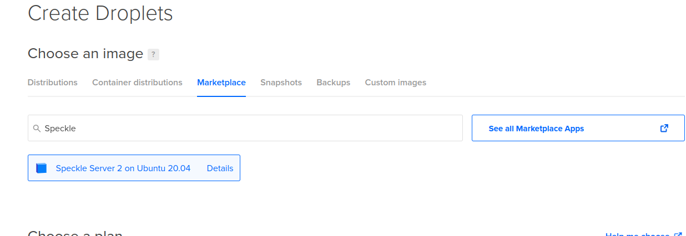
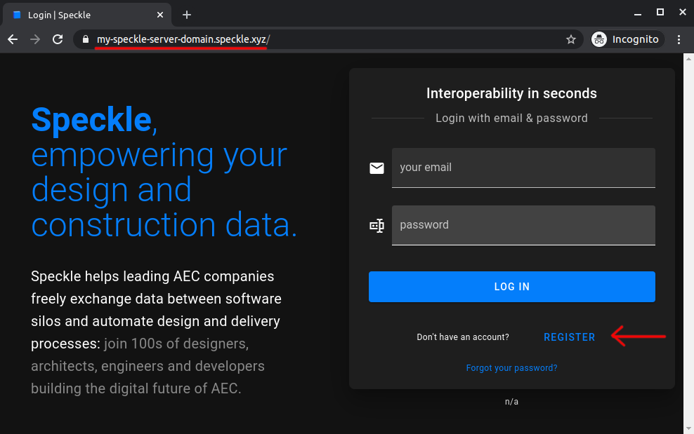

# Deploying a Server - DigitalOcean Marketplace App

To ease new deployments, we are maintaining [an app on the DigitalOcean Marketplace](https://marketplace.digitalocean.com/apps/speckle-server?refcode=947a2b5d7dc1).

::: tip IMPORTANT
This setup is not recommended for use in production for a few reasons, namely:

- application level updates: we tend to move quite fast, and if things get busy, blink twice and you’re on an outdated server. this has security implications too.
- guaranteed uptime: from our experience, vm’s tend to restart now and then (they need updates and reboots too), which results in downtime.
- database backups - again this is up to you mostly on what’s your risk appetite when it comes to dealing with live data. We’re a bit more on the paranoid side, so we’ve set up replication, failover nodes and PITR.
- automatic scalability: for example, the preview service can be quite a monster; that setup can eat up all a vm’s resources, and starve other processes causing general system wide instability.

If you need help deploying a production server, [we can help](https://speckle.systems/getstarted/)!
:::

## Prerequisites

- [Required] A [DigitalOcean](https://www.digitalocean.com/) account
- [Optional] A domain name (to use https encryption)
- [Optional] An email service provider account of your choice (to allow the server to send emails)

## Step 1: Create the Droplet

- Go to your DigitalOcean dashboard and create a new Droplet:


- When prompted to select the image for the droplet, go to `Marketplace` and look for the `Speckle Server` app:


- Configure other options for your droplet, make sure to set up an authentication method, and click the `Create Droplet` button. After the droplet is created and initialized, you should see it in your list of droplets:


## Step 2: Configure Your Server

- Login with `ssh` into the droplet to configure it. When you log in you should see the following greeting, prompting you to enter the configuration values:


- Fill in the requested fields:
  - `Domain name` (optional, but providing a domain name will use HTTPS to encrypt your data when you send/receive from your Speckle Server)
  - `Enable emails` + email provider details (optional, but enabling emails will enable extra features like sending invites)
  - If you entered a domain name, you will also configure the LetsEncrypt tool that generates HTTPS certificates and keeps them up to date (you should enter your email to receive important notifications about the certificates)

- You should see something like this:


- After configuration is done, you should see this success message:


## Step 3: Create an Account on Your Server

After you configure the server, you should open the url in your browser and `Register` a first user. The first user that registers will be the administrator account for that server.


## That's It

You have deployed a Speckle Server that you have full control over.

To reconfigure the server, you can run this ssh command:

    ```shell
    /opt/speckle-server/setup.py
    ```

If you encounter any issue, have any question or just want to say hi, reach out in [our forum](https://speckle.community/).
