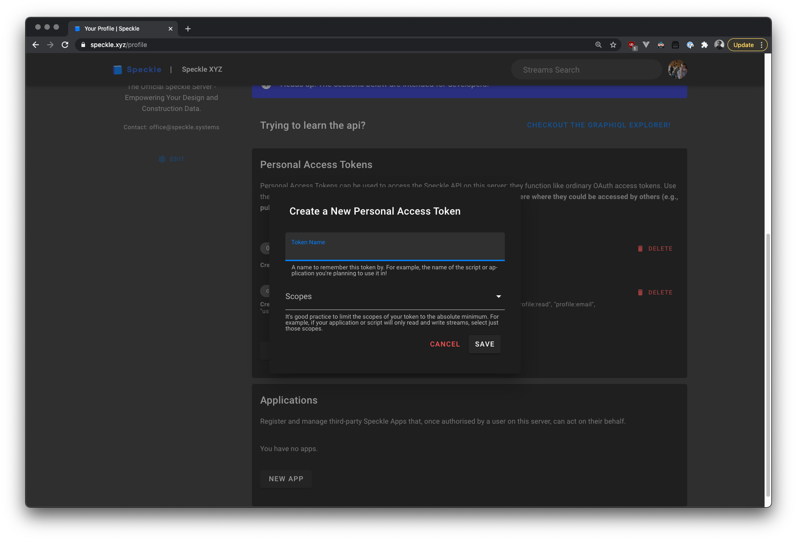
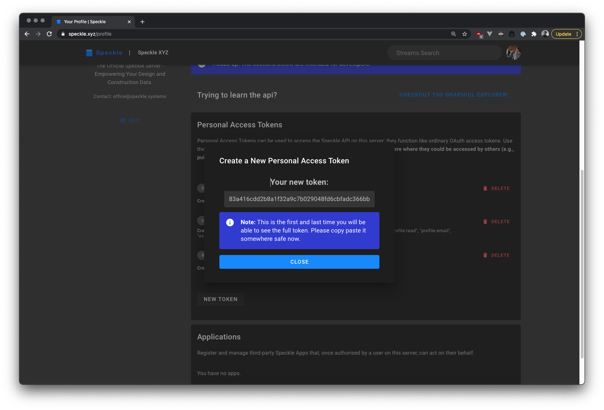

<Banner />

# Personal Access Tokens 

Personal Access Tokens can be used to access the Speckle API. They function like ordinary OAuth access tokens, and they enable a script, an app, or any other piece of code to **act on your behalf**.

This means that with a token, an app or script is able to:
- read any streams you have access to
- create streams on your behalf
- share those streams with other users
- create commits against a stream you have write access to
- read the profile (public information) of other users.

:::warning Security advisory

Treat any personal access tokens like a password: do not post them anywhere where they could be accessed by others (e.g., public repos).

:::

## Creating a Token

First, you need to login and go to your profile (/profile). Just under "Your Apps" section, you will see a list of all the personal access tokens that you have created so far, and you'll be able to create a new one.


To create a new token, click on the new token button. A dialog will appear that will ask you for some basic details about it. 



The token name should be something that you can remember. The token scopes define what actions can be taken with that specific token. 

:::tip Token Scopes

It's good practice to limit the scopes to minimum required ones. For example, if you're creating a script or app that just **reads** from streams, and doesn't need to create new ones, or edit existing ones, just assign it the `streams:read` scope. 

:::


Once your token is created, the dialog will display it. This is the first and last time you will be able to see the full token and you should store it somewhere safe now. 



## Using a Token 

Once you have a token, you usually will need to pass it as an authorization header in any server bound requests. 

For example, here is a simple request to get the total count of your streams using javascript:


```js
let res = await fetch('/graphql', {
  method: 'POST',
  headers: {
    Authorization: 'Bearer ' + token, // <- Passing in the token!
    'Content-Type': 'application/json'
  },
  body: JSON.stringify({ query: `{ user { id streams { totalCount } } }` })
})

```

Note that the token needs to be prefixed with the word `Bearer `; a full token would look like `Bearer xxx`. 

## Revoking a Token

If you're no longer using a token, or you think it may be compromised (did you commit it by accident to a public github repo?), you can revoke a token. It will be completely disabled and no more actions will be able to be taken with it. 

:::warning

As soon as possible afterwards, make sure any scripts or apps using that token did not break!

:::

