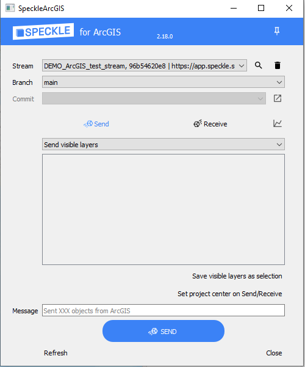
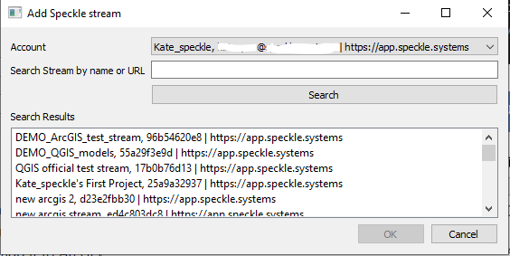
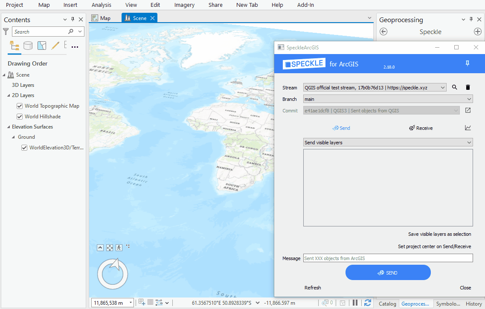
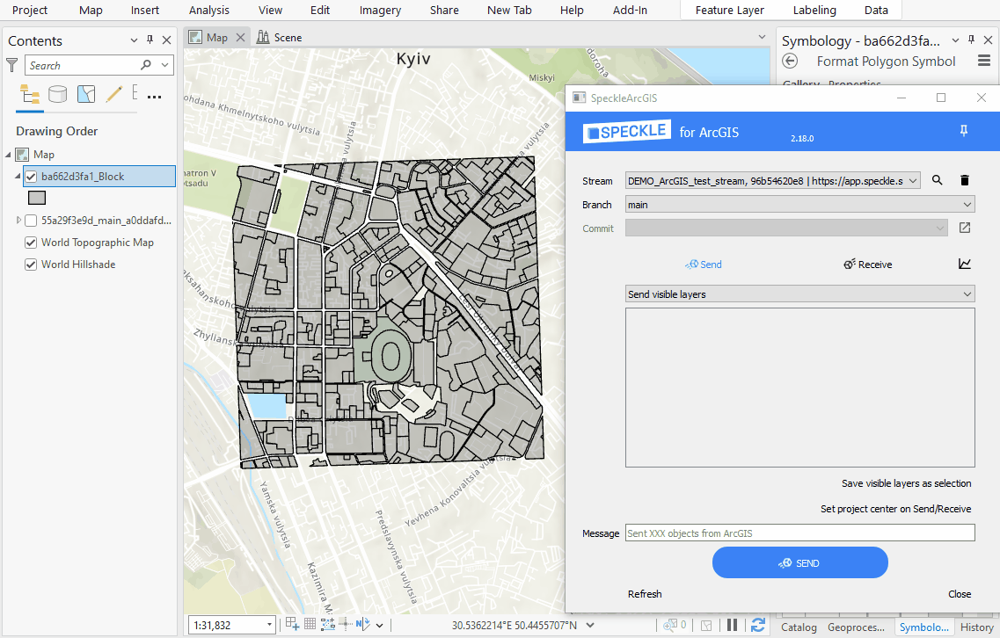

# ArcGIS

::: tip

The ArcGIS connector is in early stages of development and released as `beta`.
:::

The Speckle connector for ArcGIS currently supports ArcGIS versions 3.0.0 and upwards.

## Getting started

### Installation

::: important

If you have previously installed Speckle for ArcGIS and then updated ArcGIS, you need to first manually delete Speckle conda environment (in ArcGIS: Project-> Python-> Manage Environments-> Remove "arcgispro-py3-speckle", or Project-> Package Manager-> Active Environment (Environment Manager)-> Remove "arcgispro-py3-speckle").
:::

You can install the plugin using [Speckle Manager](https://speckle.systems/download/).

Then open ArcGIS, go to Geoprocessing tools (View -> Geoprocessing) and you will find `Speckle tools` toolbox with `Speckle` script tool inside. 

In case you are using a custom conda environment for your project, or if installation was unsuccessful, you can also do it manually following [these instructions](https://github.com/specklesystems/speckle-arcgis/tree/main/speckle_arcgis_installer).

### Features

 - The plugin allows you to select several layers in your project and send their geometry and attributes to a Speckle server.

 - You can receive Speckle geometry sent from other software. Properties of the objects upon receiving are stored in the layer attribute table.

 - You can send you data from ArcGIS and receive it in CAD in a CAD-friendly location, thanks to the option to create custom Spatial Reference (SR) in ArcGIS. To do this, you will be required to enter geographic coordinates of the point representing the origin point (0, 0) in your CAD project.

### Using Speckle ArcGIS

Once the plugin is installed, you'll find a new toolbox in Geoprocessing tools, with Speckle script tool inside. Double click will open the `Speckle` panel. The panel contains a very simple interface: 

#### Adding a stream to the project

First, you need to search and add a stream to the ArcGIS project. For that, you can press the Search button near the `Stream` panel. This will open a new pop-up window that will allow you to search for a specific stream and add it to ArcGIS project.

From the list of streams in the dropdown list, you can select one to make it the **current active stream**. This will be the stream used for sending/receiving data. When an active stream is selected, the `Branch` dropdown will be populated with all available branches from that stream.

And here's a short gif of the process 👇🏼

> Once a stream is added to the ArcGIS project, it is saved along with it so the streams will still be available after restarting ArcGIS.

#### Sending data

1. Select a stream from the dropdown list.
2. Specify a specific branch to send data to using the dropdown menu.
3. Make visible the layers in the file that you wish to send.
4. (optional) Write a commit message.
5. (optional) If you want to receive it in a non-GIS software or view in the browser, make sure you the SR of your Active Map is of projected type (e.g. using Meters as units).
5. Send the data.

The geometry will be reprojected and sent in the Spatial Reference of your Active Map. If the chosen Coordinate Reference System is of Geographic type with non-linear units, they will be treated as Meters in other software that do not support such units.

Here's a quick walkthrough of the process.

If you want to receive the layers later in a non-GIS software at the exact location (e.g. receive a context for your building in London), you can create a custom SR in ArcGIS, that will match the global coordinate system from ArcGIS with the local coordinate system in CAD. Simply enter the geographic coordinates (Lat, Lon) of the point which is the origin (0,0) of your CAD environment. 

#### Viewing the result

Once data has been sent to Speckle, you can view the result by going to your Speckle's server Url (our public one is https://app.speckle.systems/). Here is the example of [data](https://www.diva-gis.org/gdata) sent from ArcGIS: 

<iframe title="Speckle" src="https://app.speckle.systems/projects/55a29f3e9d/models/e9f320ca1c@1f8b3ca162#embed=%7B%22isEnabled%22%3Atrue%7D" width="600" height="400" frameborder="0"></iframe>

#### Receiving data

Steps to receive the data:

1. Select the stream to receive data from
2. Select the branch
3. Select specific commit (by default the latest one)
4. Find the received layers in the new layer group named after stream, branch and commit

### Custom project center
Modifying project center is useful when you need to: 
 - Send data (so you can receive correctly in a non-GIS application)
 - Receive data (if data was sent from non-GIS application).

You have several options to choose in order to set the custom project center. 

#### Adding offsets
You can choose to use the existing Spatial Reference (SR of our Active Map) and modify it's Speckle properties by adding X- and Y- offsets. This option will only be affecting Speckle properties on Send/Receive and will not change anything for you while you are working on a ArcGIS project. Use this option when your project requires a use of a specific SR. 

For example, if you use a projected SR (e.g. EPSG:32631) without the offsets and send the Eiffel Tower outline to Speckle, when receiving in Rhino geometry will be located thousands kilometers away from the origin. But if before sending you set the offsets Lat(y) as 5411939.08 and Lon(x) as 448253.52, you will receive the Eiffel Tower right in the middle of your Rhino canvas, while still preserving the required SR (e.g. EPSG:32631). 

Lat(y) and Lon(x) offsets should be specified in the units of the Active Map SR, and in the correct order. Note, that when you copy the coordinates from ArcGIS canvas using right-click, the Lat/Lon order might be different depending on the SR used (Lat is usually marked with N-North, and Lon is marked with E-East, both values can be positive or negative). 

#### Creating custom SR
Create a custom Spatial Reference, based on Traverse Mercator if you don't have to use a specific SR and want to have minimal size and shape distortions. Specify the origin Lat, Lon in geographic coordinates to create a custom SR with the required origin and change your Active Map SR. 

#### Adding angle to the True North
You can also add an angle to the True North to either of the above options if your non-GIS application require so. It will only affect Speckle object properties during Send/Receive operations and will not be visible in ArcGIS project.

## Feedback

We're really interested in your feedback regarding the integration between ArcGIS and Speckle! You can always reach us at our [Community Forum](https://speckle.community)
