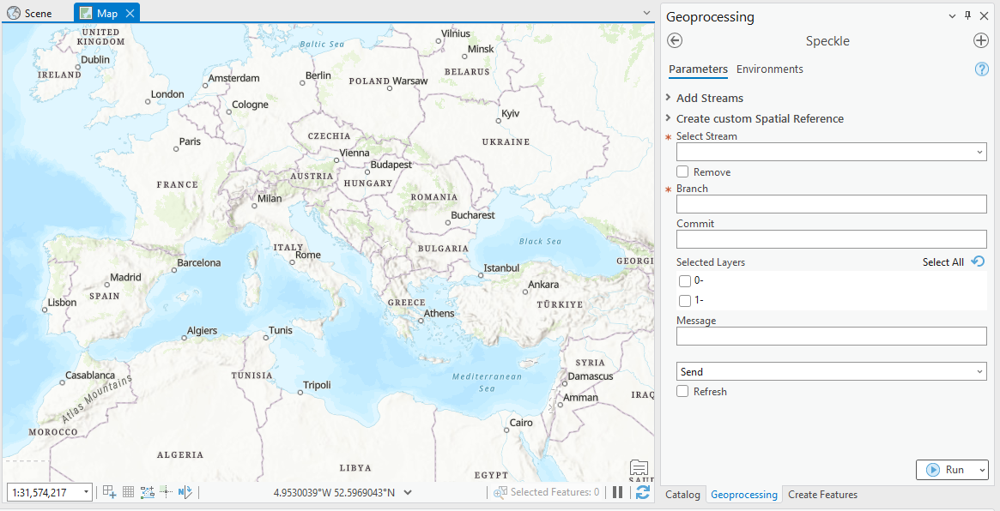
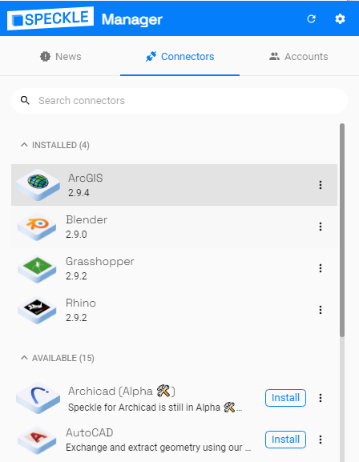
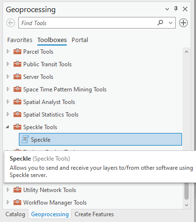
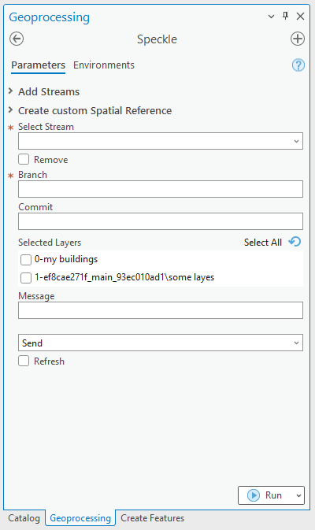
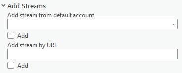
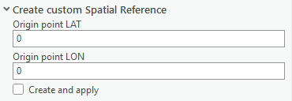
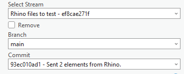

# ArcGIS

::: tip

The ArcGIS connector is in early stages of development and released as `beta`.
:::

The Speckle 2.0 connector for ArcGIS currently supports ArcGIS versions 2.9.0 and upwards.

## Getting started

### Installation

You can install the plugin using Manager for Speckle.

Then open ArcGIS, go to Geoprocessing tools (Vies -> Geoprocessing) and you will find `Speckle tools` toolbox with `Speckle` script tool inside. 

> I case you are using a custom conda environment for your project, or if installation was unsuccessful, you can also do it manually following [these instructions](https://github.com/specklesystems/speckle-arcgis/tree/main/speckle_arcgis_installer).

### Features

The plugin allows you to select several layers from your project, and send their geometry (as well as their contained metadata), to a Speckle server.

Only vector and raster based layers are supported. We're looking to improve support for other types of layers in the future.

The geometry will be reprojected and sent in a `Project SR` of your current ArcGIS project. If the chosen Spatial Reference is of Geographic type with non-linear units, they will be treated as Meters in other software that do not support such units.

You can received Speckle geometry sent from other software. Currently supported Speckle types for receiving: Point, Line, Polyline, Arc, Circle, Polycurve. BIM objects are not supported yet. 

Properties of the objects upon receiving are stored in the layer attribute table.

You can send you data from ArcGIS and receive it in CAD in a CAD-friendly location, thanks to option to create custom SR in ArcGIS. To do this, you will be required to enter geographic coordinates of the point representing origin point (0, 0, 0) in your CAD project.

### Using Speckle ArcGIS

Once the plugin is installed, you'll find a new toolbox in Geoprocessing tools, with Speckle script tool inside. Double click will open the `Speckle` panel.

The panel contains a very simple UI interface: 
- Foldable section "Add Streams": Add streams to work with to the main UI section.

- Foldable section "Create custom Spatial Reference": If you want to receive the layers later in a non-GIS software at the exact location (e.g. receive a context for your building in London), you can create a custom SR in ArcGIS, that will match the global coordinate system from ArcGIS with the local coordinate system in CAD. Simply enter the geographic coordinates (Lat, Lon) of the point which is the origin (0,0,0) of your CAD environment. 

- Selecting Speckle server options for sending and receiving data: Stream, Branch and Commit: list of streams in this section will be saved even when you re-open the project. 

- Selecting project layers to send

- Optional message for sending data

- Send/Receive action

- Refresh toggle: Sometimes UI loads faster that it can fetch data from the project. In this case you would need to refresh UI. Also it is not updating automatically if stream you are working with receives new data. Make sure to refresh before you receive your data.

#### Selecting the active stream

From the list of streams in the **Select Stream** panel, you can select one to make it the **current active stream**. This will be the stream used for sending/receiving data. When an active stream is selected, the `Branch` dropdown will be populated with all available branches from that stream.

#### Sending data

In order to send some data from the active Map, just follow these steps:

1. Select a stream so it becomes **active**
2. Specify a specific branch to send data to using the dropdown menu.
3. Select the layers that you wish to send.
4. (optional) Write a commit message.
5. (optional) If you want to receive it in a non-GIS software or view in the browser, make sure you set your project to SR of projected type using Meters as units.
5. Send the selected layers.

#### Viewing the result

Once data has been sent to Speckle, you can view the result by going to your Speckle's server Url (our public one is https://speckle.xyz)

#### Receiving data

Steps to receive the data:

1. Select the stream to receive data from
2. Select the branch
3. Select specific commit (by default the latest one)
4. Find the received layers in the new layer group named after stream, branch and commit

## Feedback

We're really interested in your feedback regarding the integration between ArcGIS and Speckle! You can always reach us at our [Community Forum](https://speckle.community)
