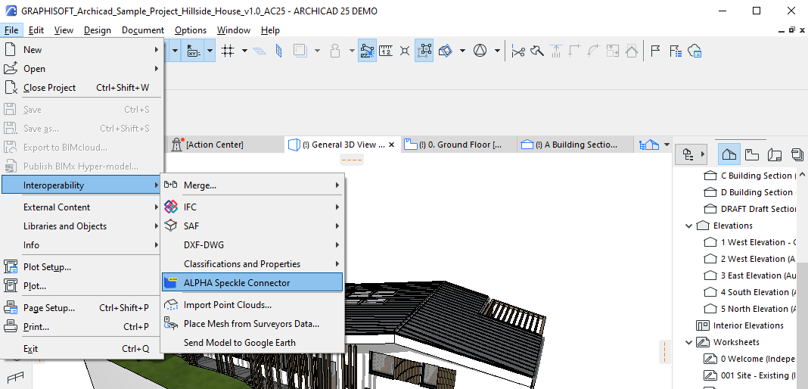
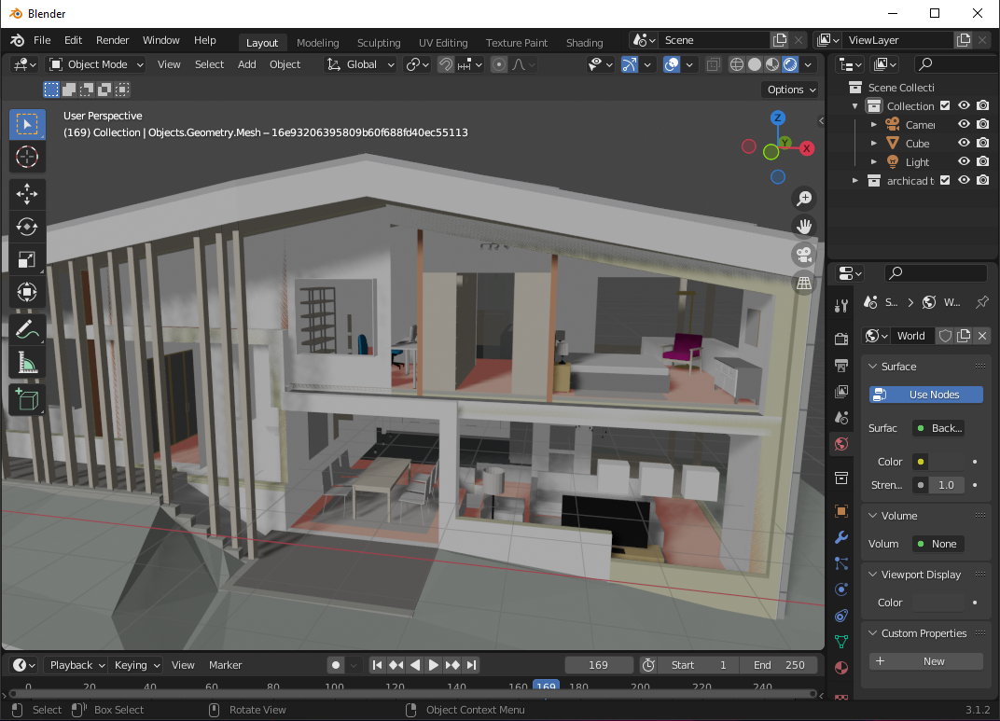
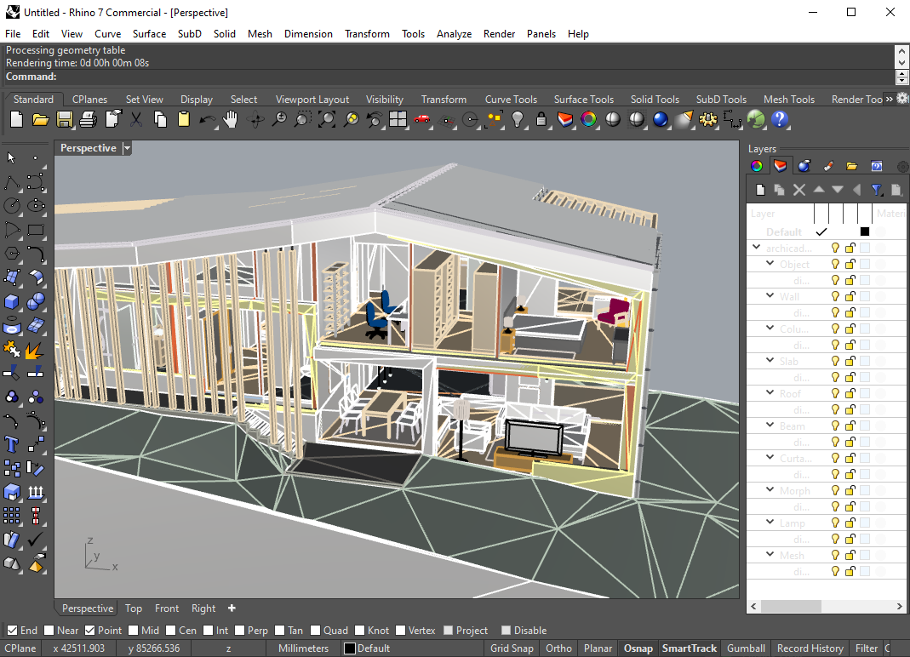
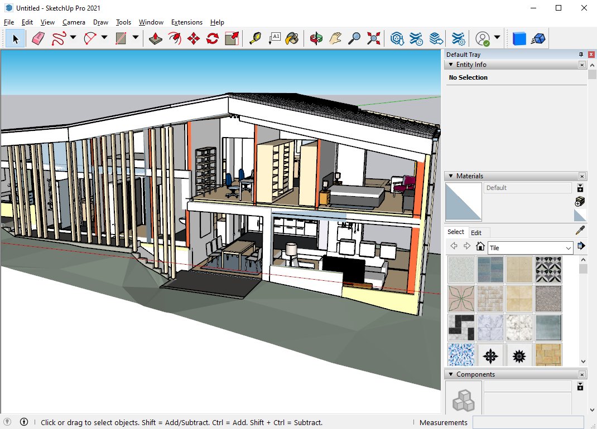

# Archicad (Alpha) 🛠️

::: tip

Check out our dedicated tutorial on [how to get started with Archicad](https://speckle.systems/tutorials/getting-started-with-speckle-for-archicad/)!

:::

## Getting Started

## Installation

Before using this connector, you'll need to follow our standard setup instructions to [install Speckle Manager and add a Speckle account](/user/manager).

Note that for this connector, you will need admin permissions on your machine to install it.

Once you've installed the connector, you'll be able to access it from the "Interoperability" menu

## User Interface

::: tip IMPORTANT 🙌

This connector uses our shared Desktop UI. Read up on general guidelines for usage in the [Desktop UI section](/user/ui).

:::

### Sending Data

Currently, sending is just supported through selection.

After launching the connector, either create a new stream or select and existing one.

Next, select the objects you want to send from within the model viewer. Then in the send menu, click "Add selection".

You can then write a commit message and click send. Once the send is complete, you'll be able to click the popup to view it in the browser.

### Receiving Data

#### Into Archicad

To receive data into Archicad, simply select a stream and click receive! Note that receiving into Archicad is currently not well supported. This is still an alpha and thus very work in progress!

Feel free to drop suggestions and ideas about how you would like to use this connector on the [forum](https://speckle.community/) to help guide the development of this connector 🚀

#### Into Other Connectors

Receiving Archicad models in other geometry focussed connectors (eg SketchUp, Rhino, Blender) is pretty well supported. Check out the images below for some examples!

**Blender**

**Rhino**

**SketchUp**

## Supported Elements

[Archicad Support Tables](/user/support-tables.html#archicad)
