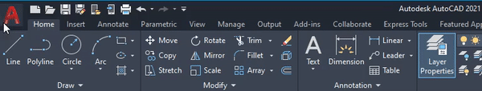
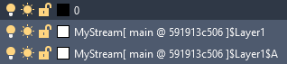

# AutoCAD and Civil 3D

<div class="banner-ribbon">
  <span><b>Notice</b>: This user guide is based on the V2 AutoCAD and Civil 3D connectors.</span>
  <span class="next-gen">AutoCAD and Civil 3D are now supported in the Next Gen connector ecosystem. These docs refer to the legacy V2 versions only.</span>
</div>

> ✅ The Next Gen AutoCAD and Civil 3D connectors are available now at  
> 👉 [**app.speckle.systems/downloads**](https://app.speckle.systems/downloads)

Speckle currently supports Autodesk® AutoCAD® and Autodesk® Civil 3D® (2021–2023) in legacy mode.  
This V2 connector is considered **alpha** and may be unstable.

::: tip

Check out our dedicated tutorials:  
- [Getting started with AutoCAD](https://speckle.systems/tutorials/getting-started-with-speckle-for-autocad/)  
- [Getting started with Civil 3D](https://speckle.systems/tutorials/getting-started-with-speckle-for-civil3d/)

:::

## Getting Started

This connector is no longer distributed through Speckle Manager.  
Please refer to [app.speckle.systems/downloads](https://app.speckle.systems/downloads) to install the Next Gen version.

Once installed (V2), you’ll find the connector in the **Add-Ins** tab under **Speckle 2**.  
Clicking the Speckle icon opens the project panel and connector interface.



## User Interface

::: tip

This connector uses Speckle’s shared Desktop UI. See the [Desktop UI guide](/user/ui) for general usage tips.

:::

### Sending Data

You can send geometry by selecting elements directly or using **layer-based filtering**.

### Receiving Data

Received geometry will be placed into AutoCAD/Civil 3D layers with the following prefix:

```
project[ model @ version id ]
```

If incoming layers have a hierarchy (e.g. from Rhino), they will be flattened using AutoCAD’s `$` delimiter. For example:

```
site$terrain$contours
```



## Supported Elements

- [AutoCAD Support Tables](/user/support-tables.html#autocad)
- [Civil 3D Support Tables](/user/support-tables.html#civil-3d)

## Notes

The AutoCAD/Civil3D connector shown here is **early-stage** and no longer actively developed.  
Please use the [Next Gen connector](https://app.speckle.systems/downloads) for a stable and actively maintained experience.

We still welcome feedback in the [Speckle Community Forum](https://speckle.community/t/new-speckle-2-0-autocad-civil3d-suggestions/1155)

