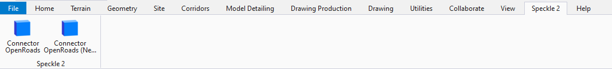

# Bentley (MicroStation, OpenRoads, OpenRail, and OpenBuildings)

  <b>Notice</b>: This user guide is based on the V2 Bentley connectors.
  Next Gen connectors are coming soon, bringing significant changes to the documentation and features!
  <b>Acknowledgement</b>: The Bentley connectors are not yet on the V3 Next Gen roadmap.

::: tip

The Bentley connectors are community-contributed: they were developed by Arup ⭐ This means that major feature updates and supported elements will be dependent on the developers at Arup, but we'll do our best to address any minor bugs and issues.

:::

The Speckle connector for Bentley software currently supports:

- MicroStation CONNECT
- OpenRoads Designer CE
- OpenRail Designer CE
- OpenBuildings Designer CE

## Getting Started

To install this connector and add your Speckle account, follow the instructions in the [Speckle Manager](/user/manager) section.

Once installed, you can find the connector in the `Speckle 2` ribbon. Click on the connector button, and this will open a new pop-up window with the standard [Desktop UI](/user/ui2.md)

## User Interface

Once the Speckle panel is open, go ahead and create a new project (or add an existing one) to the current file. Once the Microstation, OpenRoads, OpenRail, or OpenBuildings file is saved, the projects associated with that file will be saved too.

### Sending

To send objects to Speckle, you'll first need to specify which objects are to be sent.
This can be done in two ways:

- The simpler way involves manually selecting elements in Microstation, OpenRoads, OpenRail, or OpenBuildings.
- The more powerful way is to use filtering logic to select elements.

For the simpler selection method, follow the steps below:

1. First, ensure the project you want to send data to is in _Sender_ mode.
2. Select the objects you want to send, and left-click the button that says `0 objects` in the Speckle Panel. A drop-down will appear; choose `Set Selection`.
3. The same button should now display the total count of objects that were selected.
4. You're ready to send! Press the `Send` button. You should see a progress bar and, once completed, a success message.

The following filters are also available depending on the Bentley application:

- `All` (all connectors): sends everything in the model that is supported
- `Level` (all connectors): sends everything on the selected levels
- `Element Type` (all connectors): sends all elements of the selected types
- `Civil Element Type` (OpenRoads, OpenRail): sends all elements of the selected civil types

All geometric elements are organized by `Level` when they are sent to Speckle: elements that do not have a level will be located in `Unknown`. For Civil elements from OpenRoads and OpenRail are organized by their element type, and in OpenBuildings, if you sent gridlines, they will be located in the `Grid Systems` container.

### Receiving

In order to receive data from a Speckle, you'll first need to create a project to your Speckle projects panel. If the project already exists on the server it will automatically be added in _Receiver_ mode.

Once the project has been added, go ahead and hit the `Receive` button. This will display a progress bar (just like the sending operation) and, if successful, will add the received objects to the current document.

## Supported Elements

- [Bentley Support Tables](/user/support-tables.html#microstation)

## Feedback

We're really interested in your feedback regarding the integration between QGIS and Speckle! You can always reach us at our [Community Forum](https://speckle.community)
