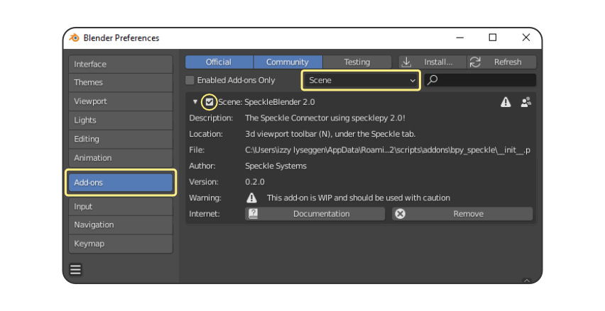
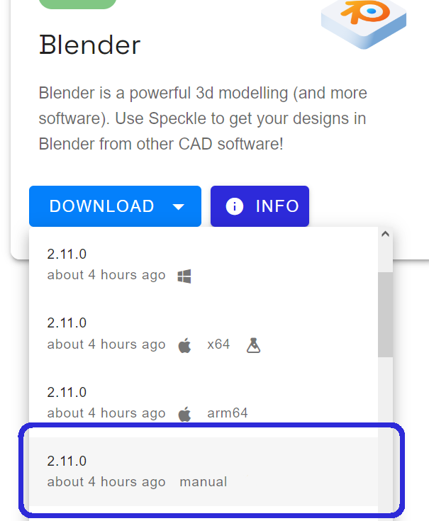
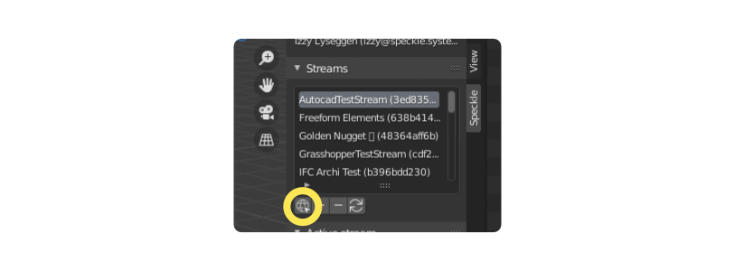

# Blender

::: tip 💡 TIP

Check out our dedicated tutorial on [how to get started with Blender](https://speckle.systems/tutorials/getting-started-with-speckle-for-blender/)!

:::

## Getting Started

For a quick overview, check out this short video on how to get started sending and receiving data from Blender!

<div style="position: relative;padding-bottom: 56.25%;"><iframe width="100%" height="100%" style="position: absolute;" src="https://www.youtube.com/embed/vy-i6lCdMOE" title="YouTube video player" frameborder="0" allow="accelerometer; autoplay; clipboard-write; encrypted-media; gyroscope; picture-in-picture" allowfullscreen></iframe></div>

## Installation

Before using this connector, you'll need to follow our standard setup instructions to [**install Speckle Manager** and **add a Speckle account**](/user/manager).

Once the Blender Connector has been **installed through Manager**, you will find it under the **"Add-ons" tab of your Preferences menu**, under the "Scene" category. Activate it by checking the tick box next to the Add-on name.



Once Enabled, a restart of blender may be required.

> Feel free to reachout to us on the [forums](https://speckle.community/) if you're having any difficulties.

### Manual Installation

Installation through Speckle Manager is recommended  for most users,
however, for users looking to install the blender connector on **unsupported platforms or Blender versions**,
the connector can be installed through a manual zip.

However, you will still need to add your accounts, either through [Speckle Manager](/user/manager) (recommended) or [manually](/user/manager.html#adding-accounts-manually)

1. Head to [releases.speckle.systems](https://releases.speckle.systems/) and, under the drop down, **download the latest `manual` installer**.

<center>
    
</center>

1. Open Blender, and **navigate to the Add-ons menu**, under `Edit -> Preferences`
2. Press the `Install` button in the top right, and select the downloaded zip.
3. Once enabled, a restart of blender may be required.

## User Interface

The Blender Connector lives in the 3D viewport toolbar (N) under the Speckle tab. It contains three main panels:

- **User Panel** for switching between different local accounts.
- **Projects Panel** for browsing your existing projects, creating new projects, or deleting old projects.
- **Active Project Panel** for sending and receiving data to and from Speckle.


The **Projects Panel** shows a list of your most recent projects, which you can search through by name. You can add new projects with the "+" button, delete projects with the "-" button, and refresh the projects with the refresh button.



From version 2.1.9, you can also add existing projects by their URL. You can use the URL to a project, a specific model, or a specific version. Simply paste it into the popup and the correct account, project, model, and version will get selected for you.

The **Active Project Panel** will show more details about the project you've selected in the Projects Panel. From here, you can change the active model and version. You can also Send and Receive any items you have selected in Blender. Under the Send and Receive buttons, you can use the dropdown menus to select a script to run on all elements during the send / receive process.

At the very bottom of the panel (not pictured), you'll find a button that will open the project in the [Speckle Web App](/user/web).

## Clean Meshes

One of the new features we added with the 2.9. release is **Clean Meshes** for Blender. With this feature, a single surface is obtained by combining triangular coplanar faces. This is especially useful for geometry that is coming from applications that do not support NGON meshes. With Clean Meshes, Material Assignment and UV Mapping will be much easier now.


Clean Mesh option can be accessed from the dialog that pops up after clicking the Receive button. By default, this will be unchecked🔳.


## Supported Elements

- [Blender Support Tables](/user/support-tables.html#blender)

## BlenderBIM

There is currently some limited support for [BlenderBIM](https://blenderbim.org/), though this is intended as an export and does not work coming back. To take advantage of this, simply open an IFC using BlenderBIM then use the Speckle connector to send to Speckle.

<iframe title="Speckle" src="https://app.speckle.systems/projects/c51120a7f7/models/d57e0b6bc8@767b7288ee#embed=%7B%22isEnabled%22%3Atrue%7D" width="600" height="400" frameborder="0"></iframe>

There are a few things to keep in mind when sending an IFC to Speckle using BlenderBIM:

- Structure: The hierarchical structure of collections and objects is preserved when sending to Speckle.
  - The name of each object is attached in the `name` field.
  - Any `/` in names will be replaced with `::`
- Materials: If the object has a material, this will be simplified into a [Render Material](https://github.com/specklesystems/speckle-py/blob/9a1f28516d0bb7c76e390af103bc677bc5ca7b04/specklepy/objects/other.py#L6-L12) and attached in the `renderMaterial` field.
- Properties: Custom properties added within Blender are always added to a `properties` field on respective objects. For BlenderBIM objects, this includes the `ifc_definition_id`.
  - Additional IFC properties that aren't stored in Blender are currently not extracted from the IFC and attached. This may be explored as an enhancement in the future.
- Type: Objects are all sent as meshes and collections are sent as `Base` objects. None of the objects are currently being converted and sent as BIM objects.

## Developing/Debugging Locally


For developers looking **test WIP branches**, or **develop ontop of/contribute to Speckle Blender**,
this is the recommended development setup for the [speckle-blender](https://github.com/specklesystems/speckle-blender) repository.

::: tip Pre-requisites
[Git](https://git-scm.com/), [Poetry](https://python-poetry.org/docs/), and the [Python](https://www.python.org/) version used by the desired Blender version </br>(e.g. Python 3.10 for Blender ≥3.0).

Also recommended: [VSCode](https://code.visualstudio.com/) with the [Blender Development Addon for VSCode](https://marketplace.visualstudio.com/items?itemName=JacquesLucke.blender-development) (allows debugging, and automatically symlinks `scripts/addons`)
::: 

1. **Clone** the [speckle-blender](https://github.com/specklesystems/speckle-blender) repository into the a folder somewhere on your system.
```sh
git clone https://github.com/specklesystems/speckle-blender
cd ./speckle-blender
```

2. Run the following commands to create a local environment
```sh
poetry lock --no-update
poetry install --with dev
```
3. Run the `export_dependencies.sh` script to export the requirements.txt file for the runtime dependencies
4. **Open the project folder** in VSCode and run the **`Blender: Build and Start`** command.
> Or, if not using VSCode, the you can must **copy** (or symlink) the `bpy_speckle` and `modules` folders into `%appdata%/Blender Foundation/Blender/{ver}/scripts/addons/`. (Creating `scripts/addons` if needed). Then start blender.
5. From `Edit -> Preferences -> Add-ons`, **enable the `Speckle Blender` plugin**.
6. A **restart of Blender** may be required upon first launch.

> Reminder, you can check the console for any errors, and feel free to reachout to us on [the forums](https://speckle.community/) if you're having any difficulties, or suggestions on better dev setups!
