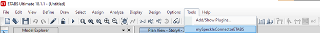
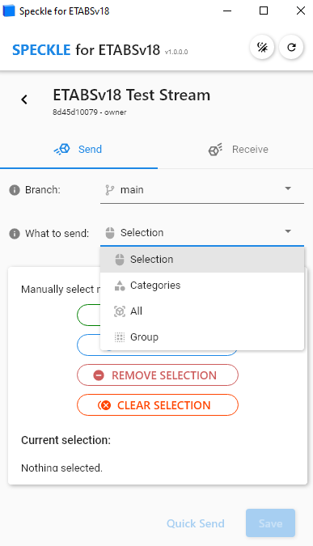
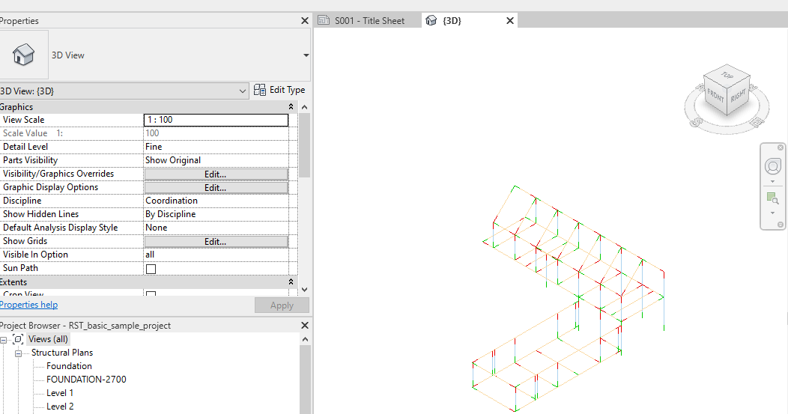
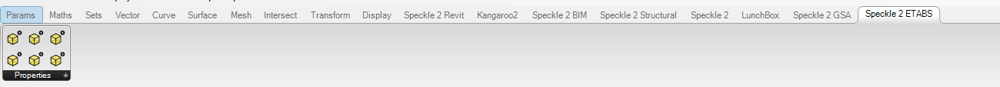
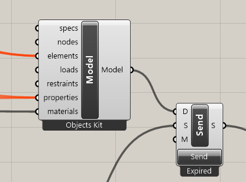
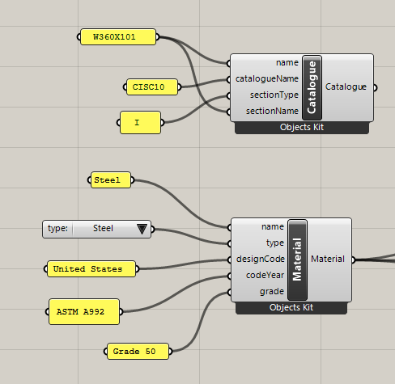

# CSI Products (ETABS, CSiBridge, SAP2000, SAFE)

These connectors are currently under beta development so please report any bugs or feedback to the [community forum](https://speckle.community/).

::: tip

Check out our dedicated tutorial on [how to get started with CSI Products](https://speckle.systems/tutorials/getting-started-with-speckle-for-csi/)! The following shows examples of ETABS and the relationship between ETABS and Speckle but can be extrapolated to relationships with the other CSI connectors.

:::

## Getting Started

To install the any of CSI Connector and add your Speckle account, proceed by following the instructions in [Speckle Manager](/user/manager).

Once installed, you can find the Speckle Connector in the PlugIn menu under the **Tools** tab like so:

::: warning
If the plugin is not installed properly, you can find the path to the PlugIn in the relative path here : This is the example for SAP2000, but you will see similar install folders to other paths in here.

`\%AppData%\Local\Computers and Structures\SAP2000\Speckle2ETABS`

:::

### Receiving in CSI Products

Save the CSI model as a file first before attempting to receive Projects into your CSI model.

## User Interface

::: tip IMPORTANT 🙌

This connector uses our shared Desktop UI2. Read up on general guidelines for usage in the [Desktop UI2 section](https://speckle.community/t/new-desktopui-in-alpha-testing/1851/2).

**Projects are saved to a textfile that will appear in your model folder titled "Speckle". Do not delete this folder.**

:::

### Filters

To help you select which elements will be to sent to Speckle, we've built various filters into our CSI connector. Once a filter is set, just click **Send** and all objects passing the filter will be sent to your Project. Section properties and materials defined within the model will always be sent.

_Please Note: Elements are sent regardless of whether they are visible or if they were created after setting up the filter._

#### Selection Filters

The selection filters will send everything that is selected within the CSI display.

#### Group Filters

You can create predefined groups of geometrical elements within CSI products to send already within the CSI group and select based on those groupings of elements.

#### Category Filter

The category filter lets you select one or more of the currently-supported CSI categories, this is the most granular filter that will also enable you to send results. Note : Other filters will not enable you to send results or non-geometrical elements and properties.

#### All Filter

This trivial filter allows you to select all the elements that are currently supported by the CSI connector. This will send all geometrical elements and their associated properties.

## Supported Elements

- [ETABS Support Tables](/user/support-tables.html#etabs)
- [SAP2000 Support Tables](/user/support-tables.html#sap2000)
- [SAFE Support Tables](/user/support-tables.html#safe)
- [CSiBridge Support Tables](/user/support-tables.html#csibridge)

## Updating Elements

The connector does not take care of updating existing elements within the Project. However the CSI products does recognize if coincident elements are generated and will not generate new elements that coincide on top of each other.

## Revit & BIM Data to CSI Products

When sending from elements from Revit, Speckle takes care of converting the data to a Speckle friendly format. If you're curious about how this data is being structured, please have a look at our [Objects Kit class definitions](https://github.com/specklesystems/speckle-sharp/tree/master/Objects/Objects/BuiltElements).

To send elements from Revit specificially into a structural model, use the analytical models generated within a revit model. Currently there is no conversion from the BuiltElement object kits and the Structural object kits, which means that only the analytical models in Revit are supported to be converted into CSI. Give us feedback on this workflow. 

## Grasshopper to CSI Products

The schema for the structural objects is based around our structural pyramid of objects. Refer to the [discourse post](https://speckle.community/t/introducing-structural-classes-for-speckle/1824/8) here if you haven't for all the information about this kit. There are CSI application specific grasshopper components. Check them out and use them to build specific properties like deck sections. If there is no specific CSI component, use the general structural schema to define them.

Everything is encapsulated in the model object from the schema in the end. Therefore make sure you define the model object.

::: tip

It's worth building a CSI model and sending and receiving that object in the software before you attempting building a model from grasshopper directly.

:::

Building models parametrically in grasshopper with the structural object schema is supported with CSI. To build section profiles from catalogue and have material definitions imported into the CSI from scratch, you will have to match the spelling of the catalogue directly as if you were importing it. Look below for an example of the spelling used.

## Exploring the CSI data

To easily explore on object's data and parameters, our [Speckle Web App](/user/web.html) interface can be of great help, as well as any other applications that lets you explore the object metadata (eg Grasshopper, Dynamo, Unity, etc).
