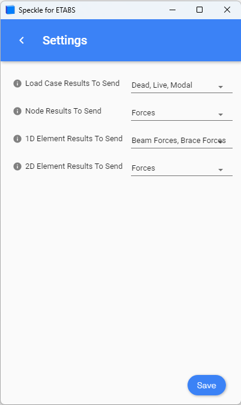

# CSI Products (ETABS, CSiBridge, SAP2000, SAFE)

  <b>Notice</b>: This user guide is based on V2 connectors.
  The ETABS connector is now available as part of our Next Gen release. Additional CSI products will follow.

> The **ETABS Next Gen connector** is now available from the [Connectors Download Page](https://app.speckle.systems/connectors).  
> Legacy documentation for SAP2000, SAFE, and CSiBridge remains below for reference until their Next Gen connectors are released.

These connectors support:

- **ETABS** (Next Gen)
- SAP2000
- CSiBridge
- SAFE

## ETABS (Next Gen)

The Next Gen ETABS connector offers a new streamlined experience and supports sending and receiving structural data directly into Speckle. Please refer to the [main Connectors page](https://app.speckle.systems/connectors) to download the latest version.

Documentation for the ETABS Next Gen connector is currently in progress.

## Legacy (V2) CSI Connectors

The following documentation refers to the **legacy V2 connectors** for CSI products.

These are no longer actively developed and will not receive further updates. If you still rely on them, please consider migrating to the Next Gen versions as they become available.

## Getting Started (Legacy)

The V2 CSI connectors were installed via Speckle Manager. Once installed, you could find them under the **Tools > PlugIn** tab in the CSI software.

### Receiving in CSI Products

Save your CSI model before receiving data.

## User Interface (Legacy Desktop UI)

Speckle project references were stored in a local folder named `Speckle` within the model directory. Do not delete this folder if you plan to continue using legacy projects.

## Filters (Legacy)

- **Selection**
- **Group**
- **Category**
- **All**

## Advanced Settings

The connector supported sending analytical results with filterable options for load cases and element types.

## Supported Elements

- [ETABS Support Tables](/user/support-tables.html#etabs)
- [SAP2000 Support Tables](/user/support-tables.html#sap2000)
- [SAFE Support Tables](/user/support-tables.html#safe)
- [CSiBridge Support Tables](/user/support-tables.html#csibridge)

## Grasshopper Integration

Structural objects could be created and sent from Grasshopper using the Speckle Structural kit.

> 💬 Questions or feedback? Join the discussion in the [Speckle Community](https://speckle.community/).
