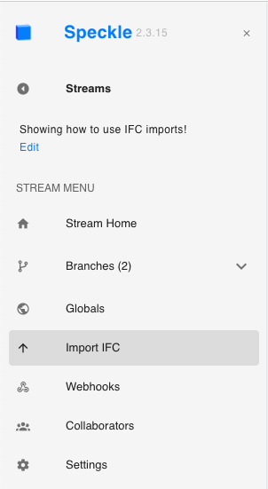

# IFC Import Service

  <b>Notice</b>: This user guide is based on the V2 IFC importer.
  Next Gen IFC importer is coming soon, bringing significant changes to the documentation and features!

Speckle can now process IFC files and store them in your projects. You can then receive them in other applications and access them from the Speckle API.

> This was made possible thanks to the amazing IFC.js Open Source project! 🙌🏼

Our **Import IFC** service can be found in the project page sidebar, right under the `Globals` section:

Once selected, you'll see the IFC Import panel with 2 main sections:

## Upload New Files

To upload new files, just drag and drop the `.ifc` file from your computer into the panel. A new item will appear bellow the "drag-and-drop" zone indicating the file was successfully added.

For each file, you can specify what model of the project to upload and save to (by default it will be sent to `main`) by selecting the model name from the drop-down menu.

Once ready, press `Upload` to start the process. The item will then be moved to the `Previous Uploads`.

## Previous Uploads

Here you'll be able to view the list of previously uploaded ifc files in that specific project.

It will also report the current status of the import operation:

1. `Converting`: the operation is still on-going, or is queued to start.

   

2. `Error`: the import operation failed. You can hover the error for more details on what went wrong.

   

3. `View version`: the import operation succeeded, and there's a new version on the selected model. Click on the button to view it.

   

You can also download the original `.ifc` file that was used to create this version at any point in the future by pressing the `download` icon on the left-hand side of the file name.

## Final result

The result will be available directly in the 3D viewer, and can be received in other applications. Here's a quick example:

<iframe title="Speckle" src="https://app.speckle.systems/projects/d9f76faff3/models/b6184a11b9@3e47b02175#embed=%7B%22isEnabled%22%3Atrue%7D" width="600" height="400" frameborder="0"></iframe>
