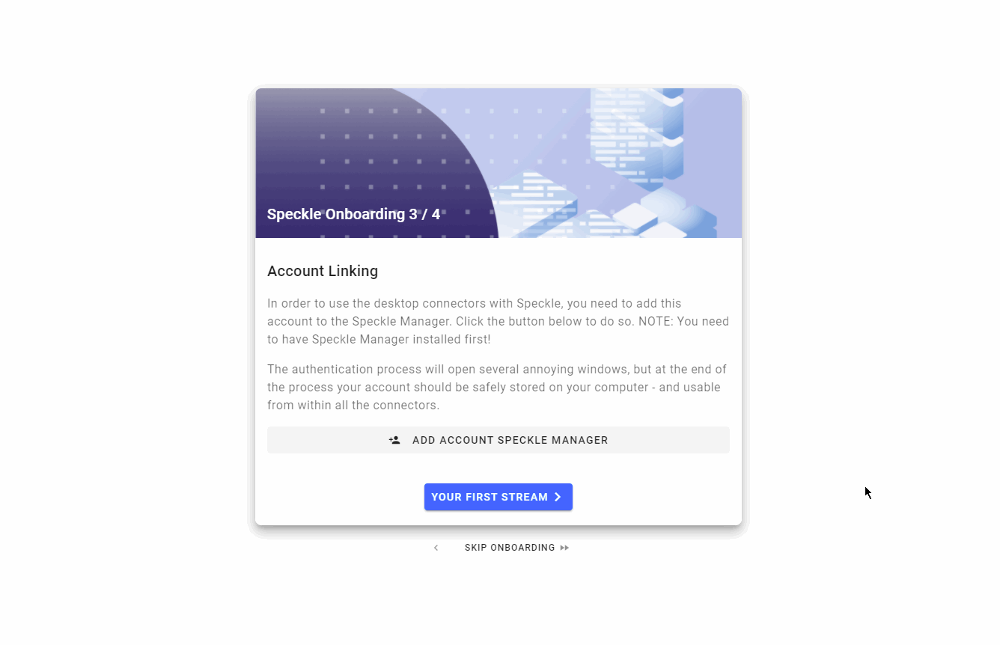

# Speckle Manager

Speckle Manager is a standalone desktop application that helps you manage your Speckle [Accounts](/quickstart.html#registration) and [Connectors](/#connectors). While the Speckle Manager isn't strictly required to use the Speckle platform, we highly recommend using it to help keep track of your connectors, install the latest updates and handle multiple user accounts.

Throughout this documentation we'll assume you have used Speckle Manager to set up your account and install the connectors ([alternative methods](/user/manager.md#adding-accounts-manually) are also supported).

::: tip IMPORTANT 🙌
This guide assumes you have access to a **Speckle Server**.
If you don't have one provided by your company, you can use our [free Speckle server](https://speckle.systems/getstarted/).
:::

## Installation

Speckle Manager is available for both Windows and Mac (with limitations).

Download the latest version of Speckle Manager:

- [Speckle Manager for Windows](https://speckle-releases.ams3.digitaloceanspaces.com/manager/SpeckleManager%20Setup.exe)
- [Speckle Manager for Mac](https://speckle-releases.ams3.digitaloceanspaces.com/manager/SpeckleManager%20Setup.dmg) (currently account management only)

Speckle Manager for Windows will automatically update when an update is available, in Mac you'll need to manually install new versions.


### Preventing Manager from running at Startup

On Windows, Speckle Manager will automatically launch on startup to check for new updates. It will notify you of any updated connector versions as soon as they are released.

If you want to disable this functionality, you can simply do so:

- Open the Task Manager, using (e.g.) `Ctrl + Shift + Esc`
- Navigate to the Startup tab..
- Find the row with **SpeckleManager** and set its **Status** to **Disabled**


### Uninstallation

On Windows, simply head over **Apps & Features**, find **SpeckleManager** and then click **Uninstall**.


## Adding Accounts

### From Speckle Manager

Once you have downloaded the Speckle Manager, you'll be able to easily add an account. All you need to do is head to the "Accounts" menu, click the "Add Account" button, and provide your server URL. This will open a browser window where you can log in or register an account on that server and authorise the Speckle  Manager.


### From the Web

Just visit your profile and click "Add account to desktop manager":


### During Onboarding

You can also add an account directly from Speckle Web as part of the onboarding process you will see after registering on a new server:



:::warning Account Problems

Having trouble adding an account? It's probably the firewall. Check our [FAQ  for possible solutions](/user/FAQs.html#i-cannot-add-an-account-in-speckle-manager)!

:::

### Adding Accounts Manually

Using Speckle Manager to handle your accounts and [Connectors](/#connectors) is the recommended way, but if you'd like to do without it a manual flow is also available.

To manually add an account you first need to [generate a token for your account](/dev/tokens-apps).

Then you can proceed to create a `.json` file in `%appdata%\Speckle\Accounts\` with the following data structure:

```json
{
  "token": "YOUR-TOKEN-HERE",
  "serverInfo": {
    "name": "Server Name",
    "company": "Company Name",
    "url": "https://YOUR-SERVE-URL-HERE"
  },
  "userInfo": {
    "id": "YOUR-USER-ID",
    "name": "First Last",
    "email": "firstlast@email.com"
  }
}
```

## Installing Connectors

The Speckle Manager also shows you the currently available connectors and allows you to install or remove connectors from your machine. Head into the **"Connectors"** menu to see what connectors you have installed and which are available to download. You'll also be able to check which version of each connector you have and update a connector as new versions are released.


### Updating Connectors

You will receive a notification in Speckle Manager when updates for your installed connectors are available. You can then update them from the [Connectors](/#connectors) page.

### Uninstalling Connectors

Just head over the [Connectors](/#connectors) page in Speckle Manager and click **Remove**.

## Advanced Settings

You can access the Settings page by clicking the ⚙ icon on the top right of the Speckle Manager window.


From here you'll be able to do various things such as clearing your local cache, resetting Speckle Manager, allowing beta versions etc.


### Using Beta Versions of our Connectors

From the settings tab you'll be able to toggle **on** beta versions of connectors. This means that every time we make a beta release you'll be able to install it as well.
In general, **you should not enable this setting unless you have been asked to**, this could happen when we are trying to release a fix for a specific issue affecting you.

To uninstall the beta version of a connector and to return to its latest stable release, just do the following:

- set the beta toggle to **off**
- uninstall & reinstall the connector


## Troubleshooting

Having issues with Speckle Manager? Send us a message on the [forum](https://speckle.community)!
You can help us troubleshoot your issues by doing the following:

- Open the settings page
- Click on **Open Dev Tools**, a new window will open
- Try reproducing you issue and if you see any text in the Dev Tools send us a screenshot
- If you include your `SUUID` in any bug report, that will help us identify what's going on!

## License

Speckle Manager is free to use and will always be.
To use it you need to agree to its [End User License Agreement](https://speckle.systems/eula/).
