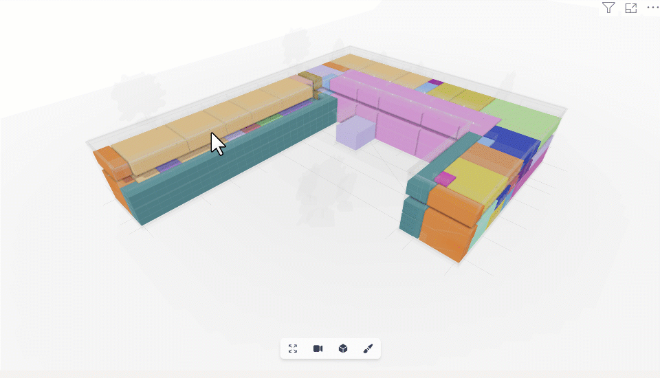

# Using 3D Viewer Visual

  <b>Important</b>: This guide features the V2 PowerBI data connector and model viewer visual.
  Next Gen is on its way, radically changing how the PowerBI connector works!

The 3D Viewer Visual was designed to work alongside our **Power BI Connector.** The *data connector* will output a table containing the following columns:

- **Model URL 👈**
- **URL Type**
- **Version Object ID🆕 👈**
- **Object ID 👈**
- **speckle_type**
- **data**

**Model URL**, **Version Object ID,** and **Object ID** are used to visualize your Speckle data in 3D.

## Viewing Objects in 3D

With the Speckle 3D Viewer Visual added, you can now configure the input fields to display your Speckle data.

1. Drag the "**Model URL**" column from your data into the "`Model URL`" input field.
2. Drag the "**Version Object ID**" column from your data into the "`Version Object ID`" input field.
3. Drag the "**Object ID**" column from your data into the "`Object ID`" input field.

Once all inputs are added, 3D Viewer Visual will load the objects into the scene.

There are two extra optional fields:

- `Color By`: defines how the objects get grouped to be assigned colors.
- `Tooltip data`: defines the information shown on the tooltip when selecting an object.

:::tip 📌IMPORTANT

The `Model URL`, `Version Object ID`, and `Object ID` columns will exist on the resulting query when using the `Get by URL` function.

If you're using the new (experimental) `Get by URL [Structured]` function, you must generate these columns in your final query table. The information is attached to the table as a `META` that can be queried in your Query Editor.
:::

### Context-Menu

When an object is `right-clicked`, the context menu for that object will appear. This allows for easy object exclusion/isolation from the viewer in an interactive way.

If you want to reset the exclusions, click on the 3D Viewer Visual, go to the “**Filters**” pane, and remove the “Excluded” filters.

:::tip 📌IMPORTANT
Power BI provides the context menu; some features still need to be implemented in depth. More work will be done to improve context-menu functionality in the coming releases.

:::
