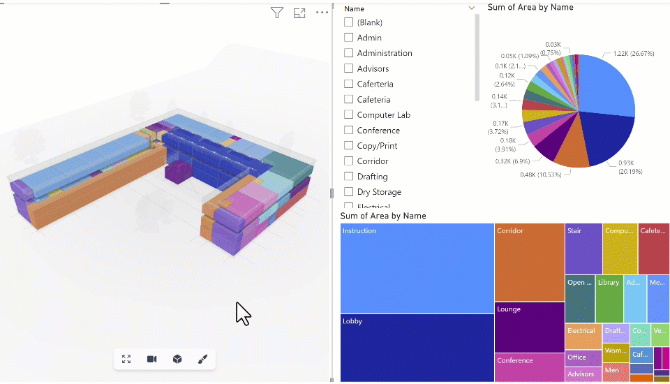

# Coloring Objects in 3D

  <b>Important</b>: This guide features the V2 PowerBI data connector and model viewer visual.
  Next Gen is on its way, radically changing how the PowerBI connector works!

Once a field has been added to **Color By,** the viewer will color the data by the provided field when available. The objects’ colors will be automatically generated and assigned using the Power BI dashboard color palette.

## Aligning Colors Across Visuals

You may notice that, initially, the colors of your visual don't match the other colors assigned in other visuals of your report.

You can fix this by aligning the sorting of the 3D visual to match the sorting performed by other visuals. If they are sorted by name (or any other parameter you defined), change 3D Viewer Visual’s sorting to match that. Objects get assigned by Power BI in order, so if the order of your visual matches the others, the colors should too.

:::warning

Currently, 3D Viewer Visual doesn't automatically detect your changes. So you need to manually reload the visual. One way of doing is Ctrl+X -> Ctrl+V.
:::

## Highlighting Objects across Visuals

Connect a field on the **Color By** or **Tooltip Data** to enable highlighting across report visuals. This could be any field in your data source (the object id, volume, level name, beam type...)

Once a field has been added, any objects highlighted in another visual (such as a Table, Matrix, Slicer...) will be filtered out in the viewer, showing any other objects *ghosted out (grey transparent material) or hidden (depending on your visual setting).*

This also works in reverse order: Selecting something on the visual will filter it on any other visual in the report configured to do so.
