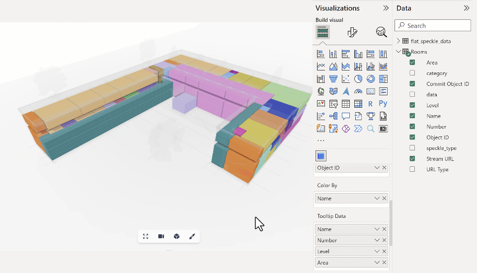

# Object Tooltips

When an object is selected in the Power BI viewer, a tooltip showing the object's properties and values will be displayed.

The information displayed will be extracted from the **Tooltip Data** input. You should be able to add as many as necessary.

The tooltip's position will be updated as the camera moves through the model.

:::tip 📌IMPORTANT
These tooltip values are not bound to Speckle data, meaning you can merge other data sources into your query and display "non-speckle data" in your Speckle object's tooltips.

:::
