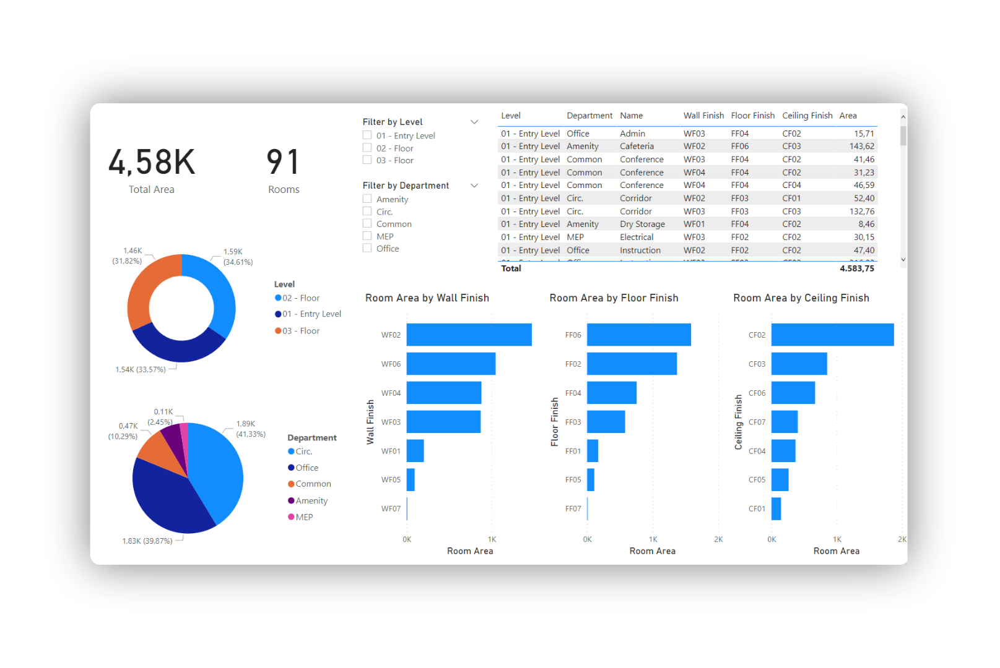
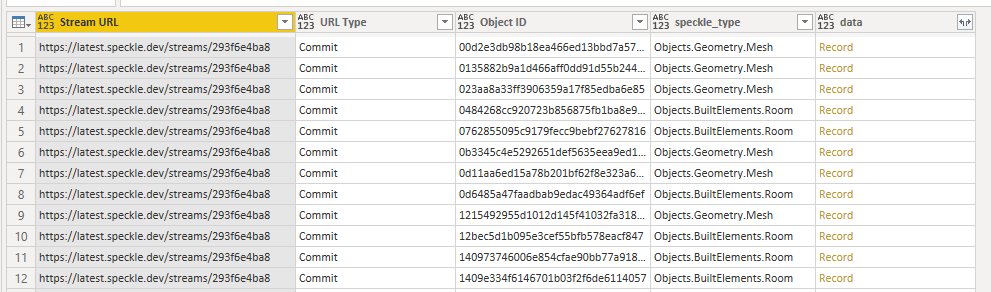
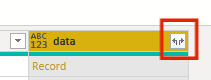
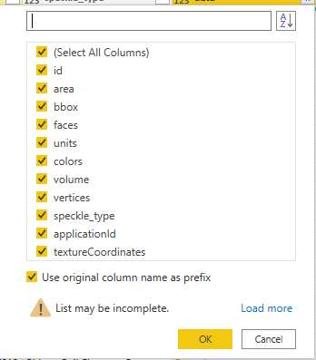
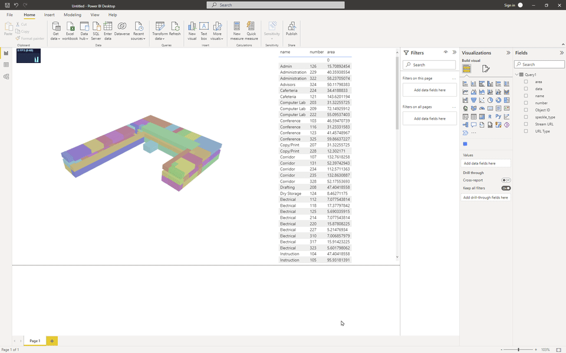
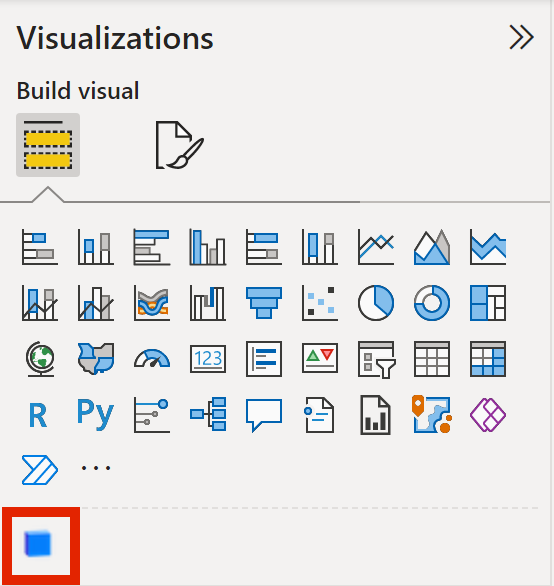
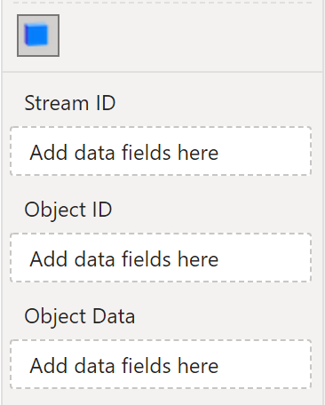
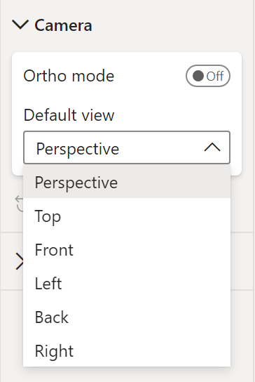
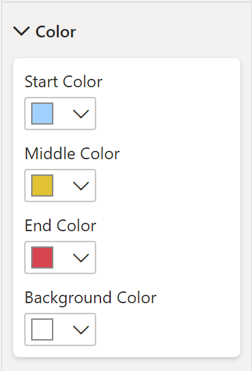

# Power BI

## PowerBI Data Connector

The Speckle 2.0 connector for Power BI supports **Power BI Desktop only**.

::: tip 💡 TIP

The Power BI connector is in `beta` development and still requires manual installation. We will look into streamlining installation via Speckle Manager as well as Microsoft certification once development stabilizes.

:::

### Features

The Power BI beta connector allows you to import your Speckle stream, branch, commit, or object data using the corresponding URL from your Speckle server stream. The following data will be retrieved depending on which type of URL you use:

- Stream URL -> the most recent commit on the main branch of this stream
- Branch URL -> the most recent commit on this branch
- Commit URL -> this commit
- Object URL -> this object

If you're having issues connecting to your stream, make sure the stream is either set to `Public` or your local account has access to the private stream.

### Installation

::: tip 📌 IMPORTANT

All releases of the Speckle 2.0 Power BI Connector are available on our [Power BI GitHub repository](https://github.com/specklesystems/speckle-powerbi/releases).

:::

1. Download the `Speckle.mez` file from the latest release (or release of your choice).

2. Copy the downloaded file into the local `Custom Connectors` folder in your installation of Power BI: **`Documents\Power BI Desktop\Custom Connectors`**.

3. The Speckle Power BI Beta Connector should now appear as a data source once you load up Power BI Desktop!

::: warning 📁 WARNING

If the `Custom Connectors` folder doesn't exist, you can create it at the path in Step 2! Make sure it is created in your user's `Documents` directory.

:::

### Using Speckle Power BI

Once the connector is installed, you'll find a `Speckle (beta)` option in the `Get data` interface, under the `Other` category.

Select the Speckle connector and click `Connect` - a window will open where you can input your Speckle stream, branch, commit, or object URL!

The result of that query will be a table with the following columns:

- Stream URL
- URL Type
- Object ID
- speckle_type
- data

::: tip

Stream URL and Object ID columns were added to facilitate loading data into the new [Speckle PowerBI 3D Viewer](#speckle-3d-viewer-visual)

:::

#### Expanding the `data` records

In order to access the data within each object, you must expand that record into a set of it's properties.

Pressing the `expand column` button displays a pop-up that will enable you to choose which properties to expand.

This process can be done several times in a row until you reach the property values you're interested in.

::: tip

We recommend that you uncheck the `Use original column name as prefix` option **only** when expanding the initial `data` column.

This allows for nested property names to not have a prefix (i.e. the level name of a room would be `level.name` instead of `data.level.name`

:::

### Experimental: Fetching the commit data in a structured way

As of version `0.0.15`, you can fetch the commit data while preserving the structure of the data that was sent.

This new function does not output the user functions
### Accessing Private Streams 🔒

#### With a Personal Access Token

If you're having issues connecting to your private stream, make sure you set an `Access Token` on your Profile. This is how you do it:

1. Go to you Profile on Speckle server. [https://speckle.xyz/profile](https://speckle.xyz/profile)
2. Under Developer Setting Create a `New Token`

   

3. Set its name as `PowerBI Connector` and check every option under `Scopes`✅ and click `SAVE`.

   

4. This will create a token for you. Make sure you copied it. It is the first and last time you’ll be able to see this token. Treat it as a Password 🔑 and do not share it with anyone.
5. Go to **Power BI > Options and Settings > Data source settings.**

   

6. Go to **Global Permissions** and select your Speckle server.

   

7. After selecting server, follow **Edit Permissions > Edit > Private Stream.** Paste your *Token* into `Personal Access Token` input.

   

8. That’s it. It should work now.

If you have trouble seeing your server under Data sources, simply delete existing servers. Go back to Speckle connector and try to receive the same stream/branch/commit. You’ll have the option to add it from there.

#### Logging in using your Speckle account

As of version `0.0.15`, user's of our public server <https://speckle.xyz> can now also login directly using their Speckle account.

To do so, you must select the `Speckle.XYZ` option in the credentials pop-up:

Then press the `Login with Speckle` button. This will open a pop-up window prompting you to log into your account and allow the PowerBI app to access your user data. This just grants `read-only` access, as recommended by PowerBI guidelines.

Once the app has been granted access, PowerBI will continue with the process of fetching the data.

## Speckle 3D Viewer Visual

> The PowerBI visual is still in **early stages of development**. We welcome your feedback!

The _3D Viewer Visual_ allows for the visualization of Speckle data in a 3D environment inside your PowerBI reports. It is compatible with PowerBI Desktop and can also be used in PowerBI.com for online visualization.

### Features

The current version enables basic visualization, filtering and coloring features, as well as some basic camera and color controls:

- Load individual objects that were fetched with the PowerBI Data Connector
- Highlight objects in the 3D viewer that were selected on a different table in the report.
- Color objects based on a category or value

### Installation

You can install the Speckle 3D Viewer Visual manually by following these steps:

1. Download the latest `.pbiviz` package from our [Github repo](https://github.com/specklesystems/speckle-powerbi-visuals/releases).
2. Open your report in Power BI Desktop or Power BI service.
3. Select the ellipsis from the visualizations pane.
   
4. Select Import a visual from a file from the menu.
   
5. If you get a message cautioning you about importing custom files, select Import if you trust the source of the file.
   
6. Navigate to the folder that has the custom visual file (`.pbiviz`) and open it.
7. When the visual has successfully imported, select OK.
   
8. The visual now appears as a new icon in the visualizations pane of the current report. Select it to create the visual on the report canvas.
   

::: tip

If you want the visual to remain on the visualization pane so you can use it in future reports, right-click on it and select Pin to visualization pane.

:::

### Usage

The 3D Viewer Visual was designed to work alongside our _PowerBI Data Connector_ (version 0.10 or above). The _data connector_ will output a table containing the following columns:

- `data`: A column of records containing the data belonging to each speckle object.
- `Stream URL`: The stream url this object was fetched from
- `Object ID`: The id of each speckle object in the table (this was extracted from the `data` records).

> Other columns may be present, and can be user generated, but are not relevant for this section.

#### Loading objects

In order to load the objects from the table into the viewer, just add the fields `Stream URL` and `Object ID` onto their respective inputs in the visual.

Once both the fields are added, the Viewer would start to load the objects into the scene. The **Object Data** input is optional, and is only used to enable highlight/coloring functions.

#### Highlighting objects across visuals

In order to enable highlighting across report visuals, connect a field on the **Object Data**. This could be any field in your data source (the object id, volume, level name, beam type...)

Once a field has been added, any objects highlighted in another visual (such as a Table, Matrix, Slicer...) will be filtered out in the viewer, showing any other objects _ghosted out (gray transparent material)_

#### Coloring objects by category

Coloring objects works in the same way that highlighting. Once a field has been added to **Object Data** the viewer will color the data by the field that was provided, when available.

The way an object is colored depends on the type of field you connected:

- Text based fields: The colors will be automatically generated by unique value.
- Number based fields: The colors will be generated using the 3-color gradient in the Viewer Settings, assuming the first color represents the minimum value and the last color represents the maximum value.

### Visual Settings

#### Camera controls

The camera controls settings allow for:

- Orthogonal or perspective mode
- Setting the view that would be shown when first loaded (top, front, back, left, right)

#### Colors

The filtering/coloring feature available when connecting a data field into the `Object Data` section can be customized by selecting a 3-color gradient on the visual settings.

This will affect the color pallette that is used when **coloring objects by a number based field**. When connecting a text based field into the `Object Data` input, the color will be computed automatically and the color pallette in the settings will be ignored.

## Feedback

We're really interested in your feedback regarding the integration between Power BI and Speckle! You can always reach us with suggestions, comments, and error reports on our [Community Forum](https://speckle.community)
