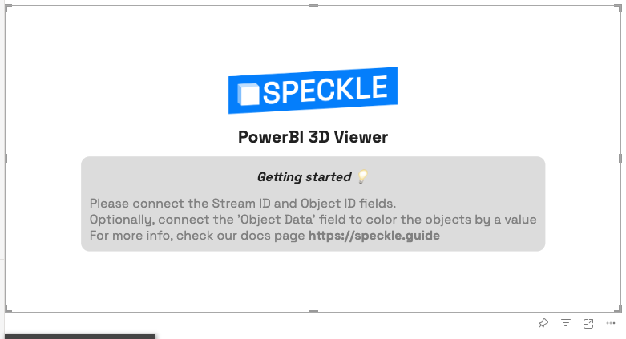
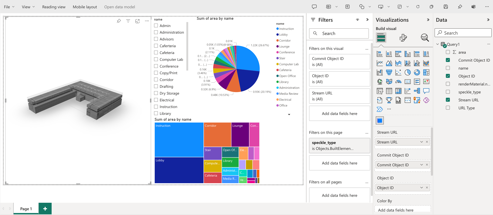
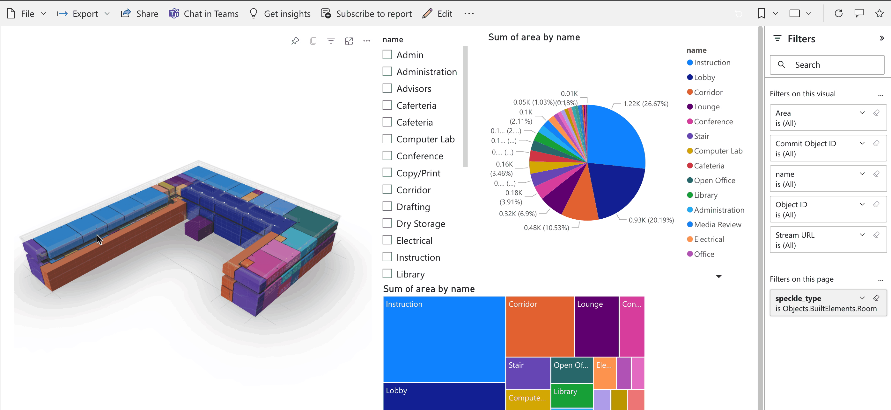
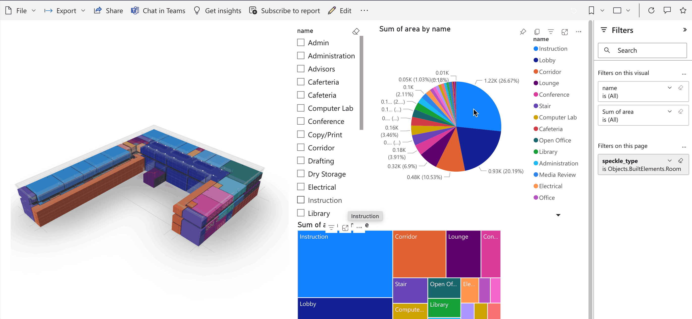
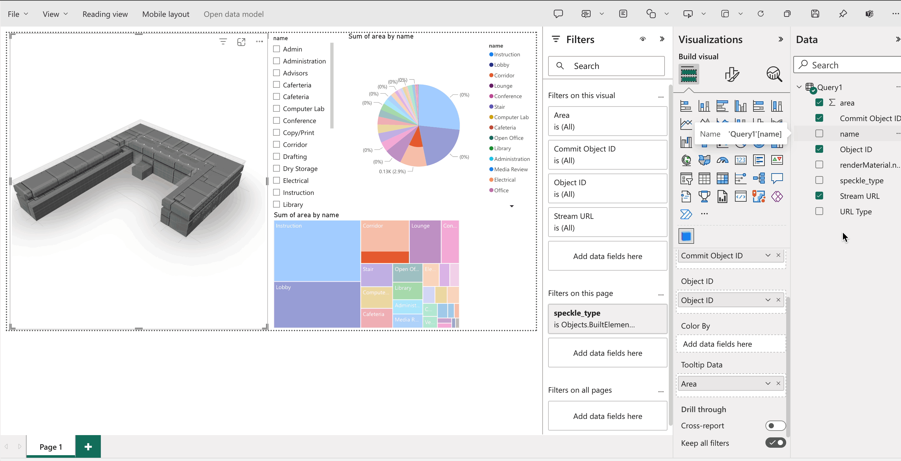
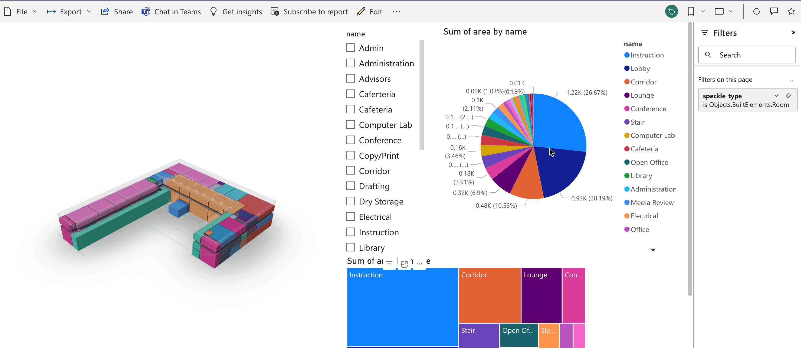
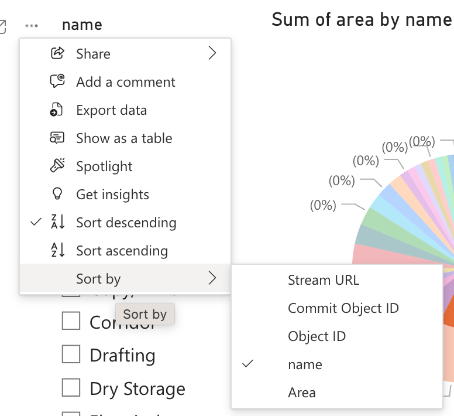

# Power BI

## PowerBI Data Connector

The Speckle 2.0 connector for Power BI supports **Power BI Desktop only**.

::: tip 💡 TIP

The Power BI connector is in `beta` development and still requires manual installation. We will look into streamlining installation via Speckle Manager as well as Microsoft certification once development stabilizes.

:::

### Features

The Power BI beta connector allows you to import your Speckle stream, branch, commit, or object data using the corresponding URL from your Speckle server stream. The following data will be retrieved depending on which type of URL you use:

- Stream URL -> the most recent commit on the main branch of this stream
- Branch URL -> the most recent commit on this branch
- Commit URL -> this commit
- Object URL -> this object

If you're having issues connecting to your stream, make sure the stream is either set to `Public` or your local account has access to the private stream.

### Installation

::: tip 📌 IMPORTANT

All releases of the Speckle 2.0 Power BI Connector are available on our [Power BI GitHub repository](https://github.com/specklesystems/speckle-powerbi/releases).

:::

1. Download the `Speckle.mez` file from the latest release (or release of your choice).

2. Copy the downloaded file into the local `Custom Connectors` folder in your installation of Power BI: **`Documents\Power BI Desktop\Custom Connectors`**.

3. The Speckle Power BI Beta Connector should now appear as a data source once you load up Power BI Desktop!

::: warning 📁 WARNING

If the `Custom Connectors` folder doesn't exist, you can create it at the path in Step 2! Make sure it is created in your user's `Documents` directory.

:::

### Using Speckle Power BI

Once the connector is installed, you'll find a `Speckle - Get by URL (beta)` option in the `Get data` interface, under the `Other` category.

Select the Speckle connector and click `Connect` - a window will open where you can input your Speckle stream, branch, commit, or object URL!

The result of that query will be a table with the following columns:

- Stream URL
- URL Type
- Commit Object ID (**new!**)
- Object ID
- speckle_type
- data

::: tip

Stream URL and Object ID columns were added to facilitate loading data into the new [Speckle PowerBI 3D Viewer](#speckle-3d-viewer-visual)

:::

#### Expanding the `data` records

In order to access the data within each object, you must expand that record into a set of it's properties.

Pressing the `expand column` button displays a pop-up that will enable you to choose which properties to expand.

This process can be done several times in a row until you reach the property values you're interested in.

::: tip

As of the latest `alpha8` version of the Speckle PowerBI 3D Visual, you can rename your expanded columns at will.
Data Connector and Visual are no longer required to keep the names of the columns for the coloring to work.

More info, see XXXXX

<!-- ADD LINK TO COLORING SECTION IN POWERBI VISUAL -->

:::

### Fetching the commit data in a structured way

::: warning

This feature is experimental and may change in future releases.

:::

As of version `0.0.15`, you can fetch the commit data while preserving the structure of the data that was sent.

This new function can be found under the `Get Data -> Other` as `Speckle - Get By URL [Structured]`.

This new function allows for much faster interactions with your Speckle data, as it no longer requires to pull every single object as a flat list. There's a small downside to this, as you will no longer get the data with the expected columns to connect it directly to the _Speckle PowerBI Visual_.

> A tutorial to cover this topic will be published soon!

### Making your own API requests

::: warning

This feature is experimental and may change in future releases.

:::

As of version `0.0.15`, you can make your own GraphQL API requests to any Speckle server.

> This is not currently exposed as an available Data Source in `Get Data`, but you can access it while in the Query editor.

This can be used to craft your own interactions with Speckle, unlocking un-supported features such as:

- Fetching comments
- Read receipts
- Admin data such as server stats.
- Any other feature available through our API.

**Inputs:**

- **Server URL**: The url of the Speckle server you want to connect to
- **Query**: The raw text GraphQL query
- **Variables**: A record containing a key for each variable in the GraphQL query and it's value. Nested records are allowed.

**Outputs**

A record containing the response, following the same structure as any GraphQL query.

::: tip

We recommend experimenting with our GraphQL explorer to construct your queries, as it will provide auto-complete and error checking out of the box.

https://speckle.xyz/explorer

Once you're happy with you're query, you can move it to PowerBI with little effort.

:::

### Accessing Private Streams 🔒

#### With a Personal Access Token

If you're having issues connecting to your private stream, make sure you set an `Access Token` on your Profile. This is how you do it:

1. Go to you Profile on Speckle server. [https://speckle.xyz/profile](https://speckle.xyz/profile)
2. Under Developer Setting Create a `New Token`

   

3. Set its name as `PowerBI Connector` and check every option under `Scopes`✅ and click `SAVE`.

   

4. This will create a token for you. Make sure you copied it. It is the first and last time you’ll be able to see this token. Treat it as a Password 🔑 and do not share it with anyone.
5. Go to **Power BI > Options and Settings > Data source settings.**

   

6. Go to **Global Permissions** and select your Speckle server.

   

7. After selecting server, follow **Edit Permissions > Edit > Private Stream.** Paste your *Token* into `Personal Access Token` input.

   

8. That’s it. It should work now.

If you have trouble seeing your server under Data sources, simply delete existing servers. Go back to Speckle connector and try to receive the same stream/branch/commit. You’ll have the option to add it from there.

#### Logging in using your Speckle account

As of version `^0.0.17`, you can now login with **any account of any Speckle server** using your own speckle account.

To do so, you must select the `Speckle Login` option in the credentials pop-up:

Then press the `Login with Speckle` button. This will open a pop-up window prompting you to log into your account and allow the PowerBI app to access your user data. This just grants `read-only` access, as recommended by PowerBI guidelines.

Once the app has been granted access, PowerBI will continue with the process of fetching the data.

## Speckle 3D Viewer Visual

> The PowerBI visual is still in **early stages of development**. We welcome your feedback!

The _3D Viewer Visual_ allows for the visualization of Speckle data in a 3D environment inside your PowerBI reports. It is compatible with PowerBI Desktop and can also be used in PowerBI.com for online visualization.

### Features

The current version enables basic visualization, filtering and coloring features, as well as some basic camera and color controls:

- Load individual objects that were fetched with the PowerBI Data Connector
- Highlight objects in the 3D viewer that were selected on a different table in the report.
- Color objects based on a category or value

### Installation

You can install the Speckle 3D Viewer Visual manually by following these steps:

1. Download the latest `.pbiviz` package from our [Github repo](https://github.com/specklesystems/speckle-powerbi-visuals/releases).
2. Open your report in Power BI Desktop or Power BI service.
3. Select the ellipsis from the visualizations pane.
   
4. Select Import a visual from a file from the menu.
   
5. If you get a message cautioning you about importing custom files, select Import if you trust the source of the file.
   
6. Navigate to the folder that has the custom visual file (`.pbiviz`) and open it.
7. When the visual has successfully imported, select OK.
   
8. The visual now appears as a new icon in the visualizations pane of the current report. Select it to create the visual on the report canvas.
   

::: tip

If you want the visual to remain on the visualization pane so you can use it in future reports, right-click on it and select Pin to visualization pane.

:::

### Usage

The 3D Viewer Visual was designed to work alongside our _PowerBI Data Connector_ (version 0.10 or above). The _data connector_ will output a table containing the following columns:

- `data`: A column of records containing the data belonging to each speckle object.
- `Stream URL`: The stream url this object was fetched from
- `Commit Object Id`: The id of the root object each individual object came from. For streams/branches/commits it will be the referenced commit object. For object urls it will match the object id on the url.
- `Object ID`: The id of each speckle object in the table (this was extracted from the `data` records).

> Other columns may be present, and can be user generated, but are not relevant for this section.

#### Landing page

When you initially drop the Speckle PowerBI visual, you'll see a landing page with some basic instructions on how to proceed

#### Loading objects

In order to load the objects from the table into the viewer, just add the fields `Stream URL`, `Commit Object ID` and `Object ID` onto their respective inputs in the visual.

Once both the fields are added, the Viewer would start to load the objects into the scene.

There are two extra optional fields:

- `Color By`: will define how the objects get grouped to be assigned colors.
- `Tooltip data`: will define the information that is shown on the tooltip when selecting an object.

::: tip

The `Stream URL`, `Commit Object ID` and `Object ID` columns will exist on the resulting query when using `Get by URL` function.

If you're using the new (experimental) `Get by URL [Structured]` function, you'll be required to generate the these columns in your final query table. The information is attached to the table as a `META` that can be queried in your Query Editor.
:::

#### Highlighting objects across visuals

In order to enable highlighting across report visuals, connect a field on the **Color By** or **Tooltip Data**. This could be any field in your data source (the object id, volume, level name, beam type...)

Once a field has been added, any objects highlighted in another visual (such as a Table, Matrix, Slicer...) will be filtered out in the viewer, showing any other objects _ghosted out (gray transparent material)_

This also works in reverse order: Selecting something on the visual will filter it on any other visual in the report that is configured to do so.

#### Object tooltips

When an object is selected in the PowerBI viewer, a tooltip will be displayed showing the object's properties and values.

The information displayed will be extracted from the **Tooltip Data** input. You should be able to add as many as necessary.

The tooltip's position will be updated as the camera moves through the model.

::: tip

These tooltip values are no longer bound to Speckle data; meaning you can now merge other data sources into your query and display "non-speckle data" in your Speckle object's tooltips.

:::

#### Context-menu

::: tip

As of the latest `alpha8` version of the Speckle PowerBI 3D Visual, the context menu has been moved to work when right-clicking an object. Previously, it worked when double-clicking.

:::

When an object is `right-clicked`, the context menu for that object will appear. This allows for easy object exclusion/isolation from the viewer in an interactive way.

::: tip

The context menu is provided by PowerBI and there are still some features that haven't been implemented in depth. More work will be done to improve context-menu functionality in the coming releases.

:::

#### Coloring objects by category

Coloring objects works in the same way that highlighting. Once a field has been added to **Color By** the viewer will color the data by the field that was provided, when available.

The objects colors will be automatically generated and assigned using the PowerBI dashboard color palette.

::: tip Aligning the colors across visuals

You may notice that, initially, the colors of your visual don't match the other colors assigned in other visuals of your report.

You can fix this by aligning the sorting of the 3D visual to match the sorting performed by other visuals.

Objects get assigned by PowerBI in order, so if the order of your visual matches the others, the colors should too.

!

:::

In the coming releases, we'll also add conditional formatting and user customization to the visual.

### Visual Settings

::: warning

We're redoing this entire section of the visual. Next release will allow for better color/camera/lighting settings, but as of `0.0.16`, the prior settings panel is considered Obsolete.

We apologize for the inconvenience. Do reach out if you want to give us feedback on this feature at https://speckle.community

:::

## Feedback

We're really interested in your feedback regarding the integration between Power BI and Speckle! You can always reach us with suggestions, comments, and error reports on our [Community Forum](https://speckle.community)
