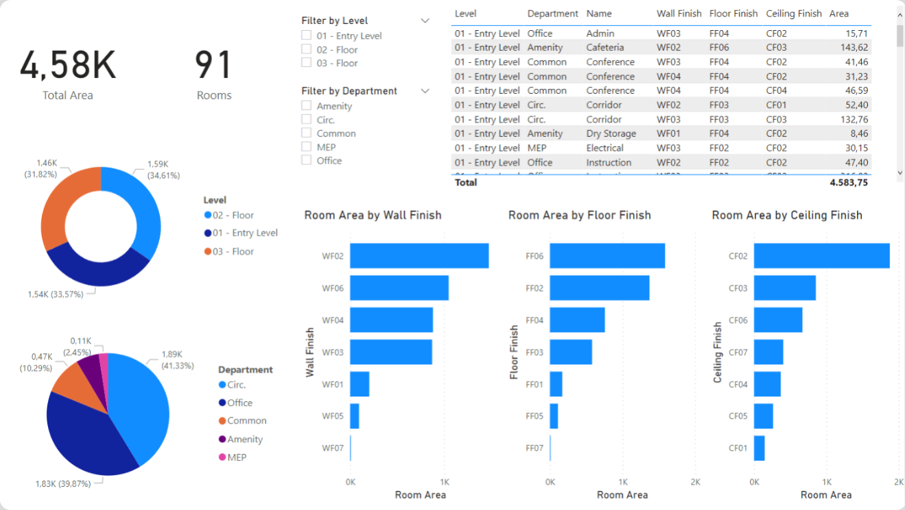

# Power BI

Speckle's connection to Power BI consists of two parts.

- Power BI Data Connector
- 3D Viewer Visual

These two parts complement each other. Together, they create a synergy that empowers you to unlock your data, making your reports truly immersive and engaging.

# Power BI Data Connector

## Introduction

Speckle Connector for Power BI lets you easily get data from Speckle into your Power BI reports and visualizations. You can access and analyze data from those applications without hassle by connecting Power BI with Speckle's extensive connections with AEC applications (like Revit, Archicad, Navisworks, Grasshopper, etc.).

::: warning ⚠️ WARNING
Currently, Speckle Connector for Power BI supports **Power BI Desktop only**.

:::

## Features

Power BI Connector allows you to import your Speckle model, version, or Object data using the corresponding URL. The following data will be retrieved depending on which type of URL you use:

- **Model URL** -> the most recent version on this model
- **Version URL** -> this version
- **Object URL** -> this object
