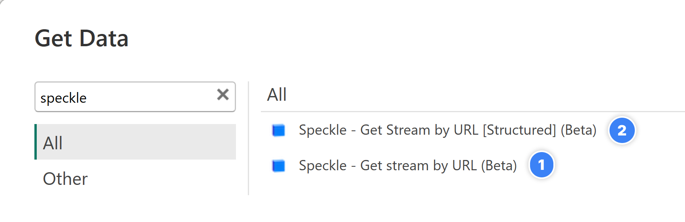
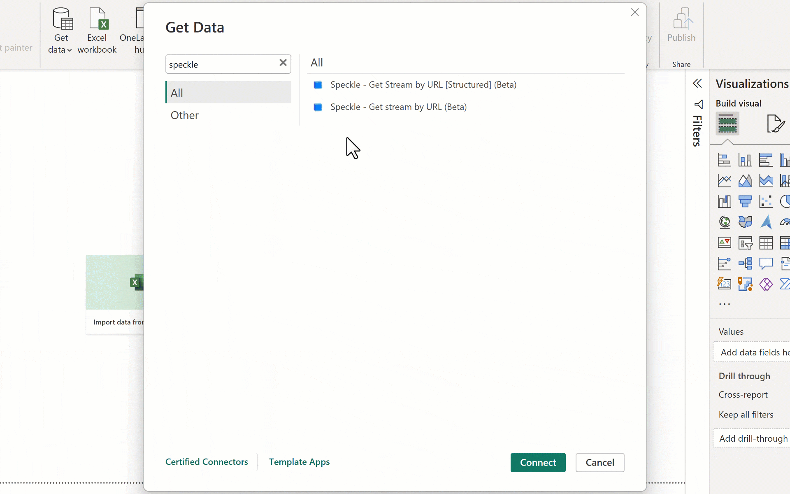
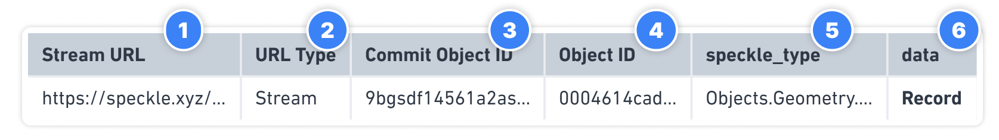
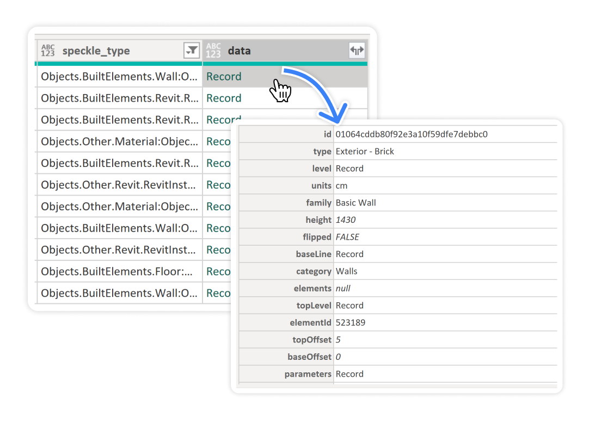

# Using Power BI Connector

If you’ve made it this far, chances are you’ve installed the Power BI connector and run through the configuration and authentication steps. If not, now is a good time to take a look.

Once the connector is installed, you'll find two new options in the ”**Get Data”** interface under the ”**Other**” category:

1.  **`Speckle - Get Model by URL (beta)`** (Recommended option for beginners)
2.  **`Speckle - Get Model by URL [Structured] (beta)`** (experimental).

### Speckle - Get Model by URL (beta)

This is recommended if you are just starting with the Speckle Power BI connector.

Using it is simple: paste **Model/Version URL** and click **OK**.

The result of that query will be a table with the following columns:

1. **Model URL**: This is the URL of your model.
2. **URL Type**: Type or category of the input URL. Its value can be model, version, or object.
3. **Version Object ID🆕:** The ID of the root object each individual object came from. For model/versions, it will be the referenced version object. For object URLs, it will match the object id on the URL.
4. **Object ID**: The ID of each speckle object in the table. This was extracted from the `data` records.
5. **speckle_type:** Speckle Type of each object.
6. **data**: A column of records containing the data belonging to each speckle object.

Other columns may be present and can be user-generated but are irrelevant to this section.\*\*\*\*

:::tip 📌IMPORTANT
Model URL, Version Object ID and Object ID were added to facilitate loading data into the new Speckle Power BI 3D Viewer
:::

#### Data Column

If you look at the values of the data column, you’d see it is full of Records. In Power BI, the Record data type represents a single row of data with one or more fields. It is similar to a JSON object in structure, where each field has a name and a corresponding value. This allows for representing complex data types within a single row.

In the case of Speckle, where objects are essentially JSON objects with key-value pairs, these objects are converted into Record objects in Power BI when received. This conversion enables the representation of the complex data structures from Speckle as Records within Power BI.

### Speckle - Get Model by URL [Structured] \(beta\)

:::warning ⚠️WARNING
This feature is experimental and may change in future releases.

:::

This new function allows for much faster interactions with your Speckle data, as it no longer requires you to pull every single object as a flat list. There's a small downside to this, as you will no longer get the data with the expected columns to connect it directly to the *Speckle Power BI Visual*.
