# QGIS

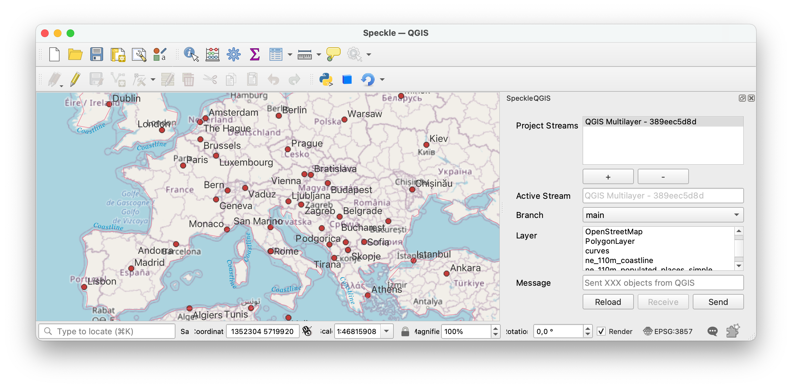

::: tip

The QGIS connector is in early stages of development and it is released as _experimental_. This means there's an extra step to installing it. Once we're out of `beta`, this step will no longer be necessary.
:::

The Speckle 2.0 connector for QGIS currently supports QGIS versions 3.0.0 and upwards.

## Getting started

### Installation

You can find Speckle QGIS in the QGIS `Plugins -> Manage and install plugins` menu item.

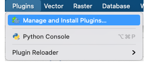

The plugin is currently published as experimental, so make sure you go to `Settings` and activate the `Show also experimental plugins` checkbox.

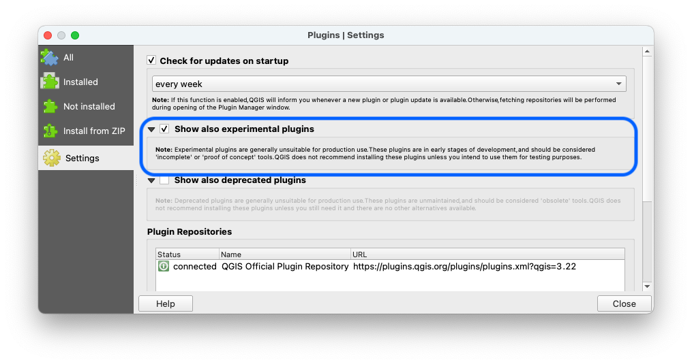

Then go to the `All` tab and search for `Speckle`. You should see the plugin appear in the list:

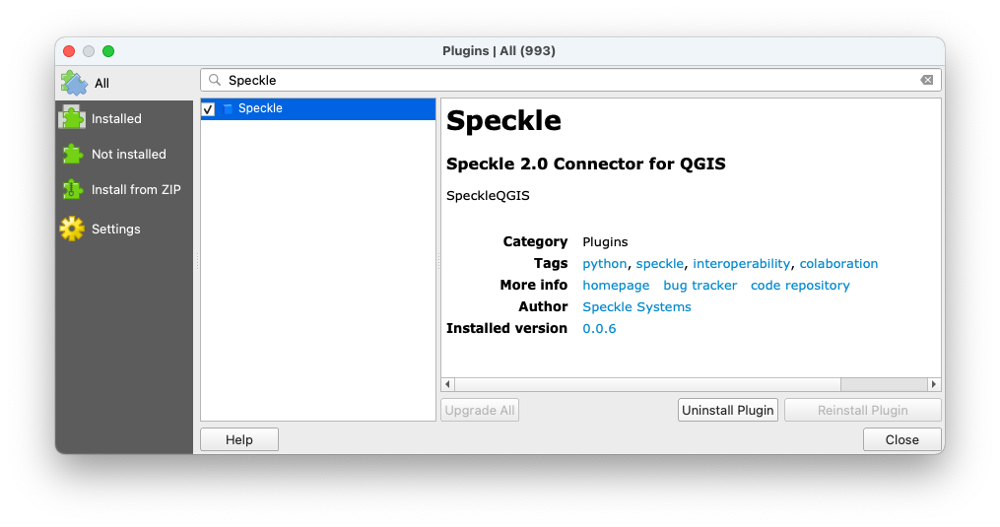

> You can also install it manually by either using the `Install from zip` option, or following the manual installation instructions in our [repo's readme](https://github.com/specklesystems/speckle-qgis).
>
> 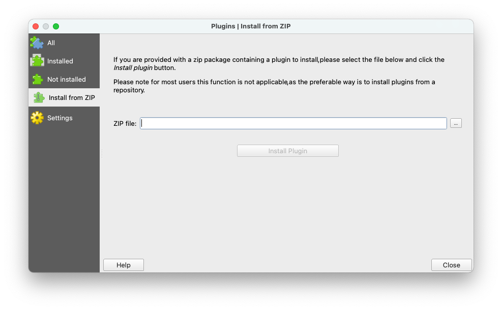

### Features

The plugin allows you to select several layers in your project, and send their geometry (as well as their contained metadata), to a Speckle server.

Only vector and raster based layers are supported. We're looking to improve support for other types of layers in the future.

For vector layers, supported geometries include:

- Point
- Multipoint
- Linestring
- MultiLineString
- Polyline
- Multipoliline
- Poligon
- Multipolygon

The geometry will be reprojected and sent in a `Project CRS` of your QGIS project. If the chosen Coordinate Reference System is of Geographic type with non-linear units, they will be treated as Meters in other software that do not support such units.

### Using Speckle QGIS

Once the plugin is installed, you'll find a new toolbar button in QGIS that will open the `SpeckleQGIS` panel.

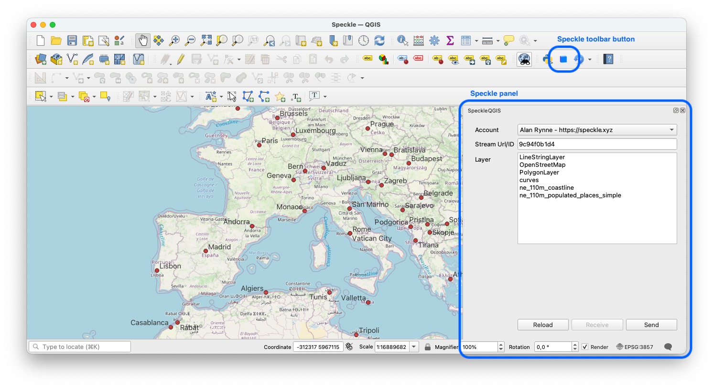

The panel contains a very simple UI interface:

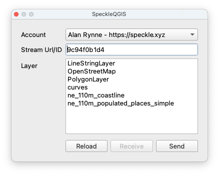

#### Adding a stream to the project

First, you need to search and add a stream to the project. For that, you can press the `+` button under the `Project Streams` panel. This will open a new pop-up window that will allow you to search for a specific stream.

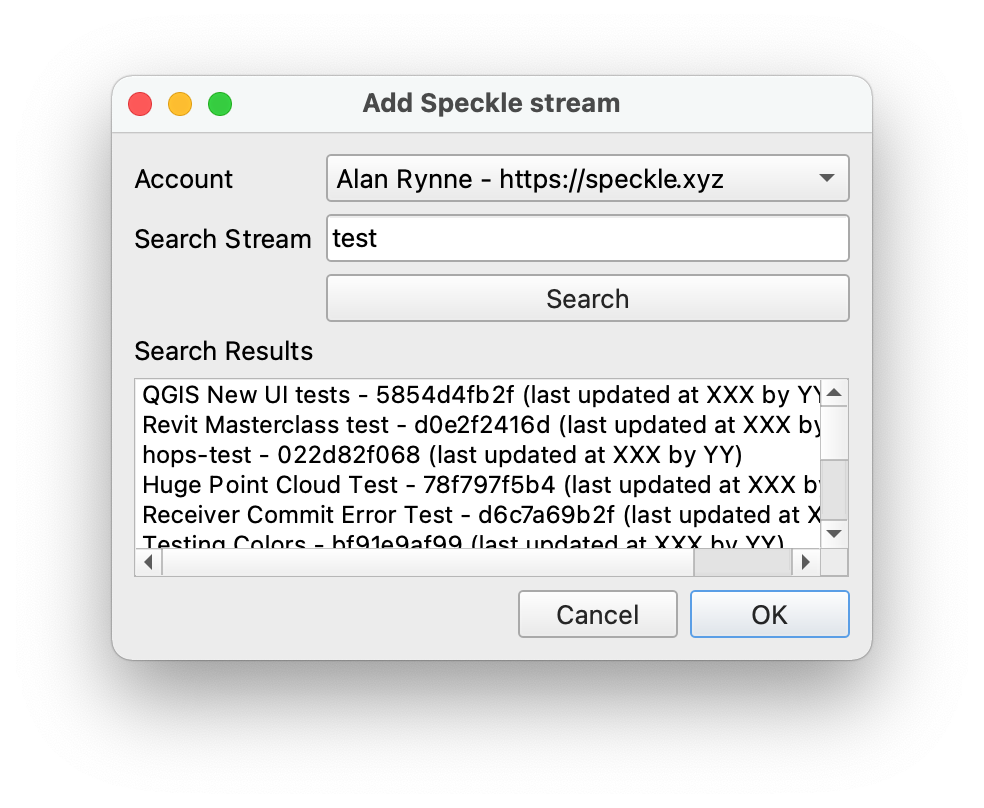

And here's a short gif of the process 👇🏼

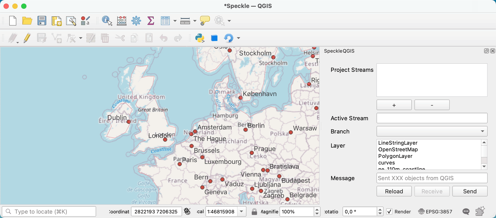

> Once a stream is added to the project, it is saved along with it so the streams will still be available after restarting QGIS.

#### Selecting the active stream

From the list of streams in the **Project streams** panel, you can select one to make it the **current active stream**. This will be the stream used for sending/receiving data. When an active stream is selected, `Active Stream` field will display the name, and the `Branch` dropdown will be populated with all available branches from that stream.

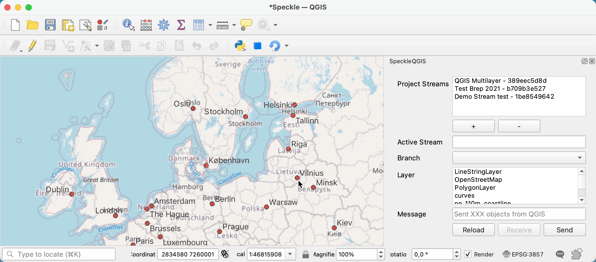

#### Sending data

In order to send some data, just follow these steps:

1. Select a stream so it becomes **active**
2. Specify a specific branch to send data to using the dropdown menu.
3. Select the layers in the file that you wish to send.
4. (optional) Write a commit message.
5. Send the selected layers.

Here's a quick walkthrough of the process.

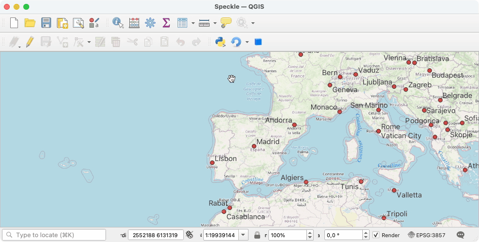

#### Viewing the result

Once data has been sent to Speckle, you can view the result by going to your Speckle's server Url (our public one is https://speckle.xyz). Here's an example of some QGIS data:

<iframe src="https://speckle.xyz/embed?stream=389eec5d8d&commit=13f1ff032c" width=600 height=400></iframe>

#### Receiving data

> We're working on enabling receiving data into QGIS and will be released in the near future! Stay tuned in our [Community Forum](https://speckle.community)!

## Feedback

We're really interested in your feedback regarding the integration between QGIS and Speckle! You can always reach us at our [Community Forum](https://speckle.community)
