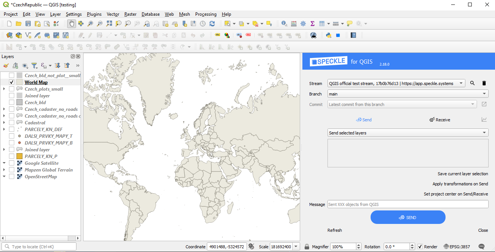
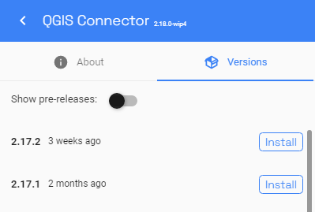
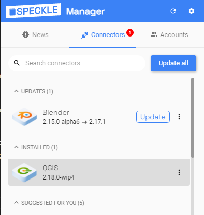
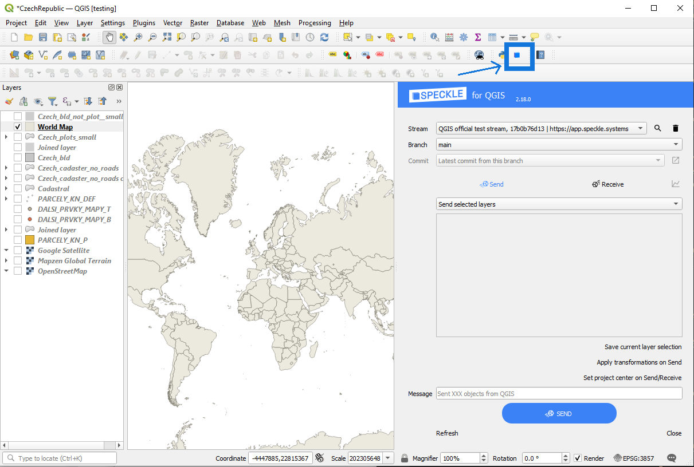
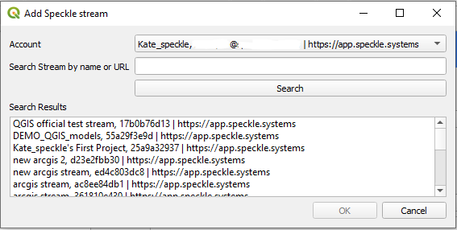
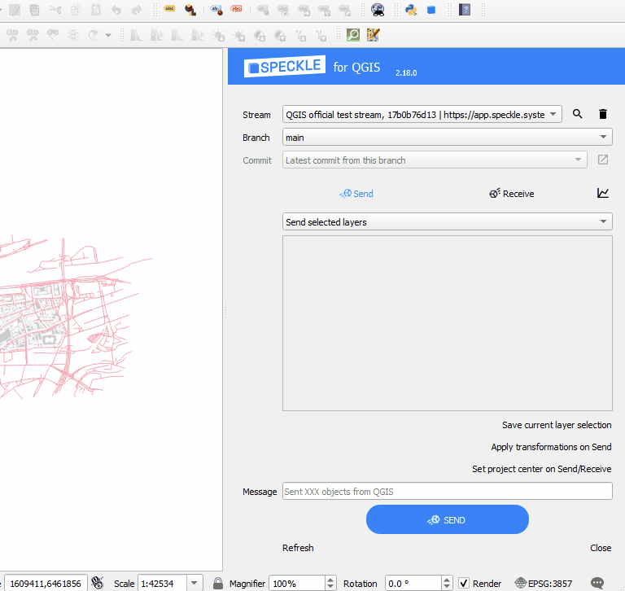
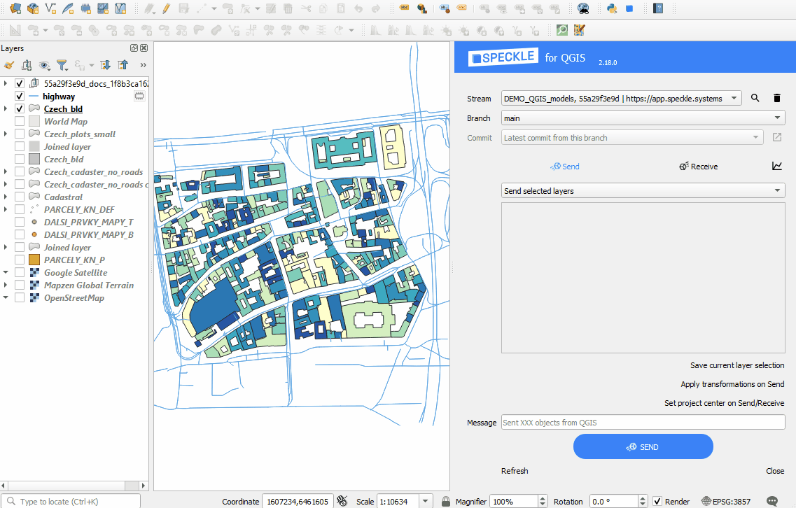
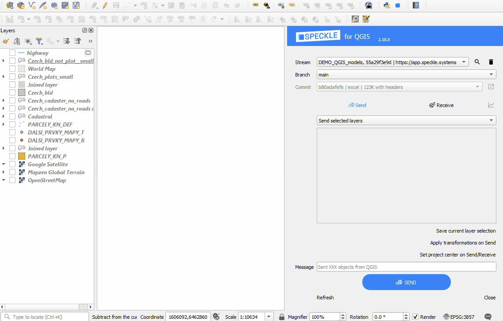

# QGIS

The Speckle 2.0 connector for QGIS currently supports QGIS versions 3.28.15 and upwards.

## Getting Started

### Installation

You can find Speckle QGIS in the QGIS `Plugins -> Manage and install plugins` menu item.

Go to the `All` tab and search for `Speckle`. You should see the plugin appear in the list:

You can also install the plugin from Speckle Desktop Manager: 

### Features

 - The plugin allows you to select several layers in your project and send their geometry and attributes to a Speckle server.

 - You can receive Speckle geometry sent from other software. Properties of the objects upon receiving are stored in the layer attribute table.

 - You can send you data from QGIS and receive it in CAD in a CAD-friendly location, thanks to the option to create custom Coordinate Reference System (CRS) in QGIS. To do this, you will be required to enter geographic coordinates of the point representing the origin point (0, 0) in your CAD project.

  - You can transform the polygons and topography (single-band raster layers) from 2d to 3d upon sending. Refer to the "Transformations" section below. 

### Using Speckle QGIS

Once the plugin is installed, you'll find a new toolbar button in QGIS that will open the `SpeckleQGIS` panel. The panel contains a very simple interface:

#### Adding a Speckle Project to the QGIS Project

First, you need to search and add a project to the QGIS project. For that, you can press the Search button near the `Project` panel. This will open a new pop-up window that will allow you to search for a specific project and add it to QGIS project.

From the list of projects in the dropdown list, you can select one to make it the **current active project**. This will be the project used for sending/receiving data. When an active project is selected, the `Model` dropdown will be populated with all available models from that project.

And here's a short gif of the process 👇🏼

> Once a project is added to the QGIS project, it is saved along with it so the projects will still be available after restarting QGIS.

#### Sending Data

In order to send your data, just follow these steps:

1. Select a project from the dropdown list.
2. Specify a specific model to send data to using the dropdown menu.
3. Select the layers in the file that you wish to send.
4. (optional) Write a version message.
5. (optional) If you want to receive it in a non-GIS software or view in the browser, make sure you set your project to CRS of projected type (e.g. using Meters as units).
6. Send the data.

The geometry will be reprojected and sent in a `Project CRS` of your QGIS project (shown in the bottom right corner in QGIS panel). If the chosen Coordinate Reference System is of Geographic type with non-linear units, they will be treated as Meters in other software that do not support such units.

Here's a quick walkthrough of the process.

If you want to receive the layers later in a non-GIS software at the exact location (e.g. receive a context for your building in London), you can create a custom CRS in QGIS, that will match the global coordinate system from QGIS with the local coordinate system in CAD. Simply enter the geographic coordinates (Lat, Lon) of the point which is the origin (0,0) of your CAD environment. 

#### Viewing the Result

Once data has been sent to Speckle, you can view the result by going to your Speckle's server Url (our public one is https://app.speckle.systems/). Here's an example of some QGIS data:

<iframe title="Speckle" src="https://app.speckle.systems/projects/55a29f3e9d/models/e9f320ca1c@1f8b3ca162#embed=%7B%22isEnabled%22%3Atrue%7D" width="600" height="400" frameborder="0"></iframe>

#### Receiving Data

Steps to receive the data:

1. Select the project to receive data from
2. Select the model
3. Select specific version (by default the latest one)
4. Find the received layers in the new layer group named after project, model and version

### Custom Project Centre is useful when you need to: 
 - Send data (so you can receive correctly in a non-GIS application)
 - Receive data (if data was sent from non-GIS application).

You have several options to choose in order to set the custom project center. 

#### Adding Offsets
You can choose to use the existing Coordinate Reference System (Project CRS) and modify it's Speckle properties by adding X- and Y- offsets. This option will only be affecting Speckle properties on Send/Receive and will not change anything for you while you are working on a QGIS project. Use this option when your project requires a use of a specific CRS. 

For example, if you use a projected CRS (e.g. EPSG:32631) without the offsets and send the Eiffel Tower outline to Speckle, when receiving in Rhino geometry will be located thousands kilometers away from the origin. But if before sending you set the offsets Lat(y) as 5411939.08 and Lon(x) as 448253.52, you will receive the Eiffel Tower right in the middle of your Rhino canvas, while still preserving the required CRS (e.g. EPSG:32631). 

Lat(y) and Lon(x) offsets should be specified in the units of the current Project CRS, and in the correct order. Note, that when you copy the coordinates from QGIS canvas using right-click, the Lat/Lon order might be different depending on the CRS used (Lat is usually marked with N-North, and Lon is marked with E-East, both values can be positive or negative). 

#### Creating Custom CRS
Create a custom Coordinate Reference System, based on Traverse Mercator if you don't have to use a specific CRS and want to have minimal size and shape distortions. Specify the origin Lat, Lon in geographic coordinates to create a custom CRS with the required origin and change your Project CRS. 

#### Adding Angle to the True North
You can also add an angle to the True North to either of the above options if your non-GIS application require so. It will only affect Speckle object properties during Send/Receive operations and will not be visible in QGIS project.

### Transformations
From 2.14 version onwards there is a new functionality helping to send a full 3d context maps for the further use in CAD, BIM or any 3D software. This can be applied by clicking "Apply transformations on Send" before sending the data. 

At the moment, 4 types of transformations are available: 

- **Creating a mesh from Digital Elevation Model:** converting a sigle-band raster layer to a 3d mesh. 
- **Using a raster layer as a texture for a 3d mesh:** mapping the raster image onto a 3d elevation (requires pre-selected Elevation layer). 
- **Extruding polygons:** using a random value or a numeric/text attribute field of the layer. 
- **Projecting polygons onto 3d elevation:** move the lowest point of the polygon to the lowest point of the surrounding terrain (requires pre-selected Elevation layer). 

Additionally: 
- **Setting a layer as Elevation layer:** will be used as a base for several transformations, such as texturing and projecting on a terrain. 

You can add and remove transformations using + and - buttons above and under the list with applied transformations: 

Each transformations type is targeting a specific layer type, e.g. only polygon layers or only raster layers. Extrusion transformation will offer additional parameter - choice of the attribute to use for the extrusion value. If you choose the option "populate NULL values", you will be able to set a "Random height" as a value. 

Add "Log Messages Panel" to your QGIS interface to see more info and warnings about your transformations. 

### Examples

**Elevation to a 3d mesh**

**Texture for 3d mesh**

**Polygon extrusions**

**Extrusing and projecting on a terrain**

**Combination of the transformations**

## Feedback

We're really interested in your feedback regarding the integration between QGIS and Speckle! You can always reach us at our [Community Forum](https://speckle.community)
