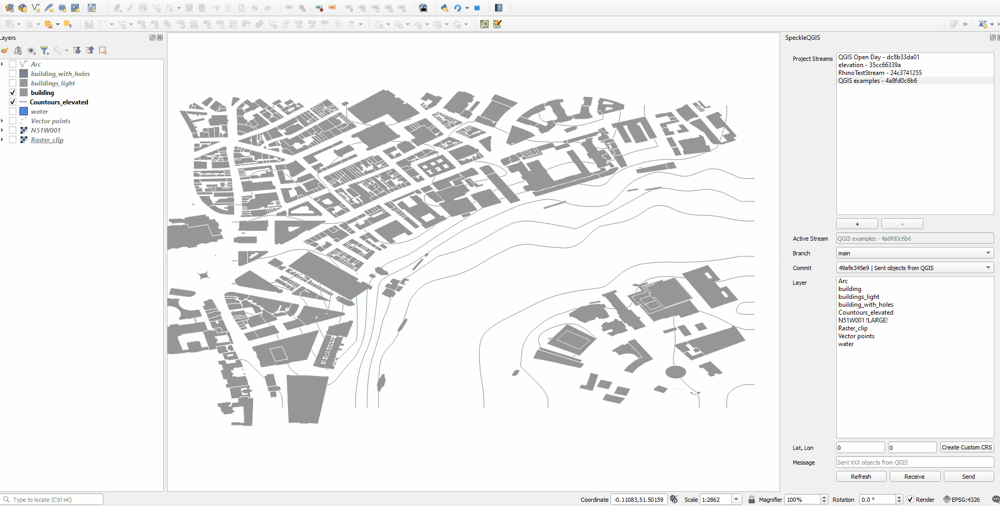
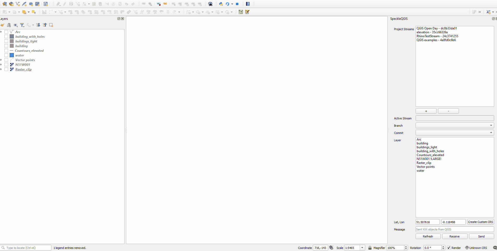

# QGIS

::: tip

The QGIS connector is in early stages of development and it is released as _experimental_. This means there's an extra step to installing it. Once we're out of `beta`, this step will no longer be necessary.
:::

The Speckle 2.0 connector for QGIS currently supports QGIS versions 3.0.0 and upwards.

## Getting started

### Installation

You can find Speckle QGIS in the QGIS `Plugins -> Manage and install plugins` menu item.

The plugin is currently published as experimental, so make sure you go to `Settings` and activate the `Show also experimental plugins` checkbox.

Then go to the `All` tab and search for `Speckle`. You should see the plugin appear in the list:

> You can also install it manually by either using the `Install from zip` option, or following the manual installation instructions in our [repo's readme](https://github.com/specklesystems/speckle-qgis).
>
> 

### Features

The plugin allows you to select several layers in your project, and send their geometry (as well as their contained metadata), to a Speckle server.

Only vector and raster based layers are supported. We're looking to improve support for other types of layers in the future.

The geometry will be reprojected and sent in a `Project CRS` of your QGIS project. If the chosen Coordinate Reference System is of Geographic type with non-linear units, they will be treated as Meters in other software that do not support such units.

You can received Speckle geometry sent from other software. Currently supported Speckle types for receiving: Point, Line, Polyline, Arc, Circle, Polycurve. 

Properties of the objects upon receiving are stored in the layer attribute table.

You can send you data from QGIS and receive it in CAD in a CAD-friendly location, thanks to option to create custom CRS in QGIS. To do this, you will be required to enter geographic coordinates of the point representing origin point (0, 0, 0) in your CAD project.

### Using Speckle QGIS

Once the plugin is installed, you'll find a new toolbar button in QGIS that will open the `SpeckleQGIS` panel.

The panel contains a very simple UI interface:

#### Adding a stream to the project

First, you need to search and add a stream to the project. For that, you can press the `+` button under the `Project Streams` panel. This will open a new pop-up window that will allow you to search for a specific stream.

And here's a short gif of the process 👇🏼

> Once a stream is added to the project, it is saved along with it so the streams will still be available after restarting QGIS.

#### Selecting the active stream

From the list of streams in the **Project streams** panel, you can select one to make it the **current active stream**. This will be the stream used for sending/receiving data. When an active stream is selected, `Active Stream` field will display the name, and the `Branch` dropdown will be populated with all available branches from that stream.

#### Sending data

In order to send some data, just follow these steps:

1. Select a stream so it becomes **active**
2. Specify a specific branch to send data to using the dropdown menu.
3. Select the layers in the file that you wish to send.
4. (optional) Write a commit message.
5. (optional) If you want to receive it in a non-GIS software or view in the browser, make sure you set your project to CRS of projected type using Meters as units.
5. Send the selected layers.

Here's a quick walkthrough of the process.

If you want to receive the layers later in a non-GIS software at the exact location (e.g. receive a context for your building in London), you can create a custom CRS in QGIS, that will match the global coordinate system from QGIS with the local coordinate system in CAD. Simply enter the geographic coordinates (Lat, Lon) of the point which is the origin (0,0,0) of your CAD environment. 

#### Viewing the result

Once data has been sent to Speckle, you can view the result by going to your Speckle's server Url (our public one is https://speckle.xyz). Here's an example of some QGIS data:

<iframe src="https://speckle.xyz/embed?stream=389eec5d8d&commit=13f1ff032c" width=600 height=400></iframe>

#### Receiving data

Steps to receive the data:

1. Select the stream to receive data from
2. Select the branch
3. Select specific commit (by default the latest one)
4. Find the received layers in the new layer group named after stream, branch and commit

### Transformations
From 2.14 version onwards there is a new functionality helping to send a full 3d context maps for the further use in CAD, BIM or any 3D software. This can be applied by clicking "Apply transformations on Send" before sending the data. 

At the moment, 4 types of transformations are available: 

- **Creating a mesh from Digital Elevation Model:** converting a sigle-band raster layer to a 3d mesh. 
- **Using a raster layer as a texture for a 3d mesh:** mapping the raster image onto a 3d elevation (requires pre-selected Elevation layer). 
- **Extruding polygons:** using a random value or a numeric/text attribute field of the layer. 
- **Projecting polygons onto 3d elevation:** move the lowest point of the polygon to the lowest point of the surrounding terrain (requires pre-selected Elevation layer). 

Additionally: 
- **Setting a layer as Elevation layer:** will be used as a base for several transformations, such as texturing and projecting on a terrain. 

You can add and remove transformations using + and - buttons above and under the list with applied transformations: 

Each transformations type is targeting a specific layer type, e.g. only polygon layers or only raster layers. Extrusion transformation will offer additional parameter - choice of the attribute to use for the extrusion value. If you choose the option "populate NULL values", you will be able to set a "Random height" as a value. 

Add "Log Messages Panel" to your QGIS interface to see more info and warnings about your transformations. 

### Examples

**Elevation to a 3d mesh**

**Texture for 3d mesh**

**Polygon extrusions**

**Extrusing and projecting on a terrain**

**Combination of the transformations**

## Feedback

We're really interested in your feedback regarding the integration between QGIS and Speckle! You can always reach us at our [Community Forum](https://speckle.community)
