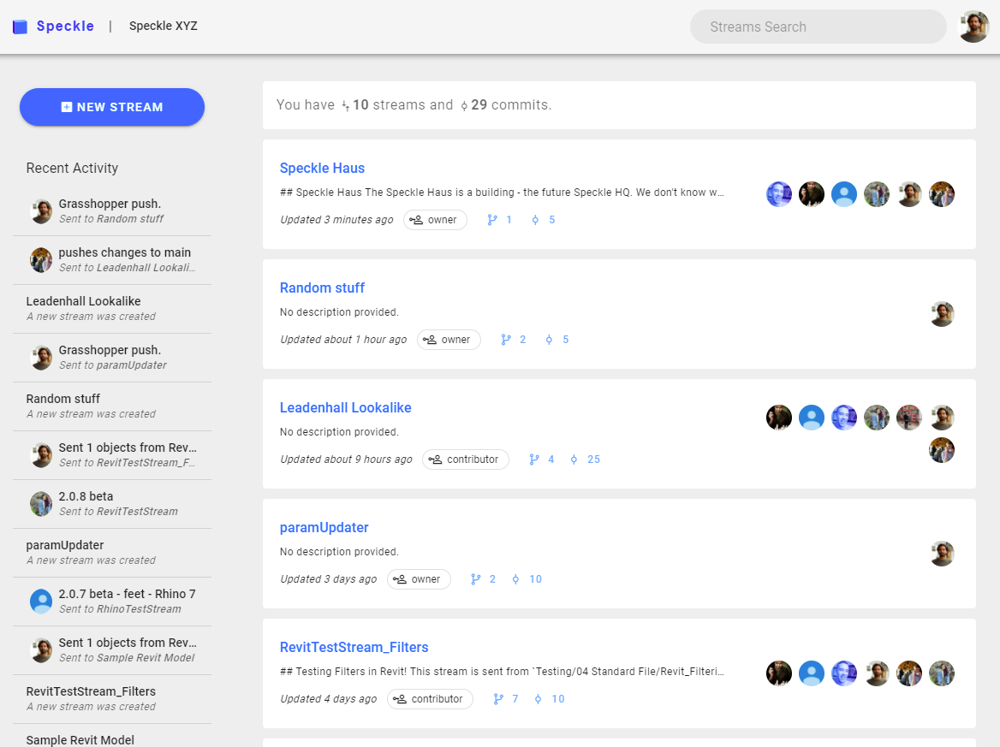

# Zero to Speckle ASAP

Pressed for time? Here's a lightning fast intro to getting started!

## Registration

Before you can use Speckle, you'll need an account!
* If your company runs its own Speckle server, you can register using the URL they can provide you.
* Otherwise, you can register with our [free official server](https://speckle.systems/getstarted/))

## Onboarding
As you register, our onboarding process will take you through:

- Downloading and installing the Speckle Manager, our desktop application for account and connector management.
- Linking your newly-created account to the Speckle Manager ([additional ways to do this](/user/manager.md#adding-account)).
- Creating your first stream.

::: tip Psst!

Did you skip the onboarding? No problem!
If you're on a company server, head over to: `https://your-server-address/onboarding`.
If you're using our official server, that's: `https://speckle.xyz/onboarding`.

:::

## Speckle Web App

Our [browser-based app](/user/web) is your gateway to the Speckle server. From here, you can:
* View and manage your streams, administer them and control who has viewing & editing access to them.
* Visualise your data in our interactive 3D viewer
* Create new branches (and soon - commits!)
* Manage your authorised apps and create personal access tokens to use in your own scripts and apps.
 
::: tip Got Programming Skills?

If you're interested in experimenting with the API, check out our [developer sections](/dev/server-api.).

:::

## Connectors

Once you've authorised the Manager, you are ready to use the desktop [Connectors](/user/connectors)!
&nbsp;
Connectors link your AEC software to Speckle, allowing you to send/receive data to/from a Speckle server.

Our growing list of official Speckle Connectors includes:
- [Rhino](/user/rhino)
- [Revit](/user/revit)
- [Grasshopper](/user/grasshopper)
- [Dynamo](/user/dynamo)
- [AutoCAD](/user/autocadcivil)
- [Civil3D](/user/autocadcivil)
- [Unity](/user/unity)
- [Blender](/user/blender)

### Installation

The official connectors can be installed through the "Connectors" page of the Speckle Manager. Simply select which one you'd like to install from the list, and the Manager will do the work for you.

### Grasshopper and Dynamo

The connectors for [Grasshopper](/user/grasshopper) and [Dynamo](/user/dynamo) are fairly aligned. The most important components/nodes are `Send Data` and `Receive Data`. These connectors will use the default account you've set in Speckle Manager, though this can be overridden using the relevant `Account` components/nodes.

You also get components/nodes to `Create`, `Get`, `Update`, and `Delete` streams as well as get a `List` of your streams or more `Details` for a stream. Streams can be retrieved by either using the `List` component or the url of a specific stream, branch, commit or object.

Finally, there are some more advanced components/nodes for creating and expanding custom objects, for JSON serialisation, and local sending / receiving.

### Revit, Rhino, AutoCAD, Civil3D

Our Revit and Rhino Connectors share the same user interface.
When loaded, the main dialog displays all the streams that exist in the current file. Each stream can be either a Sender or Receiver - click the double arrow button on the top right corner of a card to switch a stream from Sender to Receiver mode (or vice versa).

The big blue button in the bottom right corner will let you add an existing stream or create a new one. Once you've added a stream, you'll see a new Sender stream on the home screen. You can click the centre "0 objects" button to add objects to the stream using selection or filters.

Once you've added objects, you can send by clicking the Send button. You may want to add a short message describing this stream. To do this, just click the three dots menu to the right of the Send button.

Clicking on a stream's name in your stream list will let you edit its name and description, add collaborators, or remove the stream from the file.

A Receiver has a commit selection button in the centre instead of an objects selection button. This button opens a menu that lets you choose if you want to receive a specific commit or just the latest commit.

#### Further Reading

For information on using specific connectors, check out the [Desktop Connectors](/user/connectors) section of the User Guide.

If you'd like more detailed guides for sending data between AEC software, check out our [tutorials](https://speckle.systems/tutorials/).

## Conclusion

That's all, folks! You are now successfully set up and have the tools to start using Speckle. If you need further guidance on anything we covered here, head over to the more detailed sections below. If you want to learn more about the code side of things, the [Dev Docs](/dev/) should be your next stop. If you're looking for more in-depth reading on how Speckle does its Speckling, have a browse through the additional sections below.

If you're enjoying Speckle, have any questions, or would like to share any feedback or suggestions, please drop by our [Community Forum](https://speckle.community/) and join the conversation.
