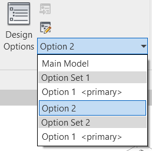

# Revit

  <b>Notice</b>: This user guide is based on the V2 Revit connector.
  This connector has a Next Gen version available, with major improvements to functionality and installation.

The Speckle Revit Connector supports Autodesk Revit 2020–2023 and is now available as a Next Gen connector.

::: tip 💡 TIP
Check out our dedicated tutorial on [how to get started with Revit](https://speckle.systems/tutorials/getting-started-with-speckle-for-revit/)!
:::

## Getting Started

You can install the Revit Connector in one of two ways:

- **Recommended**: [Speckle Manager](https://speckle.systems/download/) – for easy connector management and updates.
- **Alternative**: Download the installer directly from the [Speckle Releases page](https://releases.speckle.systems).

Once installed, you’ll find Speckle in the Revit **Ribbon** under the **Speckle** tab:

## User Interface

::: tip 🙌 IMPORTANT
The Revit Connector uses our shared Desktop UI. Learn more in the [Desktop UI section](/user/ui).
:::

You can connect a Revit project to Speckle by sending or receiving models using flexible filters and workflows.

## Filters and Send Modes

Speckle supports multiple selection filters when sending data from Revit.

### Category Filter
Send objects from one or more supported Revit categories.

### View Filter
Send objects visible in one or more selected views.

### Project Info Filter
Send metadata like levels, types (non-geometry), views, and project information.

### Revit Filter Rules
Use Revit’s own filters to select objects based on rules (e.g. rooms on a specific level).

## Receive Modes

Choose how incoming objects should be handled:

- **Update**: Updates elements if already present; creates any new ones.
- **Create**: Always creates new elements.
- **Ignore**: Skips existing elements; only creates new.
- **Update Only**: Updates only existing elements (coming soon).

## Linked Models

### Sending Linked Models

Enable this via **Advanced Settings > Send Linked Models**. Filters like “Everything” or “Category” will include elements from linked models too.

::: tip ⚠️ View-based sending from linked models behaves differently depending on Revit version:
- **Revit 2024**: only visible elements from linked models are sent
- **Revit ≤2023**: entire linked model is sent (if visible)
:::

### Receiving Linked Models

Enable via **Advanced Settings > Receive Linked Models**. Linked model elements will appear in the current document but won’t attempt to modify any linked model files.

## Supported Elements

Refer to the [Revit Support Tables](/user/support-tables.html#revit) for a full list of supported categories and elements.

## Family Editor Support

The Revit Connector also works within the Family Editor. Supported families are listed in the [support tables](/user/support-tables.html#revit).

## Element Updating Logic

The Connector automatically updates received elements instead of deleting and recreating them when possible.

Updates are triggered by matching `applicationId` values—e.g. Revit `UniqueId` or Rhino/Grasshopper-generated IDs.

Levels are handled specially: if a level with the same elevation already exists, it’s reused and renamed. Levels are **not matched by name**.

## Revit and BIM Data in Speckle

All Revit parameters (instance & type) are captured in the `parameters` dictionary on each Speckle object.

::: tip
Parameters use **internal Revit names**. See [BuiltInParameter list](https://www.revitapidocs.com/2022/fb011c91-be7e-f737-28c7-3f1e1917a0e0.htm).
:::

Explore object data in the [Speckle Web App](/user/web.html) or tools like Grasshopper, Dynamo, or Unity.

## Advanced Settings

Customise sending/receiving behaviour per project.

- **Reference Point**: choose between Internal Origin, Project Base Point, or Survey Point
- **Send/Receive Linked Models**
- **Receive as Direct Meshes**
- **Custom Object Type Mapping**
- **Import Meshes as DXF**
- **Disallow Join for Elements**
- **Schedule automatic sends**
- **Design Options per view**

Each option is explained in detail above under its relevant section.

## Schedule Sends (Alpha)

Set up automated sending triggers like:
- On Save
- On Sync to Central
- On Export

## Design Options

Send main and secondary design options using:

- **Everything** filter + Design Option drop-down
- **View** filter tied to a view with specific design options

Need help or want to share feedback? Visit our [Community Forum](https://speckle.community).
