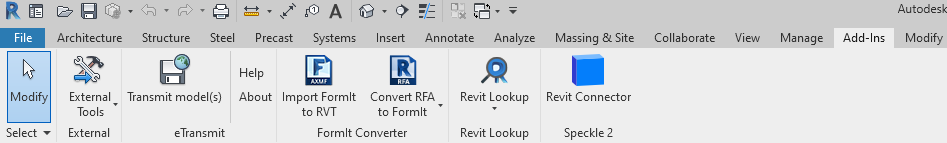
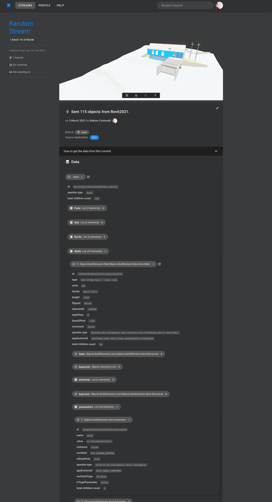

# Revit

The Speckle Revit Connector currently supports Autodesk Revit 2019, 2020 and 2021.

::: tip 

Check out our dedicated tutorial on [how to get started with Revit](https://speckle.systems/tutorials/getting-started-with-speckle-for-revit/)!

:::

## Getting Started

To install the Revit Connector and add your Speckle account, proceed by following the instructions in [Speckle Manager](/user/manager).

Once installed, you can find the Revit connector in the ribbon menu under the **Add-Ins** tab like so:

## User Interface

::: tip IMPORTANT 🙌

This connector uses our shared Desktop UI. Read up on general guidelines for usage in the [Desktop UI section](/user/ui).

:::

### Selection Filters

To help you select which elements will be to sent to Speckle, we've built various filters into our Revit connector. Once a filter is set, just click **Send** and all objects passing the filter will be sent to your Stream. 

_Please Note: Elements are sent regardless of whether they are visible or if they were created after setting up the filter._

#### Category Filter

The category filter lets you select one or more of the currently-supported Revit categories.

#### View Filter

The view filter works similarly to the category one, and lets you include all elements visible in one or more views.

#### Project Info Filter

The project info filter lets you add non physical elements, such as levels, views, element types (their properties, not geometry) and project information.

#### Parameter Filter

The parameter filter will filter all model elements that satisfy the logical conditions defined by you. For example, in the image below, Speckle will send all elements whose `Base Offset` value is greater then 2000mm.

:::tip NOTE

The list of available parameters comes from the current elements in the model. If the model is empty, no parameters will be available.

:::

## Supported Elements

* [Revit Support Tables](/user/support-tables.html#revit)

## Updating Elements

The connector takes care of updating received elements automatically where possible (instead of deleting and re-creating them). This is preferred, as dimensions, ElementIds and other annotations are preserved.

Elements are updated under these two circumstances:

- If the element was created in another project/software and had been received previously: for example, BuiltElements that were created in Rhino or Grasshopper
- If the element was created in the same project you're working on: for example, if you send some walls to Speckle, edit them, and receive them again from the same stream

Here are some technical details if you're curious about what's happening behind the scenes:

- BuiltElements have a property called `applicationId`, this is different from the `id/hash` property on them, and represents the id of such element in the host application in which it was first created. If the element was created in Revit it’s the `UniqueId`, if coming from Grasshopper/Rhino an analogous field
- When a stream is received in Revit the `applicationIds` of all BuiltElements created are cached in the receiver
- When receiving a second time from the same stream, if the received elements have the same `applicationId` of something that was previously received (and it still exists in the document), the connector will attempt to modify them instead of creating new ones. If the update fails (or is not permitted by the API), it’ll delete them and create new ones
- If no cached element is found, but there is an element in the document with a matching `applicationId` that is used for the update (this is the case of someone restoring changes previously sent, in the same project)
- If an element being received doesn’t have an `applicationId` no update mechanism will happen (this could be the case of BuiltElements created in Python if no `applicationIds` are generated manually)

## Revit & BIM Data

When sending from Revit, Speckle takes care of converting the data to a Speckle friendly format. If you're curious about how this data is being structured, please have a look at our [Objects Kit class definitions](https://github.com/specklesystems/speckle-sharp/tree/master/Objects/Objects/BuiltElements).

For instance, a Revit room will look like this:

At a high level we have all the main properties that define the room, such as the name, area, number, geometry etc. All the other Revit parameters, both **type and instance**, are nested inside the **parameters** property.

See an example below:

::: tip Note 🙌

All the parameters are stored using their **internal Revit names**. You can see the full list of `BuiltInParameter` values [here](https://www.revitapidocs.com/2022/fb011c91-be7e-f737-28c7-3f1e1917a0e0.htm). If you need to access their display name, just refer to the `name` property of each parameter, but please keep in mind these are not unique and can vary between languages.

:::

To easily explore on object's data and parameters, our [Speckle Web App](/user/web.html) interface can be of great help. As well as any other applications that lets you explore the object metadata (eg Grasshopper, Dynamo, Unity, etc).

