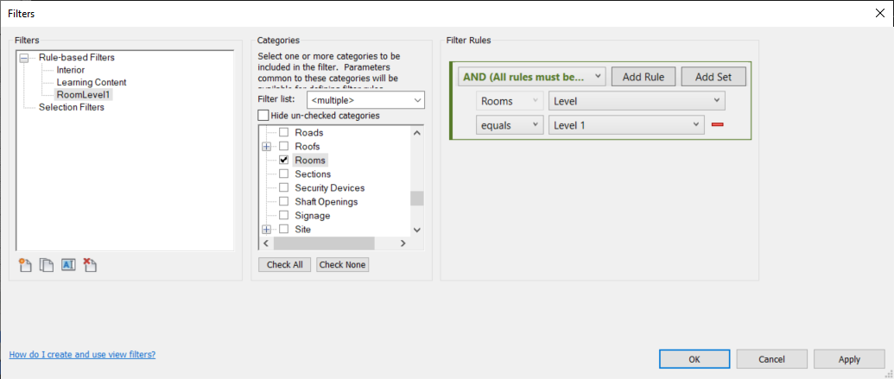
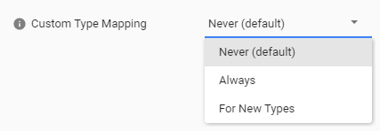
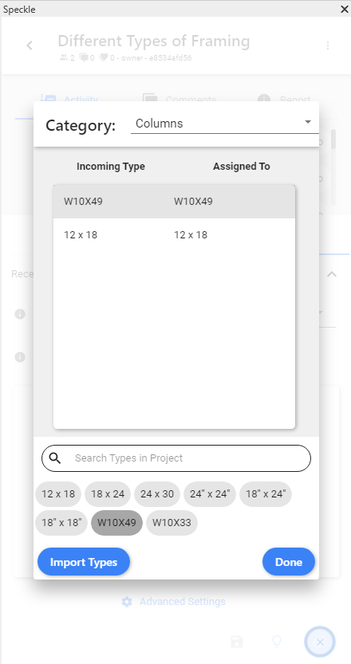
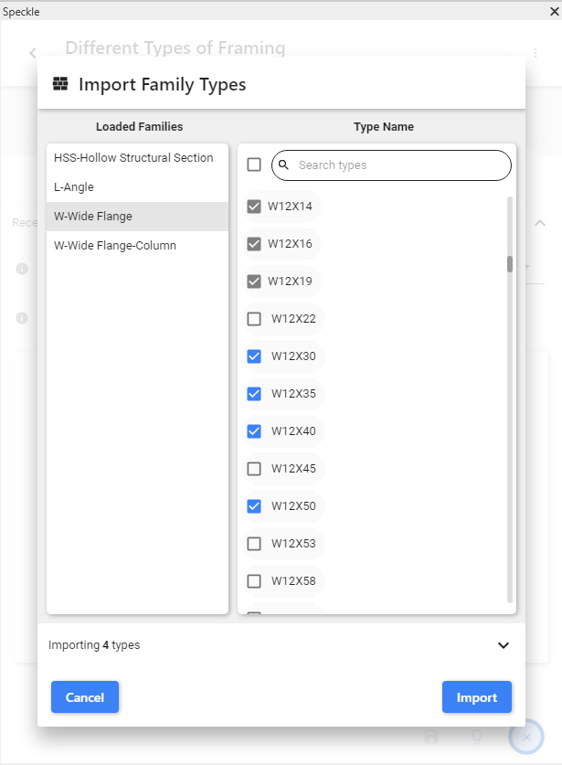
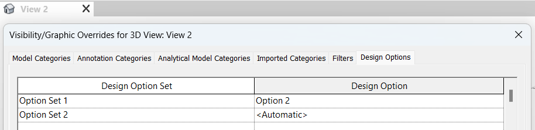
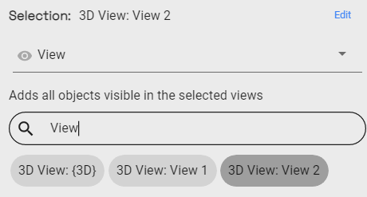

# Revit

  <b>Notice</b>: This user guide is based on the V2 Revit connector.
  Next Gen connectors are coming soon, bringing significant changes to the documentation and features!

The Speckle Revit Connector currently supports Autodesk Revit 2020, 2021, 2022 and 🆕2023.
::: tip 💡 TIP

Check out our dedicated tutorial on [how to get started with Revit](https://speckle.systems/tutorials/getting-started-with-speckle-for-revit/)!

:::

## Getting Started

To install the Revit Connector and add your Speckle account, proceed by following the instructions in [Speckle Manager](/user/manager).

Once installed, you can find the Revit Connector in the ribbon menu under the **Speckle** tab like so:

## User Interface

::: tip 🙌 IMPORTANT

This connector uses our shared Desktop UI. Read up on general guidelines for usage in the [Desktop UI section](/user/ui).

:::

### Selection Filters

To help you select which elements will be to sent to Speckle, we've built various filters into our Revit Connector. Once a filter is set, just click **Send** and all objects passing the filter will be sent to your project.

_Please Note: Elements are sent regardless of whether they are visible or if they were created after setting up the filter._

#### Category Filter

The category filter lets you select one or more of the currently-supported Revit categories.

#### View Filter

The view filter works similarly to the category one, and lets you include all elements visible in one or more views.

#### Project Info Filter

The project info filter lets you add non physical elements, such as levels, views, element types (their properties, not geometry) and project information.

#### Filters

Filters are used to selectively extract specific model elements based on predefined logical conditions. In the given image, for instance, Speckle will identify and send all room elements that have a Level value matching "Level 1".

To access the Filters feature, follow these steps:

1. Navigate to the "View" tab on the Ribbon and locate the "Filters" button in the Graphics panel. Click on it. Create a filters with category is `Rooms` and Parameter filter is `Level` equal `Level 1`.

2. Switch to the "Speckle" tab on the Ribbon and select the "Revit Connector" button.

3. Send the elements filer by selection `Filters` with name filter created.

### Receive Modes

When receiving from a project that has been received before, you might want to update, create or ignore elements that were already created before.
This is when the **Receive Mode** setting comes in! This is how it works:

- update: updates elements if they already exist and creates missing ones (current behavior in Revit)
- create: always creates new elements even if pre-existing (current behavior in Rhino)
- ignore: skips elements if they already exist
- update only: only updates existing elements (coming soon)

## Linked Revit Models

The Revit Connector supports Linked Revit Models, here's how it works.

### Sending Linked Revit Models

First enable support for linked models when sending from the _Send tab_ > click on _Advanced Settings_ > _Send Linked Models_.
Then use the selection filters as you would normally would and any relevant item from the linked models will be sent as well.
For instance: _Everything_ will send all the models, _Category_ filters will work in conjunction with any linked model elements and _Selection_ too.

:::tip IMPORTANT

If sending by **view**, the linked model support works as follows:
- in Revit 2024, only elements of the linked models visible in the selcted view(s) will be sent
- in previous versions of Revit, the whole linked model is sent, unless it is not visible in the selected view(s). This is a limitation of the Revit API.

:::

### Receiving Linked Models

First enable support for linked models when receiving from the _Receive tab_ > click on _Advanced Settings_ > _Receive Linked Models_.
On receiving we do not attempt to modify in any way linked model files, but when the _Receive Linked Models_ setting is turned on the linked model elements will be received in the current document as any other element.

### Current Limitations

Multiple instances of the same linked model are currently not supported on sending.

## Supported Elements

- [Revit Support Tables](/user/support-tables.html#revit)

## Family Editor

The Revit Connector also works in the Family Editor, refer to the list below for supported element types.

- [Revit Support Tables](/user/support-tables.html#revit)

## Updating Elements

The connector takes care of updating received elements automatically where possible (instead of deleting and re-creating them). This is preferred, as dimensions, ElementIds and other annotations are preserved.

Elements are updated under these two circumstances:

- If the element was created in another project/software and had been received previously: for example, BuiltElements that were created in Rhino or Grasshopper
- If the element was created in the same project you're working on: for example, if you send some walls to Speckle, edit them, and receive them again from the same project

Here are some technical details if you're curious about what's happening behind the scenes:

- BuiltElements have a property called `applicationId`, this is different from the `id/hash` property on them, and represents the id of such element in the host application in which it was first created. If the element was created in Revit it’s the `UniqueId`, if coming from Grasshopper/Rhino an analogous field
- When a project is received in Revit the `applicationIds` of all BuiltElements created are cached in the receiver
- When receiving a second time from the same project, if the received elements have the same `applicationId` of something that was previously received (and it still exists in the document), the connector will attempt to modify them instead of creating new ones. If the update fails (or is not permitted by the API), it’ll delete them and create new ones
- If no cached element is found, but there is an element in the document with a matching `applicationId` that is used for the update (this is the case of someone restoring changes previously sent, in the same project)
- If an element being received doesn’t have an `applicationId` no update mechanism will happen (this could be the case of BuiltElements created in Python if no `applicationIds` are generated manually)

### Levels

Levels in Revit are updated following the logic described above with just one minor exception: if you receive a level in a model that already has a level at the same elevation, the existing one will be used and its name will be updated if needed.
For example, you receive `Level 03` which is at 9000mm, in a file that has `3rd Floor` at 9000mm => `3rd Floor` will be renamed and used (we use a tolerance of 5mm for matching levels by elevation).
NOTE: Levels are _not matched by name_ as this could end up with undesired results.

### Schedules

Information on the Schedule Updater can be found in the [Excel Docs](/user/excel.html#schedule-updater)

## Revit and BIM Data

When sending from Revit, Speckle takes care of converting the data to a Speckle friendly format. If you're curious about how this data is being structured, please have a look at our [Objects kit class definitions](https://github.com/specklesystems/speckle-sharp/tree/master/Objects/Objects/BuiltElements).

For instance, a Revit room will look like this:

At a high level we have all the main properties that define the room, such as the name, area, number, geometry etc. All the other Revit parameters, both **type and instance**, are nested inside the **parameters** property.

See an example below:

::: tip 📝 NOTE

All the parameters are stored using their **internal Revit names**. You can see the full list of `BuiltInParameter` values [here](https://www.revitapidocs.com/2022/fb011c91-be7e-f737-28c7-3f1e1917a0e0.htm). If you need to access their display name, just refer to the `name` property of each parameter, but please keep in mind these are not unique and can vary between languages.

:::

To easily explore on object's data and parameters, our [Speckle Web App](/user/web.html) interface can be of great help. As well as any other applications that lets you explore the object metadata (eg Grasshopper, Dynamo, Unity, etc).

## Project Advanced Settings

The `Advanced Settings` page allows you to customize the way Speckle behaves "per-project".

### Reference Point

Allows the user to specify which reference point should be used when sending or receiving data.

Available options are:

- **Internal Origin** (the default option)
- The **project base** point
- The **survey point**

### Send/Receive Linked Models

By default, Speckle will only send data from the current model, without including any elements from any _Linked Models_ (if they exist).

Use this option to control when you want to send all the information (including Linked models) and when to receive it.

### Receive Objects as Meshes

In some cases, you may just want to receive the exact geometry some other user sent, without trying to convert it into Revit native elements.

In these cases, `Receive objects as Direct Meshes` will force all objects to be `DirectShape` instances.

### Custom Object Type Mapping

By default, Speckle will attempt to match your incoming Speckle objects with native Revit objects. It does this by trying to match the category, family, and type properties of the Speckle object. This works well if you are importing standardized objects such as structural sections.

For example, Speckle will easily be able to tell that an incoming object with a type "W12x19" will match to a type of the same name in the Wide Flange family (assuming that family type is loaded into the project). If there isn't a family type loaded into Revit of the correct category that is an exact match of the type property, then Speckle will have to make it's best guess of which object type to match to.

To avoid this, you can take advantage of the object type mapping setting.

Availible options are:

- Never
  Speckle will do all the mapping for you.
- Always
    
    Everytime a Speckle version is received, you will see a table of all the incoming object types and get the chance to set a mapped native Revit type to each incoming type.
- For New Types
    
    When a project is first received, you will see a table of all incoming types and map them to types in the Revit application (exactly the same as the above option). 

    When you receive from the same project a second time, however, the mapping dialog will only appear if there are new incoming types that have not previously been mapped by the user. 
    
    If the next version received contains the same objects as the first version, then the previous custom mapping will be used and you will not be asked to remap all of the incoming types.

#### Import Types

If you find yourself in the mapping dialog and realize that you are about to import some object types, but you don't have those Revit types loaded into the project, you can click the "Import Types" button to pull up the Import Family Types dialog.

It will first open a file dialog where you can open one or more Revit family files. From there you can sift through all the types and import the ones that you want. If a toggle is grayed out, then it means that type is already loaded into the project.

### Disallow Join for Elements

By default, Revit objects imported by Speckle will join to one another. Objects joined in Revit can have very strange behavior, so this setting lets you select one or more types of objects to disallow joins by default before receiving.

### Import Meshes as DXF

Allows to select what type of Mesh import method you'd like to use.

- By default, Speckle will convert any Meshes into Revit native meshes, leading to them appearing with all their internal edges. This may not be desired depending on the geometry and density of the mesh.

- In order to import meshes **without the inner edges**, you can select the `DXF Import` option. This will export the mesh into `DXF` format, and import it into your project. This way of exporting will also preserve colors and materials whenever possible.

- The third option is similar to the second, but it will insert the resulting DXF into a new Family document, that will then be inserted into the project.

## Scheduler (alpha)

Sometimes you might want to send data to Speckle automatically, based on a few triggers. For this, we have recently added a "Scheduler" functionality to the Revit Connector.

### Usage

To use the scheduler, you first need to set up a Sender via the main connector interface.
Make sure to select the filter you intent to use when the scheduler is triggered, for instance to send all the model:

Now that your sender project is saved you can open the Scheduler and select it, together with the intended trigger:

Currently the following triggers are available:

- On File Save
- On Sync To Central
- On File Export

Click "Save", and that's it! Every time you save your file, for instance, the sender will send data to Speckle.
_NOTE_: currently only one scheduler can be set per file, in the future we will enable multiple scheduler and let you set them up from the main Connector interface.

## Design Options

The Connector also supports Revit design options and you can publish different version of you model to Speckle. 

If the selection filter is set to **Everything**, the Connector sends the **Main model** and any objects that are part of a **primary** design option by default. To publish other options with the main model, simply select any other option from the Design Options drop-down. 

### 3D Views

You can also set up a view in Revit and associate desired options with it in the **Visibility/Graphic Overrides**, see **Design Options** tab.

Then choose **View** selection filter in the Connector and pick a view. Only objects visible in this view will be sent to Speckle, which allows you to organise your Revit model for quick and easy publishing. 

