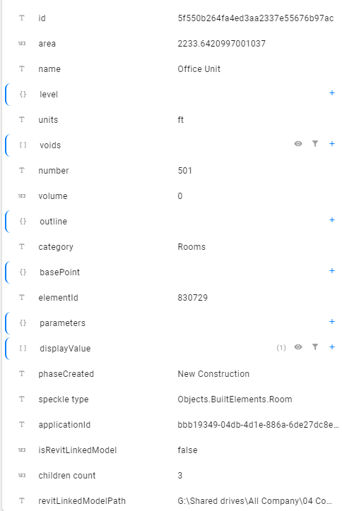
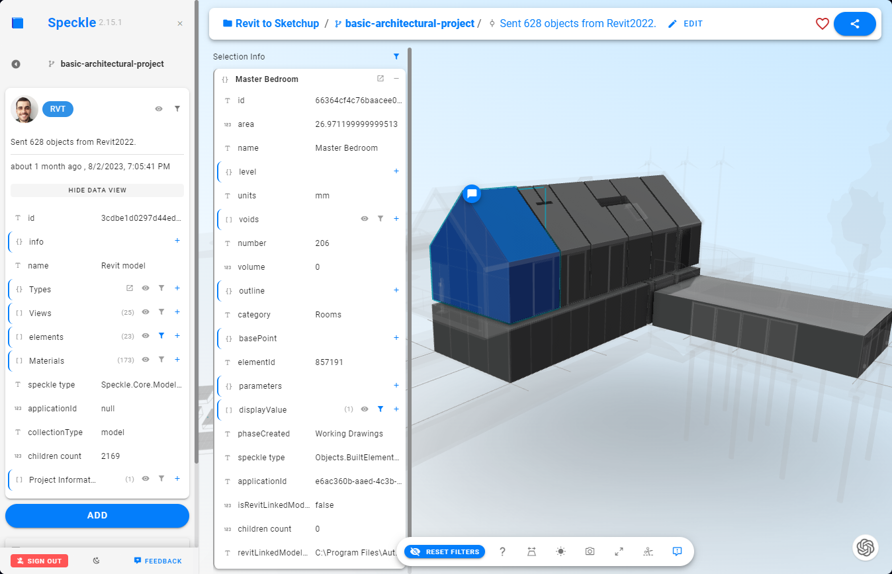
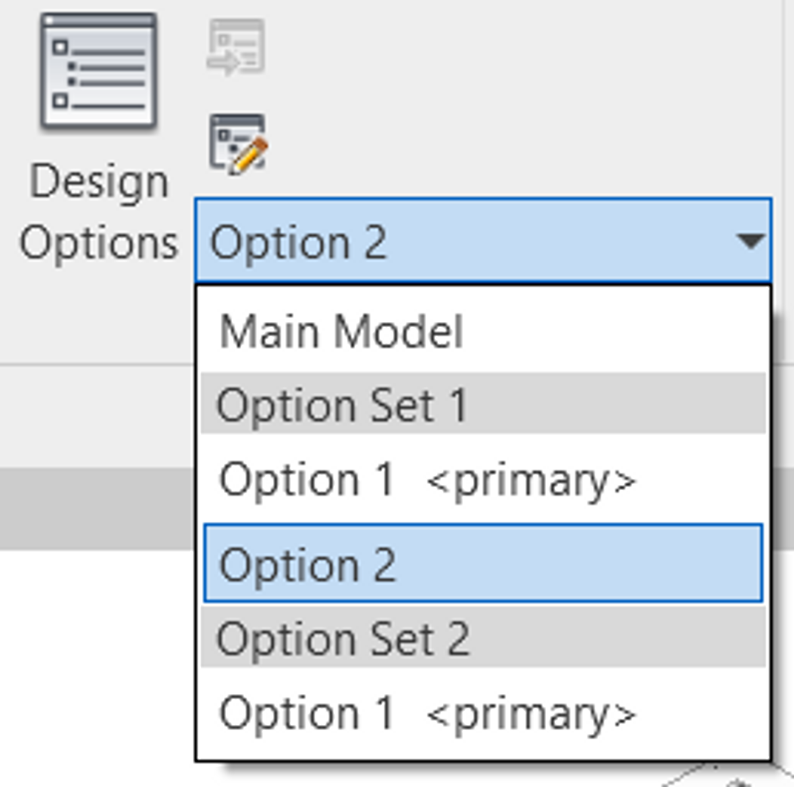
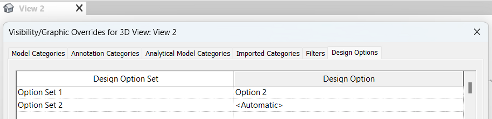
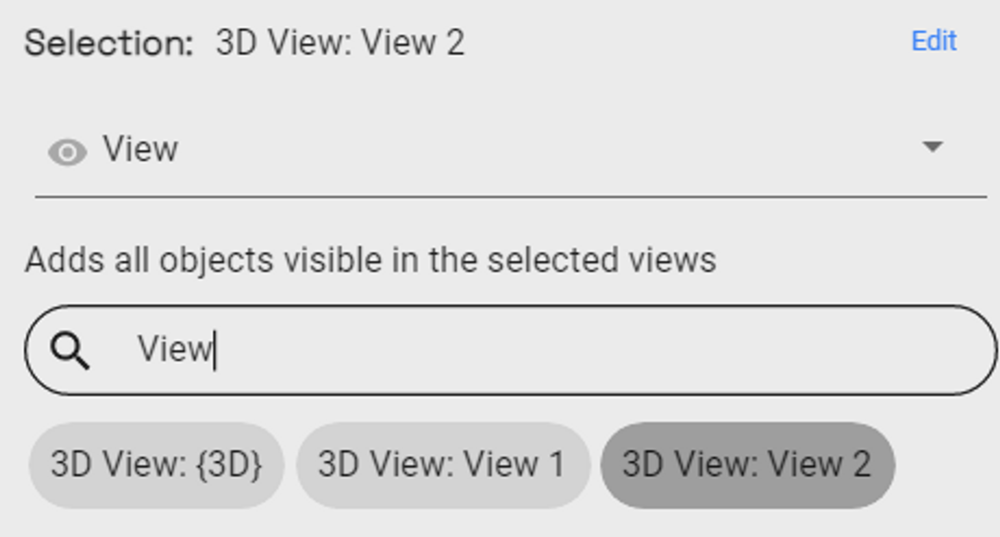
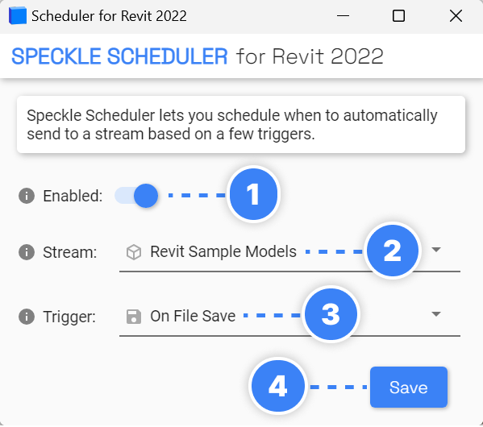

# Features

In this page, we’ll share how Revit connector converts your Revit model into Speckle format and how it handles updating in Revit.

## Converting Revit Data to Speckle

When sending from Revit, Speckle takes care of converting the data to a Speckle-friendly format. If you're curious about how this data is being structured, please have a look at our **[Objects Kit class definitions](https://github.com/specklesystems/speckle-sharp/tree/master/Objects/Objects/BuiltElements)**.

For instance, a Revit room will look like this:

- At a high level we have all the main properties that define the room, such as:

  - name
  - area
  - number
  - geometry
  - category
  - etc.

For every category of element, you’ll have some main properties quickly accessible at a high level. Keys and their values may change depending on the element.

- All the other Revit parameters, both **type and instance**, are nested inside the **parameters** property. See an example below:

  

  - **ROOM_AREA:** Internal Revit Name (API) of the Area parameter for Rooms.
  - **name:** represents the name of the parameter. In the above image, it is “Area”.
  - **value:** represents the value of the parameter. In this case, it’s “2233.64”
  - **isShared:** True if parameter is a shared parameter.
  - **isReadOnly:** True if parameter is a readonly parameter.
  - **speckleType:** Speckle representation of the element. In this case, it is a “Objects.BuiltElements.Revit.Parameter” object.
  - **and more…**

  :::tip ✍️NOTE
  All the parameters are stored using their **internal Revit names**. You can see the full list of `BuiltInParameter` values **[here](https://www.revitapidocs.com/2022/fb011c91-be7e-f737-28c7-3f1e1917a0e0.htm)**. If you need to access their display name, just refer to the `name` property of each parameter, but please keep in mind these are not unique and can vary between languages.
  :::

To easily explore on object's data and parameters, our **[Speckle Web App](/user/web)** interface can be of great help. As well as any other applications that lets you explore the object metadata (eg Grasshopper, Dynamo, Unity, etc).

## Updating Elements in Revit

The connector takes care of updating received elements automatically where possible (instead of deleting and re-creating them). This is preferred, as Dimensions, ElementIds, and other annotations are preserved.

**Elements are updated under these two circumstances:**

- If the element was created in another project/software and had been received previously: for example, BuiltElements that were created in Rhino or Grasshopper.
- If the element was created in the same project you're working on: for example, if you send some walls to Speckle, edit them, and receive them again from the same stream

Here are some technical details if you're curious about what's happening behind the scenes:

- BuiltElements have a property called `applicationId`, this is different from the `id/hash` property on them, and represents the id of such element in the host application in which it was first created. If the element was created in Revit it’s the `UniqueId`, if coming from Grasshopper/Rhino an analogous field
- When a stream is received in Revit the `applicationIds` of all BuiltElements created are cached in the receiver
- When receiving a second time from the same stream, if the received elements have the same `applicationId` of something that was previously received (and it still exists in the document), the connector will attempt to modify them instead of creating new ones. If the update fails (or is not permitted by the API), it’ll delete them and create new ones
- If no cached element is found, but there is an element in the document with a matching `applicationId` that is used for the update (this is the case of someone restoring changes previously sent, in the same project)
- If an element being received doesn’t have an `applicationId` no update mechanism will happen (this could be the case of BuiltElements created in Python if no `applicationIds` are generated manually)

### **Levels**

Levels in Revit are updated following the logic described above with just one minor exception: if you receive a level in a model that already has a level at the same elevation, the existing one will be used and its name will be updated if needed. For example, you receive `Level 03` which is at 9000mm, in a file that has `3rd Floor` at 9000mm => `3rd Floor` will be renamed and used (we use a tolerance of 5mm for matching levels by elevation). NOTE: Levels are *not matched by name* as this could end up with undesired results.

### **Schedules**

Information on the Schedule Updater can be found in the **[Excel Docs](/user/excel.html#schedule-updater)**

## Family Editor

The Revit connector also works in the Family Editor. Refer to the list below for supported element types.

- **[Revit Support Tables](/user/support-tables.html#revit)**

## Block to Family

:::warning
Ask Alan for this section
:::

## Linked Models

The Revit connector supports Linked Models, here's how it works.

### **Sending Linked Models**

The Revit connector supports sending Linked Models. To enable this feature, go to Advanced Settings and select the option for [Sending Linked Models](/user/revit/advanced-settings.html#_2-send-linked-models) . Once this is done, you can use the selection filters as usual and any relevant items from the linked models will also be sent.

For instance: *Everything* will send all the models, *Category* filters will work in conjunction with any linked model elements, and *Selection* too.

#### Sending by View

When sending by **view**, the linked model support works as follows:

- **Revit 2024:** only elements of the linked models visible in the selcted view(s) will be sent
- **Revit 2023 and before:** The whole linked model is sent unless it is not visible in the selected view(s). This is a limitation of the Revit API.

:::warning Current Limitations

Multiple instances of the same linked model are currently not supported on sending.
:::

### **Receiving Linked Models**

Revit connector also supports receiving Linked Elements. To enable this option, Go to Advanced Settings and check [Receiving Linked Models](/user/revit/advanced-settings.html#_3-receive-linked-models). On receiving we do not attempt to modify linked model files in any way, but when the *Receive Linked Models* setting is turned on, the linked model elements will be received in the current document as any other element.

## Design Options

The Connector also supports Revit design options and you can publish different options of your model to Speckle.

### How does it work?

If the selection filter is set to **Everything**, the Connector sends the **Main Model** and any objects that are part of a **primary** design option by default. To publish other options with the Main Model, simply select any other option from the Design Options drop-down.

### Using 3D Views

You can also set up a view in Revit and associate desired options with it in the **Visibility/Graphic Overrides**, see **Design Options** tab.

Then choose **View** selection filter in the Connector and pick a view. Only objects visible in this view will be sent to Speckle, which allows you to organise your Revit model for quick and easy publishing.

## Using the Scheduler (Alpha)

Sometimes, you might want to send data to Speckle automatically, based on a few triggers. For this, we have added a "**Scheduler**" functionality to the Revit Connector.

Before using the Scheduler, you need to **send your model** through the connector interface. (_Note: Make sure to select the selection filter you intend to use when the scheduler is triggered, for instance, to send all the model or a particular view._)

1. **Enabled**: When turned on, Scheduler will send the model to selected **Project(Stream)** with the selected **Trigger**)
2. Select **Stream**: Select the Project (Stream) card you used in the connector interface.

   <aside>
   💡 Currently, only one scheduler can be set per file. We are planning to enable setting up multiple schedulers from the Main Connector interface.

   </aside>

3. Select **Trigger**: Currently the following triggers are available:
   - **On File Save**
   - **On Sync To Central**
   - **On File Export**
4. Click "**Save**".

That's it! Every time you save your file, for instance, your data will be sent to Speckle.
