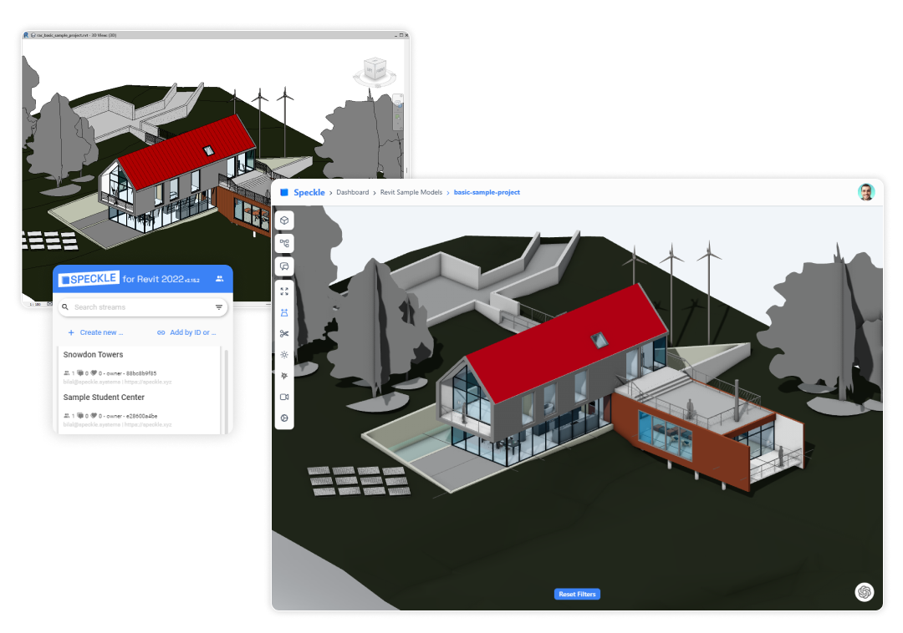

# Revit

Revit is an essential tool for many architects and engineers, but there are certain things Revit can’t do. You can use Speckle to get data in and out of Revit to supercharge your productivity! Once your data is in Speckle, you can load it in our other connectors (such as Grasshopper, Power BI, Archicad, Blender etc.), or work with it through your own apps and scripts.

:::tip NOTE✍️
The Speckle Revit Connector supports **Autodesk Revit 2020, 2021, 2022, 2023 and 2024🆕.**
:::

