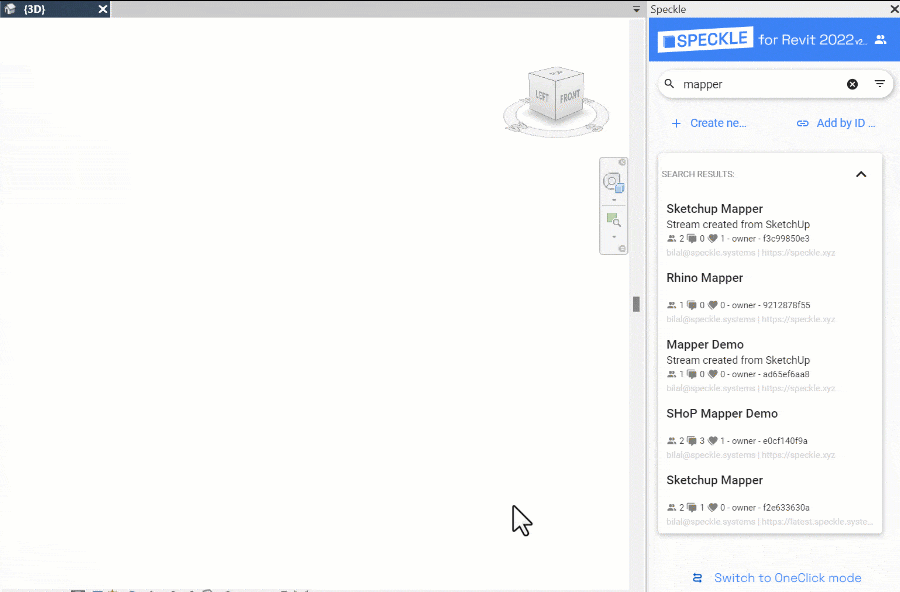
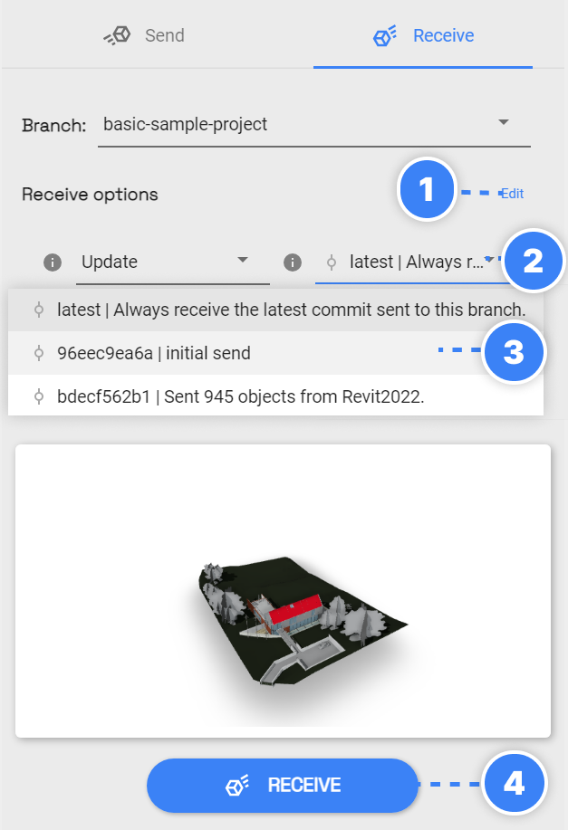
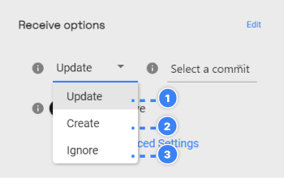

# Receiving from Speckle into Revit

In this section, you will learn how to receive models sent to Speckle into Revit.

:::tip NOTE✍️
We are renaming the core concepts in Speckle to be more widely understandable.

- *Streams* will be renamed to **Projects**
- *Branches* will be renamed to **Models**
- *Commits* will be renamed to **Versions**

:::

## Receiving a Speckle Model

To receive a Speckle Model:

1. Select a **Speckle Project.**
2. Switch to **Receive** tab.
3. Select a **Speckle Model** to receive from
4. Click **Receive**.

That’s it! You will have the latest version of the selected model received.

:::tip
If you're interested in learning more about how we handle models from CAD applications, check out [Speckle Mapper](/user/mapping-tool.md).
:::

## Receiving a Specific Version

If you want to receive a specific version of the selected model (branch):

1. **Expand** Receive Options by clicking on the **Edit**
2. Click on the **Version Dropdown**.
3. **Select the version**.
4. Click **Receive**.

## Receive Modes

When receiving a Model that has been received before, you might want to **Update**, **Create** or **Ignore** elements that were already created before. This is when the **Receive Mode** setting comes in! This is how it works:

1. **Update**: updates elements if they already exist and creates missing ones (current behavior in Revit)
2. **Create**: always creates new elements even if pre-existing (current behavior in Rhino)
3. **Ignore**: skips elements if they already exist
