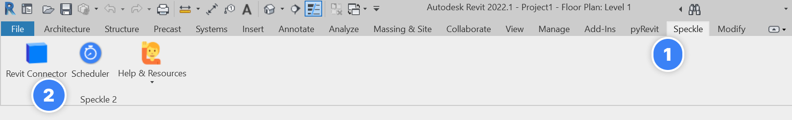
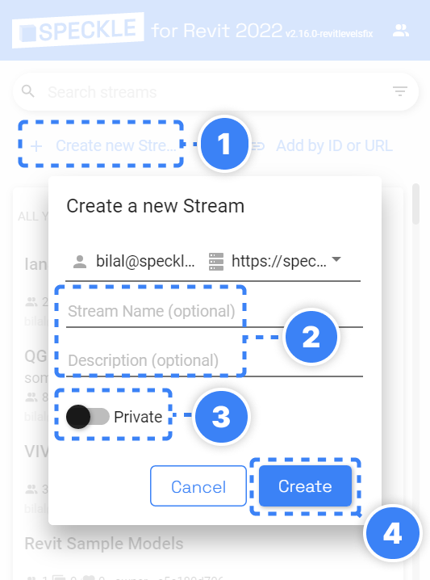
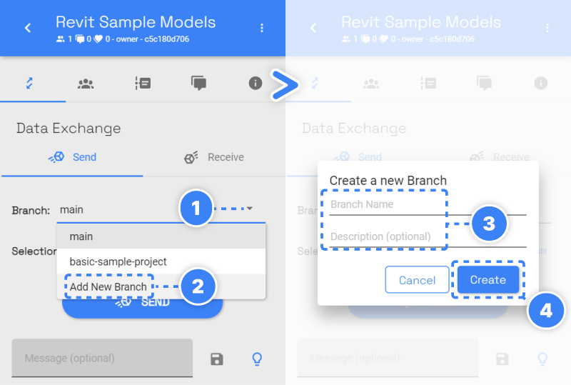
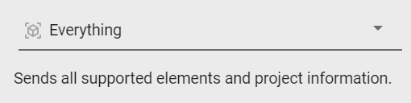
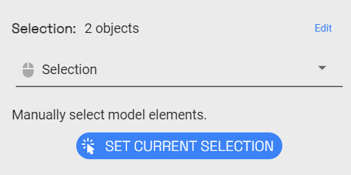
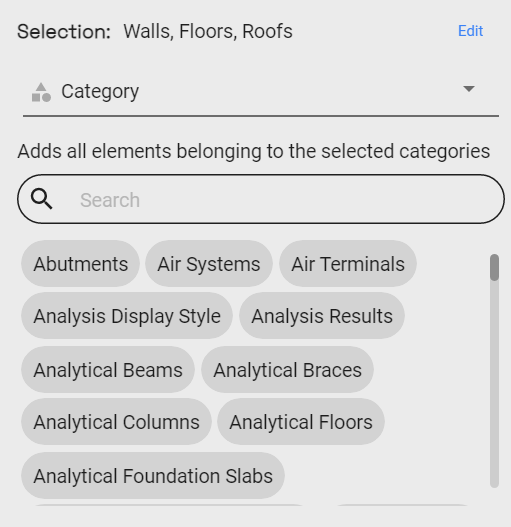
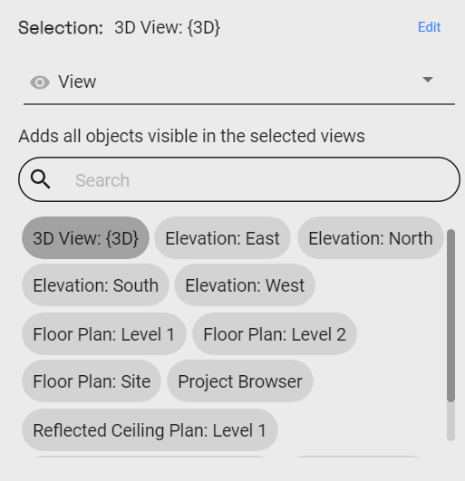
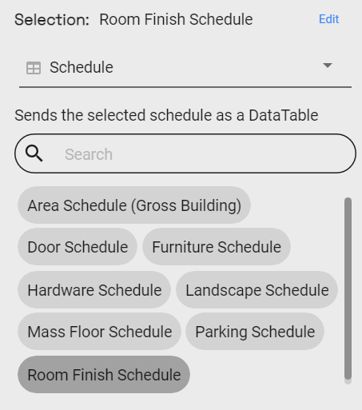
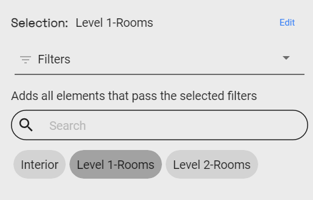
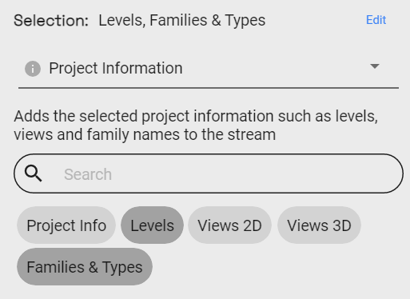

# Sending Models from Revit

After successfully installing the Revit connector for Speckle, let’s send your first data from Revit to Speckleverse.

:::tip NOTE✍️
We are renaming the core concepts in Speckle to be more widely understandable.

- *Streams* will be renamed to **Projects**
- *Branches* will be renamed to **Models**
- *Commits* will be renamed to **Versions**
  :::

## Launching the Connector

Revit connector will be added to all supported versions that you have installed.

:::tip IMPORTANT
Revit Connector currently supports Autodesk Revit 2020, 2021, 2022, 2023 and 2024🆕.
:::

To launch the connector:

1. Navigate to the “**Speckle**” tab in the ribbon.
2. Click on the “**Revit Connector**” button, the one with the little blue brick 🧊.

## Sending Models

:::warning
ADD IMAGE HERE
:::

Sending your Revit model takes only **4** steps:

1. **Select (or create) a Speckle Project (Stream).**
2. **Select (or create) a Speckle Model (Branch)** to send to.
3. **Select what you want to send.**
4. Click **Send**.

Let’s expand on these.

## Selecting a Speckle Project (Stream) & Model (Branch)

Before sending data from Revit, it is important to determine where you want to send the data. You can create a Speckle Project (Stream) & Model (Branch) using the web interface or the Revit connector UI. We’ll cover how to create those using the Connector UI.

### Create a Speckle Project (Stream)

To create a Speckle Project (Stream):

1. Click the **Create New Stream(Project)** button.
2. Provide a **Name** for your Project (Stream) and an optional **Description**.
3. Use the toggle, to make your project **Private** or **Link Shareable**.
4. Click **Create**.

:::tip IMPORTANT
It's not necessary to create a Speckle project every time. You can also select an existing project (stream) and send data to it.
:::

You can also create a Speckle Project (Stream) using Speckle’s web interface.

### Create a Speckle Model (Branch)

To create a Speckle model:

1. Expand the **Branch(Model)** dropdown.
2. Select **Add New Branch.**
3. Provide a **Name** and an optional **Description**.
4. Click **Create**.

:::tip IMPORTANT
Again, you can also select an existing model (branch) and send data to it.
:::

You can also create a Speckle Model (Branch) using Speckle’s web interface.

## Selecting What to Send

Next, you need to decide what you want to send from Revit. To help you select which elements will be sent to Speckle, we've built various filters into our Revit connector. Once a filter is set, just click **Send** and all objects passing the filter will be sent to your Stream.

Let's review each of filter.

### 1. Everything

Sends all supported model elements, family types, levels, project information etc. The everything filter covers graphical and non-graphical elements in the model.

### 2. Selection

Manually select elements from Revit, click “**Set Current Selection**” and send them to Speckle.

### 3. Category

The category filter lets you select one or multiple supported Revit categories.

### 4. View

The view filter works similarly to the category filter and lets you include all elements visible in one or multiple views.

### 5. Schedule

Sends the selected Revit Schedule as a **DataTable** to Speckle. Learn more about DataTables and their usage in Parameter Updater.

### 6. Filters

Filters are used to selectively extract specific model elements based on predefined logical conditions. In the given image, for instance, Speckle will identify and send all elements that passes the selected filter.

### 7. Workset

Selects all elements belonging to the selected workset.

:::warning
ADD IMAGE HERE
:::

### 8. Project Information

The project info filter lets you add non-graphical elements, such as Levels, Views (2D & 3D), Family Types (their properties, not geometry), and Project Information.

