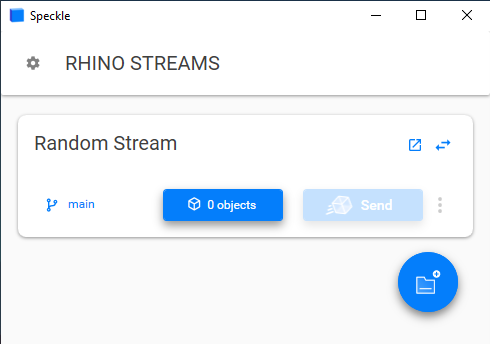
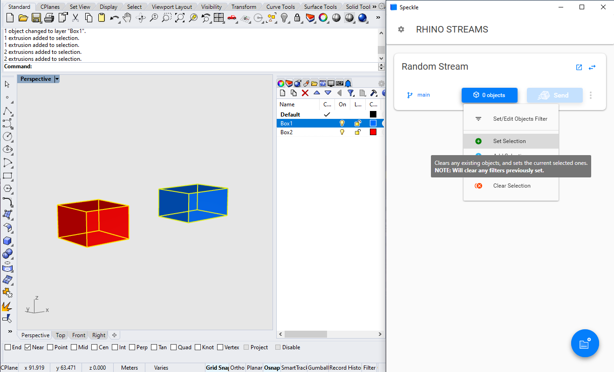
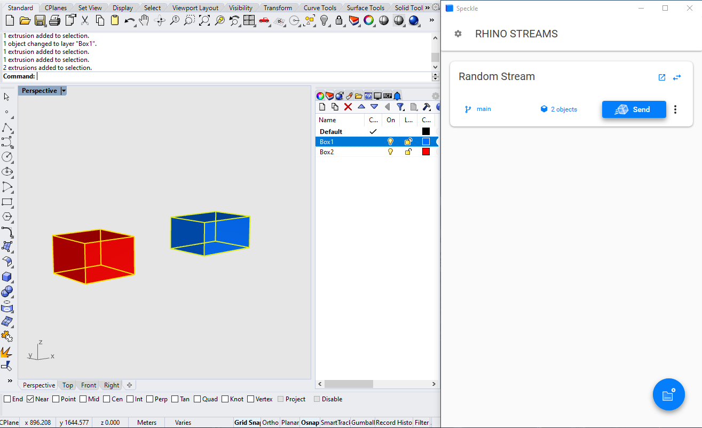
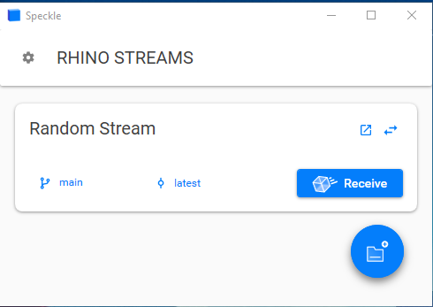
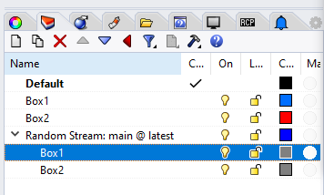
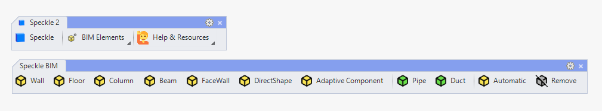
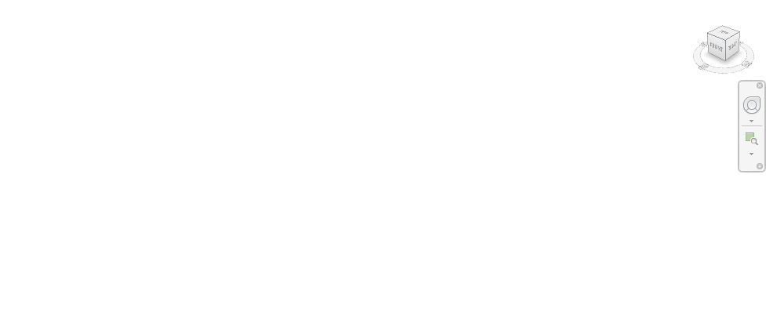

# Rhino

## Quick Start Video

Prefer watching to reading? Who doesn't!

<div style="position: relative;padding-bottom: 56.25%;"><iframe width="100%" height="100%" style="position: absolute;" src="https://www.youtube.com/embed/v56nxXBbtfI" title="YouTube video player" frameborder="0" allow="accelerometer; autoplay; clipboard-write; encrypted-media; gyroscope; picture-in-picture" allowfullscreen></iframe></div>

## Getting Started

::: tip 

Check out our dedicated tutorial on [how to get started with Rhino](https://speckle.systems/tutorials/getting-started-with-speckle-for-rhino/)!

:::

To install this Connector and add your Speckle account, follow the instructions in the [Speckle Manager](/user/manager) section.
Speckle currently supports both Rhino 6 and Rhino 7.

Once installed, you can find the connector by running the `Speckle` command in Rhino. This should open a new pop-up window with the [Desktop UI](/user/ui.md) (the old version of Speckle used the `SpecklePanel` command for this).


## User Interface

> This connector uses our shared Desktop UI. Read up on general guidelines for usage in the [Desktop UI section](/user/ui).

Once the Desktop UI panel is open, go ahead and create a new stream (or add an existing one) to the current file. Once the Rhino `.3dm` file is saved, the streams associated with that file will be saved too.

### Sending

To send objects to Speckle, you'll first need to specify which objects are to be sent.
This can be done in two ways:

* The simpler way involves manually selecting elements in Rhino. 
* The more powerful way is to use filtering logic to select elements.

In the example below, we'll use the simpler method of manually selecting the elements to be sent. First, ensure the stream you want to send data to is in _Sender_ mode.



Next, select the objects you want to send, and left-click the button that says `0 objects` in the Speckle Panel. A drop-down will appear; choose `Set Selection`.



The same button should now display the total count of objects that were selected.



You're ready to send! Press the `Send` button. You should see a progress bar and, once completed, a success message.


For the detail-lovers out there, you'll notice that your Rhino layer structure is replicated as `Base` object properties, which can be recreated on the receiving end.

### Receiving

In order to receive data from a Speckle stream, you'll first need to add that stream to your Speckle streams panel. If the stream already exists on the server it will automatically be added in _Receiver_ mode.



Once the stream has been added, go ahead and hit the `Receive` button. This will display a progress bar (just like the sending operation) and, if successfull, will add the received objects to the current document.


In order to prevent overriding existing layers/objects in the file, all received objects will be placed in a nested layer structure. This structure will contain all the layers. that the sent objects were placed to, with a parent layer with a name in the format `<STREAM_NAME>: <BRANCH_NAME> @ <COMMIT>`.



In the screenshot above, you can see the difference between:

1. The original layers of the sent objects
2. The layers created by Speckle when receiving the data back

You may also notice the overlapping received objects(gray) with the original objects (blue and red).


## Supported Elements

* [Rhino Support Tables](/user/support-tables.html#rhino)

# Rhino BIM

Speckle 2.0 lets you tag Rhino geometry as Speckle BIM elements, so you can send objects like lines and surfaces as beams and floors! This means you can bring in your Rhino geometry directly as native Revit family elements 💥


## Features

Access Rhino BIM element creation through the Speckle BIM toolbar, which includes a button for every supported BIM element. Check the section below for a run through of which geometries can be tagged as Speckle BIM elements and their associated commands.



Rhino BIM manages BIM tags by assigning geometry objects a `Attribute User Text` property if they have been flagged as BIM elements while sending to a stream. Once they are added, remember to remove these tags with the `Remove` button if you wish to send the objects as plain geometry instead of BIM elements, or if you wish to assign them a different tag.

:::tip NOTE

If this is your first time installing the Speckle connector, you may need to load the toolbar by navigating to Options > Toolbars > SpeckleConnectorRhino, and then making sure the Speckle2 checkbox is selected.

:::

Keep in mind that when streaming Speckle BIM elements from Rhino into Revit, they will come in as the first available family type in your Revit document. Currently there is no way to assign specific revit families to Rhino BIM elements, but this may be changed in the future.

## Using Rhino BIM 

Assigning or removing Speckle BIM tags from geometry objects is easy:

1. Click the BIM button corresponding to the BIM element or action you would like apply
2. Select all geometry objects you wish to apply the button action to
3. Press Enter

If you'd prefer to use the command line instead of the toolbar buttons, refer to each button section for their respective command. There's also a bit of magic happening behind the scenes to detect which types of geometry can be assigned Speckle BIM tags, so if a selected object is missing its Speckle BIM `Attribute User Text` property when you try to turn it into a BIM element, it probably doesn't qualify for that tag!

### Creating walls

**Command:** *CreateWall* 

1. Create or select *vertically planar* surfaces.

2. Click on the Speckle BIM wall button and press Enter. Check your object's User Attribute Text to confirm the Speckle BIM tag was successfully applied.

3. Send the geometry with Speckle: if you're unfamiliar with how to do this, check out the How To Get Started with Rhino docs!
4. Receive the geometry in Revit: if you're unfamiliar with how to do this, check out the How To Get Started with Revit docs! The surface will be created as a default wall type.

5. Transform your rhino surface, and resend it to Revit - your wall will automatically update!


### Creating Floors

**Command:** *CreateFloor* 

1. Create or select *xy planar* surfaces.

2. Click on the Speckle BIM floor button and press Enter. Check your object's User Attribute Text to confirm the Speckle BIM tag was successfully applied.

3. Send the geometry with Speckle: if you're unfamiliar with how to do this, check out the How To Get Started with Rhino docs!
4. Receive the geometry in Revit: if you're unfamiliar with how to do this, check out the How To Get Started with Revit docs! The surface will be created as a default floor type.

5. Transform your rhino surface, and resend it to Revit - your floor will automatically update!

### Creating Columns

**Command:** *CreateColumn* 

1. Create or select lines that are *approximately vertical*, defined as less than 45 degrees tilted relative to the z-axis.

2. Click on the Speckle BIM Column button and press Enter. Check your object's User Attribute Text to confirm the Speckle BIM tag was successfully applied.

3. Send the geometry with Speckle: if you're unfamiliar with how to do this, check out the How To Get Started with Rhino docs!
4. Receive the geometry in Revit: if you're unfamiliar with how to do this, check out the How To Get Started with Revit docs! The line will be created as a default column type.

5. Transform your rhino line, and resend it to Revit - your column will automatically update!


### Creating Beams

**Command:** *CreateBeam* 

1. Create or select lines that are *approximately horizontal*, defined as less than 45 degrees tilted relative to the xy-plane.

2. Click on the Speckle BIM Beam button and press Enter. Check your object's User Attribute Text to confirm the Speckle BIM tag was successfully applied.

3. Send the geometry with Speckle: if you're unfamiliar with how to do this, check out the How To Get Started with Rhino docs!
4. Receive the geometry in Revit: if you're unfamiliar with how to do this, check out the How To Get Started with Revit docs! The line will be created as a default beam type.

5. Transform your rhino line, and resend it to Revit - your beam will automatically update!


### Creating Pipes

**Command:** *CreatePipe* 

1. Create or select open curves (this works best for lines).
2. Click on the Speckle BIM Pipe button and press Enter. Check your object's User Attribute Text to confirm the Speckle BIM tag was successfully applied. **Note:** the default Pipe `diameter` is set to "1.0" - if you'd like to change this, just change the value in the user string!
3. Send the geometry with Speckle: if you're unfamiliar with how to do this, check out the How To Get Started with Rhino docs.
4. Receive the geometry in Revit: if you're unfamiliar with how to do this, check out the How To Get Started with Revit docs. The curve will be created as a default pipe type.
5. Transform your rhino curve, and resend it to Revit - your pipe will automatically update!


### Creating Ducts

**Command:** *CreateDuct* 

1. Create or select open curves (this works best for lines).
2. Click on the Speckle BIM Duct button and press Enter. Check your object's User Attribute Text to confirm the Speckle BIM tag was successfully applied. **Note:** the default Duct `width`, `height`, and `diameter` is set to "1.0" - if you'd like to change this, just change the corresponding value in the user string.
3. Send the geometry with Speckle: if you're unfamiliar with how to do this, check out the How To Get Started with Rhino docs.
4. Receive the geometry in Revit: if you're unfamiliar with how to do this, check out the How To Get Started with Revit docs. The curve will be created as a default duct type.
5. Transform your rhino curve, and resend it to Revit - your duct will automatically update!

### Creating Face Walls

**Command:** *CreateFaceWall* 

1. Create or select any kind of surface.

2. Click on the Speckle BIM face wall button and press Enter. Check your object's User Attribute Text to confirm the Speckle BIM tag was successfully applied.

3. Send the geometry with Speckle: if you're unfamiliar with how to do this, check out the How To Get Started with Rhino docs!
4. Receive the geometry in Revit: if you're unfamiliar with how to do this, check out the How To Get Started with Revit docs! The surface will be created as a default wall type.

5. Transform your rhino surface, and resend it to Revit - your face wall will automatically update!

### Creating Direct Shapes

**Command:** *CreateDirectShape* 

1. Create or select any kind of brep, extrusion, or mesh.

2. Click on the Speckle BIM direct shape button and press Enter. *Select the BIM type for this direct shape in the commandline*. Check your object's User Attribute Text to confirm the Speckle BIM tag was successfully applied.

3. Send the geometry with Speckle: if you're unfamiliar with how to do this, check out the How To Get Started with Rhino docs!
4. Receive the geometry in Revit: if you're unfamiliar with how to do this, check out the How To Get Started with Revit docs! The geometry will be created as a generic model.

5. Transform your rhino geometry, and resend it to Revit - your generic model will automatically update!

### Creating Adaptive Components

**Command:** *CreateAdaptiveComponent* 

1. Create a set of points that define your adaptive components. In this example, our Revit adaptive family is defined by four points, so we will have a collection of points in a multiple of four.

2. Click on the Speckle BIM adaptive component button and press Enter. *Then type the family name for your adaptive component in commandline*. Select your points in order, pressing enter after every group of four. Press Enter again when done, and blocks will be created for each point group. Check your block's User Attribute Text to confirm the Speckle BIM tag was successfully applied!

3. Send the blocks with Speckle: if you're unfamiliar with how to do this, check out the How To Get Started with Rhino docs!
4. Receive the blocks in Revit: if you're unfamiliar with how to do this, check out the How To Get Started with Revit docs! Make sure you have your Adaptive Family loaded into your Revit document. The geometry will be created as instances of your adaptive component!


### Automatically Creating BIM elements

**Command:** *CreateAutomatic* 

This is a super magic option that will try to automatically assign the most appropriate Speckle BIM tags to all of your selected geometry 🔮

1. Select all geometry that you want to turn into BIM elements.
2. Click on the Speckle BIM automatic button and press enter. Check each geometry's User Attribute Text to see the Speckle BIM tag that is applied.

3. Send the geometry with Speckle: if you're unfamiliar with how to do this, check out the How To Get Started with Rhino docs!
4. Receive the geometry in Revit: if you're unfamiliar with how to do this, check out the How To Get Started with Revit docs! The geometries that have a BIM tag will come in as their respective default category type.


### Remove

**Command:** *RemoveSpeckleSchema* 

Removes all Speckle BIM tags from selected geometry objects. This is necessary when you want to send your geometry as regular geometry, or if you'd like to change the BIM tag for an object.

1. Select all geometry that you want to remove Speckle BIM tags for.
2. Click on the Speckle BIM remove button and press enter. If you check your geometry's User Attribute Text, you should no longer see the SpeckleSchema tag!

## Schema Builder (OLD)

This feature is now replaced by Rhino BIM, but the commands still work - check below for a walkthrough of old schema builder features.

Currently, direct conversions are available for the following types:

| Base Geometry            | BuiltElement schemas            | Revit type |
| ------------------------ | ------------------------------- | :--------: |
| Planar surface           | `Wall` `Floor` `Roof`           |            |
| Planar polysurface       | `Wall`                          |            |
| Planar and nurbs surface | `FaceWall`                      | ✅         |
| Line                     | `Column` `Beam`                 |            |
| Brep / extrusion         | `DirectShape`                   | ✅          |
| Mesh                     | `DirectShape`                   | ✅          |

### Walkthrough

Stream your Rhino objects directly into Revit as BuiltElements! Rhino to Revit interop uses a custom Speckle `Attribute User Text (AUT)` string to determine an object's schema before sending streams. AUTs are modified with two commands:

- `ApplySpeckleSchema` gives you options for adding AUTs to model objects
- `RemoveSpeckleSchema` removes schema AUTs from model objects

Some schemas have additional parameters that can be manually modified for custom control over parameters like Revit Family or Revit Type.

### Assigning schemas


#### The automagic method

The easiest way to assign schemas to your Rhino objects is to let the Speckle schema builder decide for you!

1. Type `ApplySpeckleSchema` in the command line
2. Select objects for BuiltElements conversion
3. By default, `Automatic` is set to `On`. Press **Enter**!

The algorithm for automatic schema application takes into account object and layer naming before it tries to find the best BuiltElements schema to apply. For example, if an object has _Wall_ in its name, or in the absence of a name, the object is nested in a layer with a name that includes _Wall_, then the automatic method will try to send the object as a Speckle `Wall` element. If the algorithm can't find a BuiltElements type in either the object or layer name, it will analyze the object geometry and try to find the first schema fit based on the object's properties.

**note** `DirectShape` conversions are not assigned during the automagic method. If an XY planar surface does not have a specific schema in its object or layer name, it will default to `Floor`, instead of `Roof` or `Ceiling`.

#### The single schema method

You can assign a specific schema to selected objects through the single schema method: this method also includes conversions to `DirectShape` and `FaceWall` schemas.

1. Type `ApplySpeckleSchema` in the command line
2. Set `Automatic` to `Off`
3. Select a `Schema` option
4. By default, `DirectShape` is set to `Off`. To send as a DirectShape instead of a native object, set the toggle to `On`.
5. Select objects for schema application, and press **Enter**!

#### Customizing properties

Revit-specific BuiltElements schemas such as `FaceWall` and `DirectShape` can be manually customized with additional properties. By default, these schemas will have a user string with the following formats:

```
FaceWall([family], [type])
DirectShape(Schema, UniqueName)
```

To assign custom values, select your FaceWall or DirectShape object and navigate to its User Attribute Text panel. Double click on the _SpeckleSchema_ entry value and replace the `[]` properties with custom values if you want to assign a specific Revit family or type to your `FaceWall` object. If no changes are made, FaceWalls are assigned to the `Basic Wall` type by default. For DirectShapes, a unique shape name is automatically generated, but can be changed to a custom string if desired.

### Removing schemas

Removing schemas from Rhino objects is super easy:

1. Type `RemoveSpeckleSchema` in the command line
2. Select objects to remove schemas from
3. Press **Enter** - Speckle AUT strings are now deleted from all selected objects!

## Things to keep in mind

This section is work in progress 🚧 ! Please check back again soon 😃
