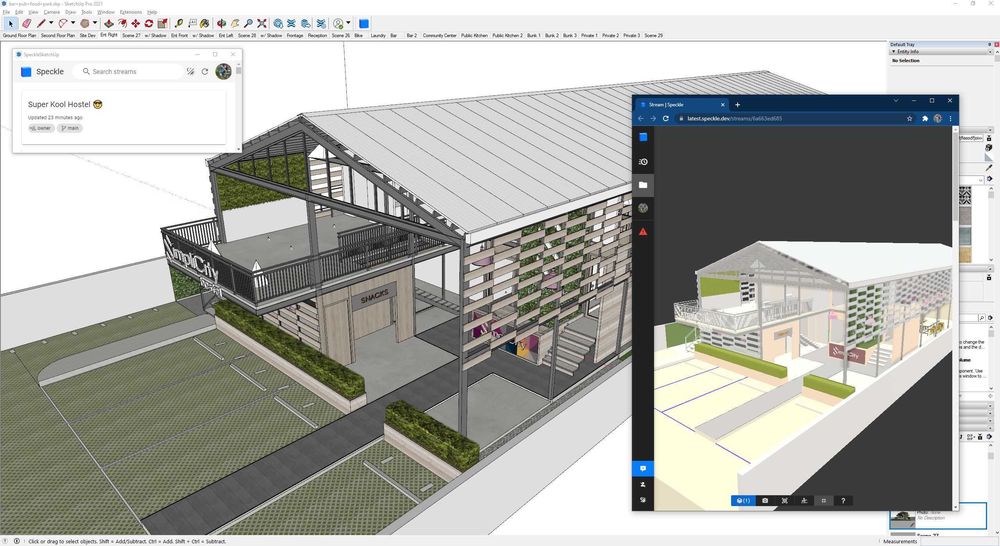
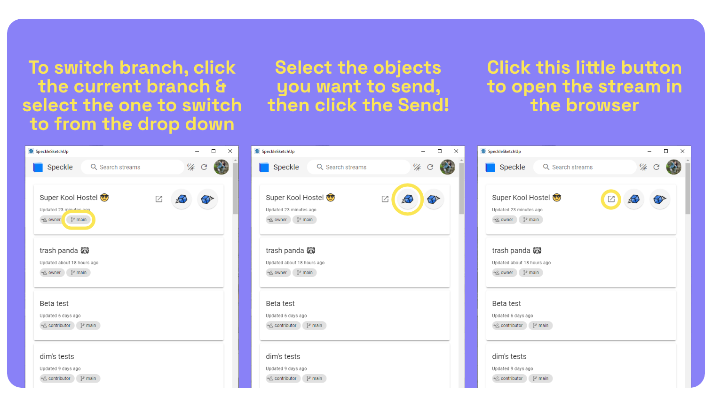
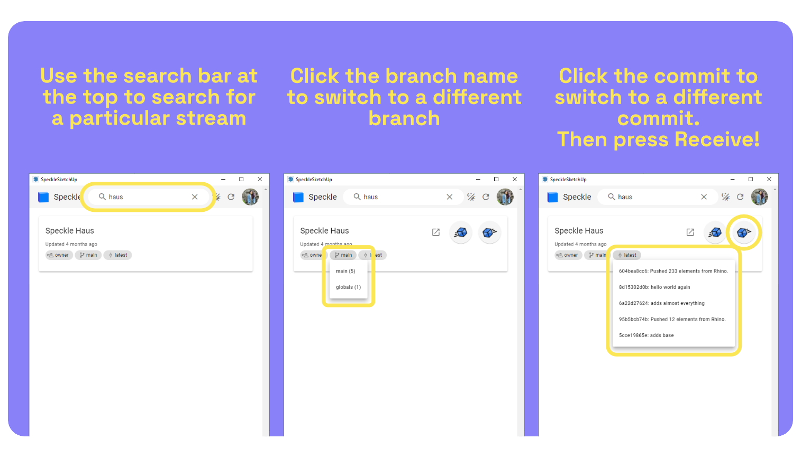

# SketchUp (Alpha) 🛠️

::: tip IMPORTANT ⚠️
This connector is currently in alpha with limited functionality - please keep this in mind while testing!
:::

## Getting Started

Before using this connector, you'll need to follow our standard setup instructions to [install Speckle Manager and add a Speckle account](/user/manager).

As this connector is still in heavy development, see the [repo](https://github.com/specklesystems/speckle-sketchup) for the latest updates.

## Installation

The easiest way to install the SketchUp Alpha Connector is via the [Speckle Manager](/user/manager). Simply open up manager, find the SketchUp connector, and click "Install".

However, this method only works for Windows for SketchUp 2021. If you'd like to try installing on a different platform or for a different version, you can do a manual installation. Note that the connector has been developed for SketchUp 2021 and has not been tested on older versions or on different platforms. There may be issues, so feel free to report them on the [forum](https://speckle.community/).

### Manual Installation 

#### 1. Clone the repository

First, ensure you have [git](https://git-scm.com/downloads) installed.

Run the following command in your terminal to clone the repo:

    git clone https://github.com/specklesystems/speckle-sketchup

This will create a `speckle-sketchup` folder with the connector files wherever you run this command.

#### 2. Build the User Interface

Navigate into the `ui/` folder

    cd speckle-sketchup/ui

Then run the following commands

    npm install
    npm run build

This will create a `html` folder inside the `speckle-sketchup/speckle_connector` folder.

#### 3. Add the Connector to SketchUp

Find the `Plugins` folder for your SketchUp installation. On Windows for SketchUp 2021, the folder will be at:

    C:\Users\{YOU}\AppData\Roaming\SketchUp\SketchUp 2021\SketchUp\Plugins

Once you've found the equivalent for your OS / SketchUp version, copy the `speckle_connector` folder and the `speckle_connector.rb` file into the `Plugins` folder.

## User Interface

### Sending Data

For the moment, there is only one send mode: selection.

Simply select all the objects you would like to send, then click the "Send" cube. To switch the targeted branch, click the currently selected branch and find the branch from the dropdown menu.

See the gif below for the full process.

### Receiving Data

Receiving streams in SketchUp is as simple as clicking the "Receive" cube. As with sending, you can switch the targeted branch and the particular commit to receive.

Note that if you sent SketchUp groups to a stream, they will be received as component instances rather than groups.

See the full process of receiving a Rhino model in this snazzy gif

### Accounts

Your Speckle accounts should be added via [Speckle Manager](/user/manager).

You can switch between your accounts by clicking your profile image and selecting it from the popup menu.

## Supported Elements

See [SketchUp Support Tables](/user/support-tables.html#sketchup)
