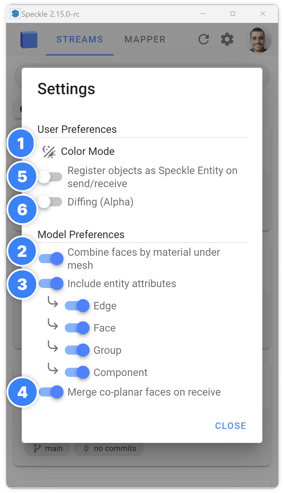

# Advanced Settings

SketchUp Connector has a settings dialog to give you more control on how you want to send and receive your models.

    

## 1. Color Mode

SketchUp Connector supports both Light and Dark mode. To switch between the two, click on “Color Mode”. By default, it is set to Light mode.

## 2. Combine Faces by Material

The "Combine Faces by Material" setting lets you combine faces that share the same material into a single mesh when sending to Speckle. This can significantly reduce the sent data size and drastically improve loading times, making it up to 10 times faster! By default, it is set to True.

## 3. Include Entity Attributes

Entities inside SketchUp can have additional data attached to them, which are called attributes. By enabling this setting, you can include attributes of entities when sending to Speckle. You can also choose to include attributes per geometry types: Edges, Faces, Components and Groups separately.

## 4. Merge Co-Planar Faces on Receive

When enabled, it merges co-planar faces upon receiving data. Is is particularly useful when working with models from other applications like Revit, Rhino, etc., where faces of the meshes might consist of smaller triangles. By enabling this setting, co-planar triangles are merged into ngons, making them easier to manipulate with the push-pull tool inside SketchUp.

## 5. Register Objects as Speckle Entity

When sending objects to Speckle, we establish a connection between the converted Speckle objects and their corresponding entities in SketchUp. This association is crucial for tracking and synchronizing data accurately. To achieve this, we follow these steps:

1. We traverse the objects during conversion, creating unique Speckle IDs for each entity.
2. Next, we store these Speckle IDs as attributes within the corresponding SketchUp entities and SpeckleState. This association allows us to identify which SketchUp entity corresponds to a specific Speckle object using its unique ID.

::: warning
Notably, this registration process might slightly increase the conversion time, typically by around 10% to 40%.
:::

## 6. Diffing (experimental)

Diffing feature is currently in the experimental phase. When this setting is enabled, a small triangle icon will appear next to the project card. Clicking on this icon will display the differences between the version you sent to Speckle and the current version in SketchUp.

::: warning
⚠️ The feature currently shows only the geometries modified with the push-pull tool between the versions.
:::
