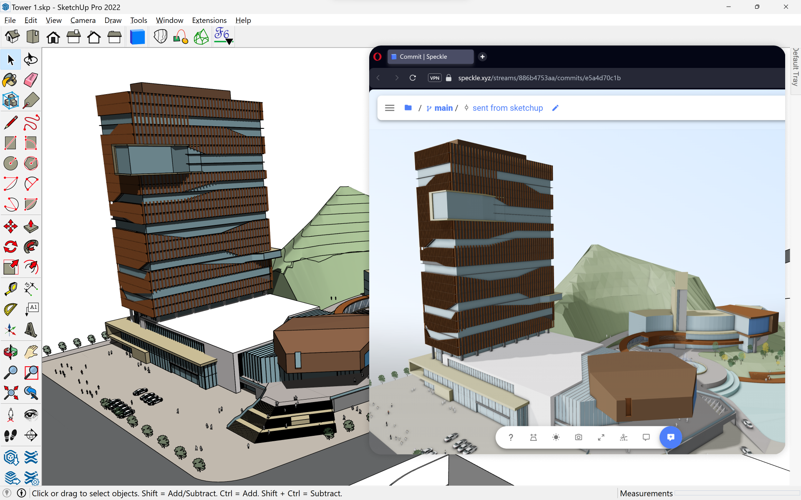

# SketchUp

SketchUp connector currently supports SketchUp 2020, 2021, 2022 and 🆕2023.

:::tip
SketchUp Connector is currently in beta and only available on **Windows**! If you'd like to try installing on a different platform or for a different version, you can do a manual installation(page link here).
:::

As this connector is still in heavy development, see the **[repo](https://github.com/specklesystems/speckle-sketchup)** for the latest updates.

# Getting Started

To install the SketchUp connector, it’s assumed you have:

- Speckle Account (you can get one **for free🎉** at **https://speckle.xyz/**)
- Manager for Speckle. You can download it from **[here](https://speckle.systems/download/)** and add your Speckle account.

Once Manager is installed and your account is set, you can continue with the installation.

## Installation

<video autoplay muted loop>
  <source src="./img-sketchup/installing-sketchup-connector.mp4" type="video/mp4">
  Your browser does not support the video tag.
</video>

1. Open Manager for Speckle and click on the "**Connectors**" tab.
2. You should see a list of available connectors. Scroll down until you find the "**SketchUp**" connector or use the search bar to find it.
3. Click the "**Install**" button next to it.

That's it! You're all set to use the Speckle connector for Sketchup.

## Installing Pre-Releases

If you want to stay on the cutting edge of the SketchUp connector, then you can install pre-releases of it.

:::warning
⚠️ Please keep in mind that these early versions are not intended for production work and may have some untested features.
:::

<video autoplay muted loop>
  <source src="./img-sketchup/pre-releases.mp4" type="video/mp4">
  Your browser does not support the video tag.
</video>

To install pre-releases for the SketchUp connector, follow these steps:

1. Inside the connector page, switch to the “Versions” tab.
2. Inside the "Versions" tab, toggle on the "Show Pre-releases" option.
3. From this list, select the desired version you wish to install and click on the “Install” button next to it.
