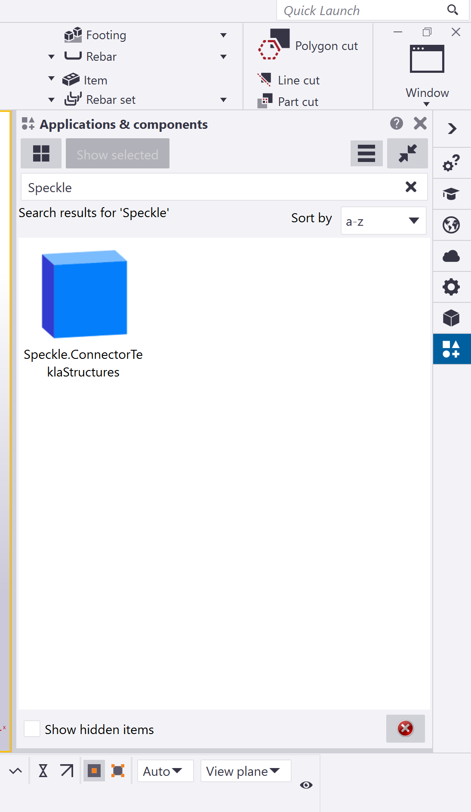
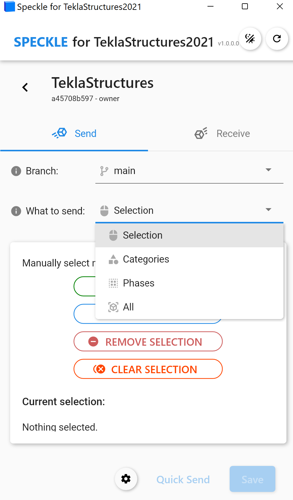

# Tekla Structures (Alpha) 🛠️

The Speckle Tekla Structures Connector currently supports Tekla Structures 2020 and 2021. It is currently under alpha development so please report any bugs or feedback to the [community forum](https://speckle.community/).

::: tip

Check out our dedicated tutorial on [how to get started with Tekla Structures](https://speckle.systems/tutorials/getting-started-with-tekla-structures)!

:::

## Getting Started

To install the Tekla Structures Connector and add your Speckle account, proceed by following the instructions in [Speckle Manager](/user/manager).

Once installed, you can find the Tekla Structures Connector in the Application and Components tabs :

### Recieving in Tekla Structures

Save the Tekla Structures model as a file first before attempting to recieve projects into your Tekla Structures model.

## User Interface

::: tip IMPORTANT 🙌

This connector uses our shared Desktop UI2. Read up on general guidelines for usage in the [Desktop UI2 section](https://speckle.community/t/new-desktopui-in-alpha-testing/1851/2).

**Projects are saved to a textfile that will appear in your model folder titled "Speckle". Do not delete this folder.**

:::

### Filters

To help you select which elements will be to sent to Speckle, we've built various filters into our Tekla Structures Connector. Once a filter is set, just click **Send** and all objects passing the filter will be sent to your Project. Section properties and materials defined within the model will always be sent.

_Please Note: Elements are sent regardless of whether they are visible or if they were created after setting up the filter._

#### Selection Filters

The selection filters will send everything that is selected within the Tekla Structures display.

#### Phase Filters

The phase filters is going to grab the predefined phases within Tekla Structures that are attached to the objects and send all objects associated with that phase.

#### Category Filter

The category filter lets you select one or more of the currently-supported Tekla Structures categories, this is the most granular filter that will also enable you to send results. Note : Other filters will not enable you to send results or non geometrical elements and properties.

#### All Filter

This trivial filter allows you to select all the elements that are currently supported by the Tekla Structures Connector. This will send all geometrical elements and their associated properties.

## Supported Elements

- [Tekla Structures Support Tables](/user/support-tables.html#teklastructures)

## Updating Elements

The connector does not take care of updating existing elements within the project.

## Revit and BIM Data to Tekla Structures

When sending from elements from Revit, Speckle takes care of converting the data to a Speckle friendly format. If you're curious about how this data is being structured, please have a look at our [Objects kit class definitions](https://github.com/specklesystems/speckle-sharp/tree/master/Objects/Objects/BuiltElements).

You can send models into Revit and recieve them currently with geometric properties. We are still working a bit more on this workflow, and it will become a bit more refined as time goes on. Stay tuned for more !

## Grasshopper to Tekla Structures

Tekla Structures has it's own grasshopper plugins, but you can always send it through the speckle systems with our schema builders as well. Go to the Tekla Structures specific tab and send beam elements which encompass all geometric elements that are 1D and contour plates which encompasses all geometric elements that are 2D. Defining sections will be defined on a name basis, and therefore as long as the catalog sections is defined in the Tekla catalog by name, it will be imported and built correctly. Refer to an example similar to this in the [ETABS documentation.](/user/etabs.html)

## Exploring the Tekla Structures Data

To easily explore on object's data and parameters, our [Speckle Web App](/user/web.html) interface can be of great help. As well as any other applications that lets you explore the object metadata (eg Grasshopper, Dynamo, Unity, etc).
