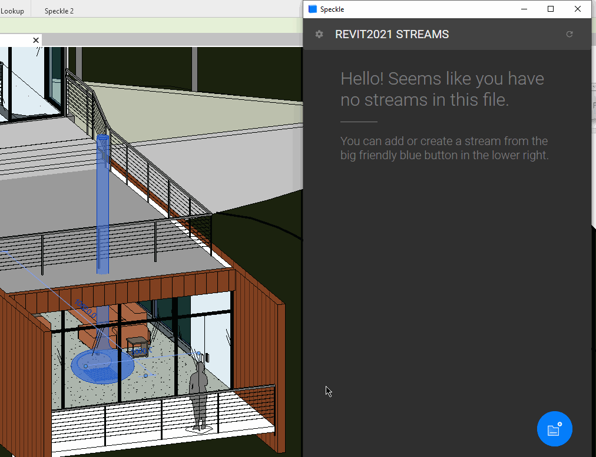
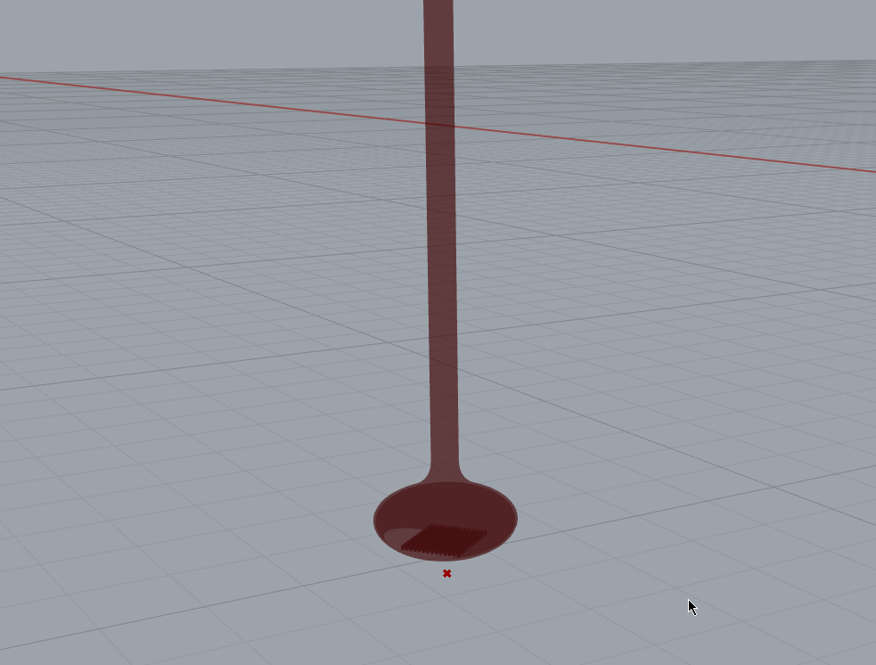
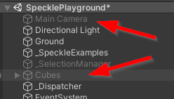

# Create Interactive Real-Time Experiences with Unity, Revit and Rhino

::: tip NOTE ❗️

All our tutorials have been migrated to out tutorials portal! 
Check them out 👉 [Tutorials](https://speckle.systems/tutorials/)

:::

>**Level:** Advanced
>
>**Author:** Matteo
>
>**Software used:** Unity, Revit 2021, Rhino 6-7

In this tutorial we will create an interactive Unity app that renders Revit data in real time. We'll see how the Unity connector works and how to write custom code that pulls data from Speckle that originates in Revit and Rhino. We'll also see how to work with streams and branches to organize data.

<div style="position: relative;padding-bottom: 56.25%;"><iframe width="100%" height="100%" style="position: absolute;" src="https://www.youtube.com/embed/VEipv8XzPdI" title="YouTube video player" frameborder="0" allow="accelerometer; autoplay; clipboard-write; encrypted-media; gyroscope; picture-in-picture" allowfullscreen></iframe></div>

The Unity Connector is evolving fast 🏃‍♂️! To follow this tutorial it is recommended that you pull the version at the start commit as future versions might be different.

- [Start commit](https://github.com/specklesystems/speckle-unity/commit/3526e8eba769caa8c62f1a9e497952f4839f29fe) - use this if you want to follow along with this tutorial.
- [End commit](https://github.com/specklesystems/speckle-unity/commit/4241e4a619d078be0c8da7265c5999b646565f6f) - the finished version, if you just want to skip to the end!

## Preparing the Models

The Unity app we are writing will let users receive (download) into their scene any model they have available in their Speckle account.

### In Revit

Assuming you don't already have a model, let's go ahead and set one up. We'll be using the _most boring model ever_, the Revit Basic Sample File - of course, you can use a different project!

You can also just [download a copy of the model](https://drive.google.com/file/d/18UK-aJFzjFEn-Gys_qGFfp9X4HwToNUr/view?usp=sharing) with the required edits already applied.


::: tip

If using a Revit model, you'll need to **edit the door families so that they are open**, this will let you walk through the model instead of just... slamming into it!

:::

We'll use this model for a walkthrough, but we'll want to let the users dynamically replace some of its components. In this case, I decided **the big fireplace in the living room** is a good candidate. Let's go:

- Select it
- Open the Revit Connector
- Create a new stream and then a new branch named 'fireplace'
- Click on _0 objects_ and then _Set selection_
- Now click _send_



Now let's **delete the fireplace and send the entire model**:

- Delete the fireplace
- Select the entire model
- Select the _main_ branch
- Set the selection again and click send

### In Rhino

We'll use Rhino to create some alternative "furniture" to use instead of the fireplace, here you can get creative!

It's important that this new geometries are located exactly where the fireplace is, so first receive that by using the Grasshopper or Rhino connectors and use it as a base to align the other objects you're creating.

You can download the two geometries I'm using [from this Rhino 7 file](https://drive.google.com/file/d/1dvG_CBB4l7Zc14lCA1UGBr6ruNWSZP0G/view?usp=sharing).

::: tip

Remember to set your desired materials on the objects before sending them.

:::

Now we can **send both the bunny and the statue to the same stream we created in Revit, but each in its own branch**.



### In the 3D Viewer

If you've followed all the steps correctly, this is what you should have when viewing the stream online.


## Writing the Unity App

### Preparing the Scene

Back in Unity, we can start to work off the _SpecklePlayground_ scene. 

We'll need to add a first-person controller. I downloaded [this simple one from the asset store](https://assetstore.unity.com/packages/tools/input-management/mini-first-person-controller-174710).

We can then disable or delete any other game objects not needed for this tutorial:



I've also enabled Global Illumination to make everything look nicer.

### Adding Custom Logic

Since most of the logic to receive streams and to create UI components already exists in the scene, we just need to add a small script.

Create a `Tutorial.cs` file with the following content:

```csharp
using UnityEngine;

public class Tutorial : MonoBehaviour
{
  private bool _uiMode = false;
  public GameObject UI;
  public GameObject Controller;
  private CanvasGroup _canvas;
  private MonoBehaviour _cameraScript;

  void Start()
  {
    _canvas = UI.GetComponent<CanvasGroup>();
    _canvas.alpha = 0.5f;

    _cameraScript = Controller.GetComponentInChildren<FirstPersonLook>();
  }

  void Update()
  {
    if (Input.GetKeyDown(KeyCode.E))
    {
      _uiMode = !_uiMode;
      _cameraScript.enabled = !_uiMode;
      _canvas.alpha = _uiMode ? 1 : 0.5f;
      Cursor.lockState = _uiMode ? CursorLockMode.None : CursorLockMode.Locked;
    }
  }
}

```

This example script enables and disables _edit mode_ upon pressing of the `E` key.

Create a new game object and attach the script above to it. That's it - your app is now complete :)

::: tip

Please Note: When adding a receiver, if you leave "Auto Receive" checked, the geometry will be automatically updated as soon as a new commit is pushed to that stream/branch.

:::

### Further Developments

This app is an oversimplification of what a proper interactive real time app would look like... but it's a great starting point!

The UI and logic can be completely customized. A good starting point for this would be looking into the `SpeckleExamples.cs` class or the prefabs used for the UI components.

For instance, you could perform different actions when the data is received or consume the Revit metadata attached to the objects with a script. Instead of having the stream cards custom for a UI, custom buttons could be added to pull a specific commit and model.